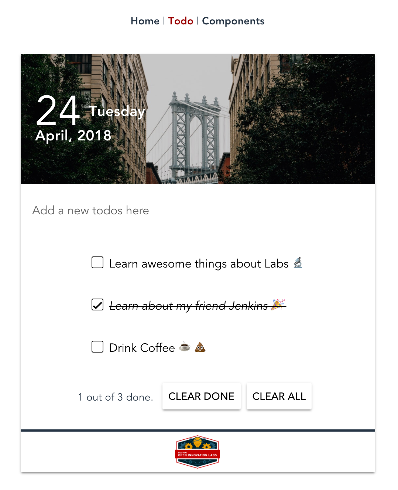

# Attack of the Pipelines

> In this lab we will explore the sample TODO List application and create a pipeline in Jenkins to build and deploy our code.


_____

## Learning Outcomes
As a learner by the end of this lesson you will be able to

- Build and run the full stack of the TODO List application locally
- Create an un-gated pipeline using the Jenkins UI for the backend and frontend
- Add branching to the pipeline to target specific namespace

## Tools and Frameworks
> The following tools are used throughout this exercise. Familiarity with them is not required but knowing what they are may help!

1. [Jenkins](https://jenkins.io/) - OpenSource build automation server; highly customisable through plugins
1. [NodeJS](https://nodejs.org/en/) - Node.js® is a JavaScript runtime built on Chrome's V8 JavaScript engine. Node.js uses an event-driven, non-blocking I/O model that makes it lightweight and efficient. Node.js' package ecosystem, npm, is the largest ecosystem of open source libraries in the world.
1. [MongoDB](https://www.mongodb.com/what-is-mongodb) - MongoDB stores data in flexible, JSON-like documents, meaning fields can vary from document to document and data structure can be changed over time
1. [VueJS](https://vuejs.org/) - Vue (pronounced /vjuː/, like view) is a progressive framework for building user interfaces. It is designed from the ground up to be incrementally adoptable, and can easily scale between a library and a framework depending on different use cases. It consists of an approachable core library that focuses on the view layer only, and an ecosystem of supporting libraries that helps you tackle complexity in large Single-Page Applications.

## Big Picture
> From the previous exercise; we created some supporting tooling needed by our app/

_____

## 10,000 Ft View
> _This lab requires users to take the sample TODO app and create a build pipeline in Jenkins by clicking your way to success ending up with an app deployed to each of the namespaces created previously_

2. Import the projects into your gitlab instance. See README of each for build instructions

2. Deploy a `MongoDB` using the provided template to all project namespace.

2. Create 2 pipline with three stages (`build`, `bake`, `deploy`) in jenkins for `develop` & `master` branches on the `todolist-fe` such that:
    * `Build` job should:
        1. Checkout from source code (`develop` for `<yourname>-dev` & `master` for `<yourname>-test`)
        2. Install node dependencies and run a build / package
        3. Send the package to Nexus (as a zip)
        4. Tag the git repository with the `${JOB_NAME}.${BUILD_NUMBER}` from Jenkins
        5. Trigger the `bake` job
    * `Bake` job should:
        1. Take an input of the previous jobs `${BUILD_TAG}` ie `${JOB_NAME}.${BUILD_NUMBER}`.
        2. Checkout the binary from Nexus and unzip it's contents
        3. Run and OC build of the App and tag it's imagestream with the provided `${BUILD_TAG}`
        4. Trigger a deploy job using the parameter `${BUILD_TAG}`
    * `deploy` job should:
        1. Take an input of the `${BUILD_TAG}`
        2. Patch / set the DeploymentConfig to the image's `${BUILD_TAG}`
        3. Rollout the changes
        4. Verify the deployment

2. Repeat the above setup for the backend `todolist-fe`. TIP - use the copy config to speed things up!

2. Verify that both apps and the DB are talking to one another as expected.

## Step by Step Instructions
> This is a fairly structured guide with references to exact filenames and sections of text to be added.

### Part 1 - Explore the Sample App
> _In this part of the exercise we will explore the sample application, become familiar with it locally before building and deploying in OCP Land_

2. Git clone the `todolist-fe` project to somewhere sensible and checkout the `develop` branch.
```bash
$ git clone https://github.com/springdo/todolist-fe.git
$ git checkout develop
```

2. Create a new project (internal) in GitLab called `todolist-fe` to host your clone of the project and copy it's remote address. 

2. In your local clone of the `todolist-fe`, remove the origin and add the GitLab origin by replacing `<YOUR_GIT_LAB_PROJECT>`. Push your app to GitLab
```bash
$ git remote remove origin
$ git remote add origin <YOUR_GIT_LAB_PROJECT>
$ git push -u origin --all
```

2. To get the app running locally; first check you've got node and npm installed
```bash
$ node -v
$ npm -v
```
<p class="tip" > 
NOTE - If you are missing these dependencies; install them with ease using the [Node Version Manager](https://github.com/creationix/nvm)
</p>


2. The `todolist-fe` has a package.json at the root of the project, this defines some configuration for the app including it's dependencies, dev dependencies, scripts and other configuration. Install the apps dependencies
```bash
$ npm install
```

2. The `todolist-fe` has some scripts defined in the package.json at the root of the project. To Run any of these scripts run `npm run <SCRIPT_NAME>`. Let's start by serving our application
 
```bash
npm run serve
```

2. This will take sometime to execute; but once done it should open the browser for you displaying the `todolist-fe` app.
 
    * The server hosting it live reloads; so as you make changes to your code; the app will live update
    * The Data you see in the screen is dummy / stubbed data. This is served up when there is no backend connection found

2. Play around with the App. You will notice when you add todos they appear and clear as expected. If you refresh the page you'll loose all additions. This is because there is persistence

3. The structure of the `todolist-fe` is as follows.
```bash
todolist-fe
├── jest.config.js
├── jsconfig.json
├── nightwatch.config.js
├── node_modules
├── package.json
├── public
│   ├── favicon.ico
│   ├── img
│   ├── index.html
│   └── manifest.json
├── src
│   ├── App.vue
│   ├── assets
│   ├── components
│   ├── config
│   ├── main.js
│   ├── registerServiceWorker.js
│   ├── router.js
│   ├── scss
│   ├── services
│   ├── store
│   └── views
├── tests
│   ├── e2e
│   └── unit
└── vue.config.js
```
where the following are the important things:
    * `./src` is the main collection of files needed by the app. The entrypoint is the `main.js` which is used to load the root `App.vue` file.
    * `./node_modules` is where the dependencies are stored
    * `./test` contains our end-to-end tests and unit tests. More covered on these in later labs.
    * `./src/components` contains small, lightweight reusable components for our app. These include the `NewTodo` component which encapsulates the styling, logic and data for adding a new todo to our list
    * `./src/store` is the `vuex` files for managing application state and backend connectivity
    * `./src/views` is the view containers; which are responsible for loading components and managing their interactions.
    * the `./src/router.js` controls routing logic. In our case the app only has one real endpoint.
    * `./src/scss` contains custom  SCSS used in the application.
    * `./*.js` is mostly config files for running and managing the app and the tests

### Part 2 - do some other things
> _prefix of exercise and why we're doing it_

3. Do other things

_____

## Extension Tasks
> _Ideas for go-getters. Advanced topic for doers to get on with if they finish early. These will usually not have a solution and are provided for additional scope._

 - Add a GitHub Webhook to trigger your build on each commit
 - Create a _promote-to-uat_ phase after the <master> branch deploy
 - Add MongoDB Stateful set for the UAT environment (or test)
 - Do some other stuff

## Additional Reading
> List of links or other reading that might be of use / reference for the exercise

 -  What's in a package.json?

## Slide links
> link back to the deck for the supporting material