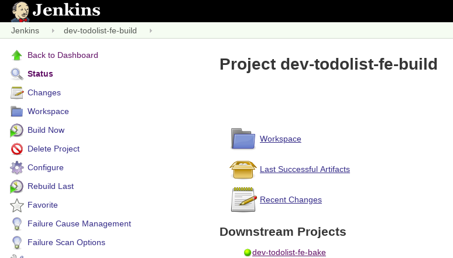
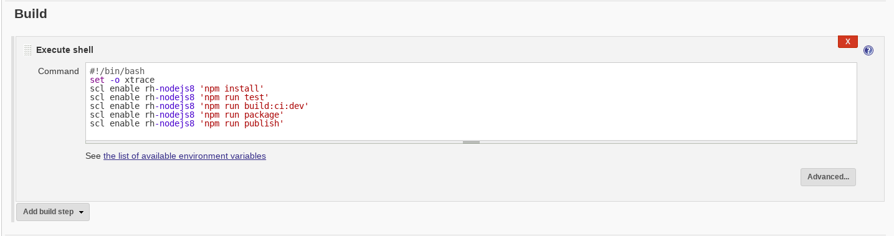
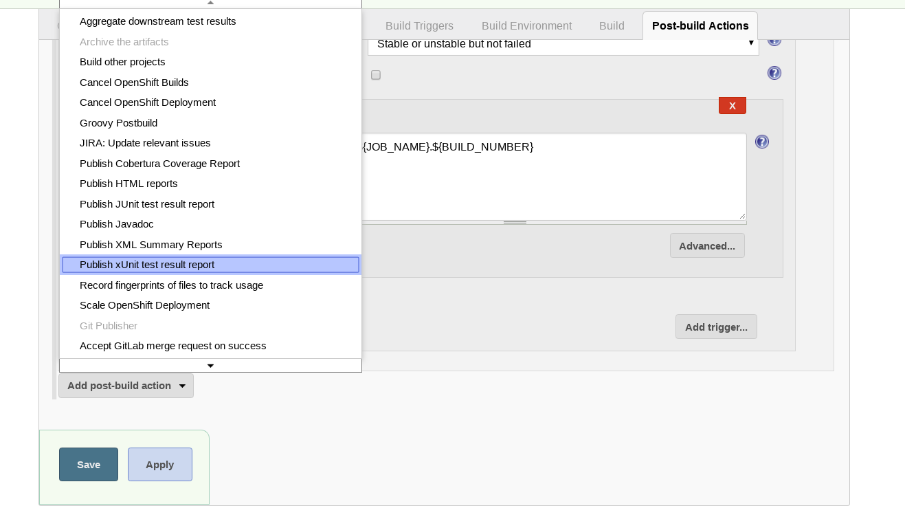
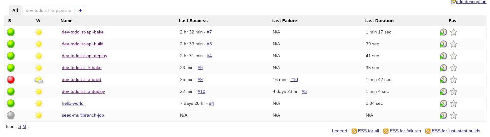
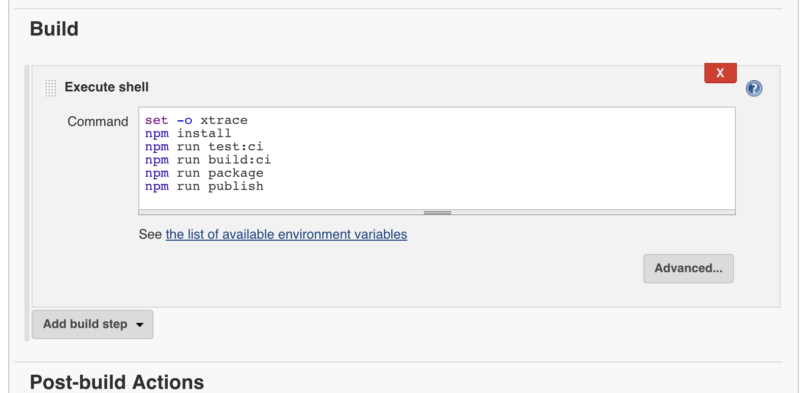

# Exercise Title

> The purpose of this lab is to develop and validate a new feature; and to promote the assured feature to production. The user story for our new feature is as follows
_____

## Learning Outcomes
As a learner you will be able to
- Do thing 1
- Do thing 2
- Do thing 3

## Tools and Frameworks
> Name of tool - short description and link to docs or website

1. [Jenkins](https://jenkins.io/) - OpenSource build automation server; highly customisable through plugins
1. [Ansible]() - blah blah ...

## Big Picture
This exercise begins cluster containing blah blah

_____

## 10,000 Ft View
> This should contain the goal of the exercise; with enough information that advanced learners could use this to build the exercise without much guidance. The information here

StoryID: DO421 | As a doer I want to mark todos as high priority so that I can keep track of and complete important todos first  On changing a todos
-------------  | -------------
Acceptance Criteria | 
priority: 
    should be doable with a single click
    should add a red flag against the todo when marked high-priority
    should remove the red colour flag on the flag when high-priority removed
    should not affect existing todos
On page load: 
    should display existing todos that are not marked high-priority 
    should display existing todos that are marked high-priority with an red flag

## Step by Step Instructions
> This is a fairly structured guide with references to exact filenames and sections of text to be added.

### Part 1 - Tests in our Pipeline 
> _In this exercise we will improve the pipeline created already by adding some unit tests for the frontend & backend along with some end to end tests (e2e) to validate the full solution_

#### Part 1a - Unit tests

2. Before linking our automated testing to the pipeline we'll first ensure the tests run locally. Change to the `todolist-fe` directory and run `test`.  
```bash
$ cd todolist-fe
$ npm run test
```
<p class="tip" > 
`test` is an alias used that runs `vue-cli-service test` from the scripts object in `package.json`
</p>


2. You should see an output similar to the following. The above command has run a test suite for every `*.spec.js` file. The table generated in the terminal shows the code coverage. We're going to be focusing on the unit tests for now.


2. Repeat the same process for `todolist-api` and verify that all the tests run.
```bash
$ cd todolist-api
$ npm run test
```

2. Navigate to your instance of jenkins at `https://jenkins-<YOUR_NAME>-ci-cd.apps.s8.core.rht-labs.com/`. 
Click on `dev-todolist-fe-build` and then click the `configure` button on the left-hand side.


2. Scroll to the `Build` part of the configuration page and add `scl enable rh-nodejs8 'npm run test'` below `scl enable rh-nodejs8 'npm install'`. Click `save` or `apply` at the bottom to save the changes.


2. Scroll to the `Post-build Actions` section and click `Add post-build action`. Select `Publish xUnit test result report`.


2. Click the `Add` button under `Publish xUnit test result report` and select `JUnit`. In the pattern field enter `test-report.xml`. In the `Failed Tests Thresholds`  input box enter 0 under `Red Ball Total`. It should look a little something like this:


2. Click `save` or `apply` at the bottom to save the changes. Rerun the `dev-todolist-fe-build` job and verify that this passes and the `build` and `bake` jobs are both triggered.

2. We're now going to deliberately fail a test to ensure that `bake` and `deploy` jobs aren't triggered if any tests fail. Go to `ListOfTodos.spec.js` in `/tests/unit/vue-components` and head to `line 38`. Add `not.` before `toHaveBeenCalled()`.


2. Push this to Gitlab and rerun the build job.
```bash
$ git add .
$ git commit -m "Deliberately failed test to test the pipeline stops me deploying broken code"
$ git push
```

2. Rerun the `dev-todolist-fe-build` job. It should have failed and not run any other builds. 


2. Undo the changes you made to the `ListOfTodos.spec.js` file, commit your code and rerun the build. This should trigger a full `build --> bake --> deploy` of `todolist-fe`.

2. We're now going to do the same for the api. Head to the `configure` panel of the `dev-todolist-api-build` job. 

2. Add `scl enable rh-nodejs8 'npm run test:ci'` above `npm run build:ci`.


2. Scroll to the `Post-build Actions` section and click `Add post-build action`. Select `Publish xUnit test result report`.

2. Click the `Add` button under `Publish xUnit test result report` and select `JUnit`. In the pattern field enter `reports/server/mocha/test-results.xml`. In the `Failed Tests Thresholds`  input box enter 0 under `Red Ball Total`. It should look a little something like this:


2. We're now going to deliberately fail a test again to ensure that `bake` and `deploy` jobs aren't triggered if any tests fail. Go to `todo.spec.js` in `/server/api/todo` and head to `line 35`. Replace `false` with `true`. 


2. Push this to Gitlab and rerun the build job.
```bash
$ git add .
$ git commit -m "Deliberately failed test to test the pipeline stops me deploying broken code"
$ git push
```

2. If successful this will fail the build and not run the `bake` or `deploy` jobs. Don't forget to remove the changes that you made to your tests!

#### Part 1b - End to End tests (e2e)
> TODO - this section is not complete

2. Add new part to the dev pipeline (`dev-todolist-fe-e2e`)

2. Add e2e tests and reporting to Jenkins

### Part 2 - Our App's new feature
> _In this exercise we will introduce a new feature to create an important flag on the todos. In order to be able to build and test our feature we will use TDD_

// TODO - OUR USER STORY SHOULD GO HERE !

#### Part 1a - Create todolist-fe tests
> In this exercise we will execute our test for the frontend and backend locally. Once verified we will add them to Jenkins.

3. Create a new branch in your `todolist-fe` app for our feature and push it to the remote
```bash
$ git checkout -b feature/important-flag
$ git push -u origin feature/important-flag
```

#### Part 1b - Create todolist-api tests

3. TODO

#### Part 1c - Create todolist e2e tests

3. TODO

_____

## Extension Tasks
> _Ideas for go-getters. Advanced topic for doers to get on with if they finish early. These will usually not have a solution and are provided for additional scope._

 - Add Auth to your application
 - Do some other stuff

## Additional Reading
> List of links or other reading that might be of use / reference for the exercise

## Slide links
> link back to the deck for the supporting material