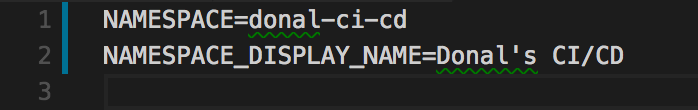
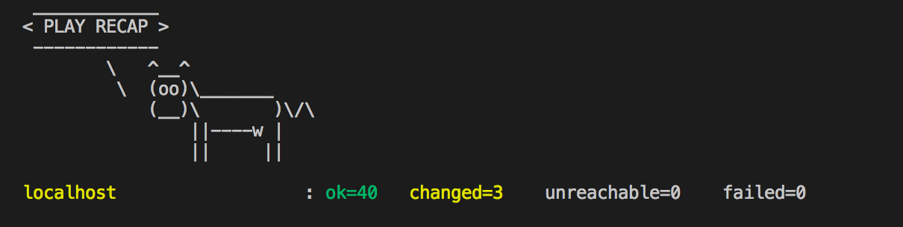

# The Manual Menace

> In this lab learners will use Ansible to drive automated provisioning of Projects, Access Control, Git, Jenkins and Nexus

_____

## Learning Outcomes
As a learner you will be able to

1. Run the OpenShift Applier to automate creating cluster content
1. Create and admin project namespaces in OpenShift
1. Deploy commonly used applications to support the development process

## Tools and Frameworks

* [GitLab](https://about.gitlab.com/) - Community driven Git server now with integrated DevOps Toolchain.
* [Nexus](https://www.sonatype.com/nexus-repository-sonatype) - Repository manager for storing lots of application types. Can also host `npm` and `Docker` registries.
* [Jenkins](https://jenkins.io/) - OpenSource Build automation server. Highly customisable with plugins.
* [Ansible](https://www.ansible.com/) - IT Automation tool used to provision and manage state of cloud and physical infrastructure.
* [OpenShift Applier](https://github.com/redhat-cop/openshift-applier) - Community driven Git server

## Big Picture
This exercise begins with an empty Cluster
> TODO - add big picture here...

_____

## 10,000 Ft View
> This lab is aimed at the creation of the tooling that will be used to support the rest of the Exercises. The highlevel goal is to create a collection of project namespaces and populate them with Git, Jenkins & Nexus.

If you're feeling confident and don't want to follow the step-by-step guide these highlevel instructions should provide a challenge for you:

2. Clone the repo `git@github.com:rht-labs/enablement-ci-cd.git` which contains the scaffold of the project.
2. Create `<your-name>-ci-cd`, `<your-name>-dev` and `<your-name>-test` project namespaces using the inventory and run them with the OpenShift Applier to populate the cluster
2. Use the templates provided to create build and deployment configs in `<your-name>-ci-cd` for:
    * Nexus
    * GitLab
    * Jenkins
2. Commit your `enablement-ci-cd` repository to the GitLab Instance you've created

## Step by Step Instructions
> This is a structured guide with references to exact filenames and explanations.

### Part 1 - Create OpenShift Projects
3. Clone the scaffold project to your local machine and open it in your favourite editor.
```bash
git clone git@github.com:rht-labs/enablement-ci-cd.git
```

3. The project is laid out as follows
```
.
├── README.md
├── docker
│   └── jenkins-slave-node
├── inventory
│   ├── group_vars
│   │   └── all.yml
│   └── hosts
├── jenkins-s2i
│   ├── configuration
├── params
│   └── project-requests-ci-cd
├── requirements.yml
└── templates
        └── project-requests.yml
```
 * `docker` folder contains our jenkins-slave images that will be used by the builds.
 * `jenkins-s2i` contains the configuration and plugins we want to bring jenkins to life with
 * `params` houses the variables we will load the templates with
 * `templates` is a collection of OpenShift templates
 * `inventory/group_vars/all.yml` is the collection of objects we want to insert into the cluster.
 * `requirements.yml` is a manifest which contains the ansible modules needed to run the playbook
Open the `inventory/group_vars/all.yml` file; you should see a some variables setup to create the `ci-cd` namespace. This calls the `templates/project-requests.yml` template with the `params/project-requests-ci-cd` parameters. We will add some additional content here but first let's explore the parameters and the template

3. Open the `params/project-requests-ci-cd` and replace the `<your name or initials>` with your name to create the correstponding projects in the cluster. 


3. Create another two params files for `params/project-requests-dev` & `params/project-requests-test` and add the `NAMESPACE=<your name>-dev` && `NAMESPACE=<your name>-test` and update their Display names.

3. In the `inventory/group_vars/all.yml` file; add the new inventory items for the projects you want to create (dev & test) by adding another object to the content array. You can copy and paste them from the `ci-cd` example and update them accordingly eg
```yaml
  - name: <your name>-dev
    template: "{{ inventory_dir }}/../templates/project-requests.yml"
    template_action: create
    params: "{{ inventory_dir }}/../params/project-requests-dev"
    tags:
    - projects
  - name: <your name>-test
    template: "{{ inventory_dir }}/../templates/project-requests.yml"
    template_action: create
    params: "{{ inventory_dir }}/../params/project-requests-test"
    tags:
    - projects
```


3. With the configuration in place; install the OpenShift Applier dependency
```bash
$ ansible-galaxy install -r requirements.yml --roles-path=roles
```

3. Apply the inventory by logging into OpenShift and then running 
```bash
$ oc login -p <password> -u <user> <cluster_url>
$ ansible-playbook roles/casl-ansible/playbooks/openshift-cluster-seed.yml -i inventory/
``` 

3. Once successful you should see an output similar to this 

### Part 2 - Nexus and GitLab
> _Now that we have our Projects setup; we can start to populate them with Apps to be used in our dev lifecycle_

4. In the `enablement-ci-cd` repo, checkout the templates for GitLab and Nexus by running
```bash
$ git checkout 
```

4. 
4. 
4. 
4. 

### Part 3 - Jenkins & s2i
5. Add new plugin ...

### Part 4 - live, die repeat
6. Commit your code to the new repo in GitLab

6. Burn it to the ground 

_____

## Extension Tasks
> Ideas for go-getters. Advanced topic for doers to get on with if they finish early. These will usually not have a solution and are provided for additional scope.

 - Add Auth to your application
 - Do some other stuff

_____

## Additional Reading
 > List of links or other reading that might be of use / reference for the exercise
