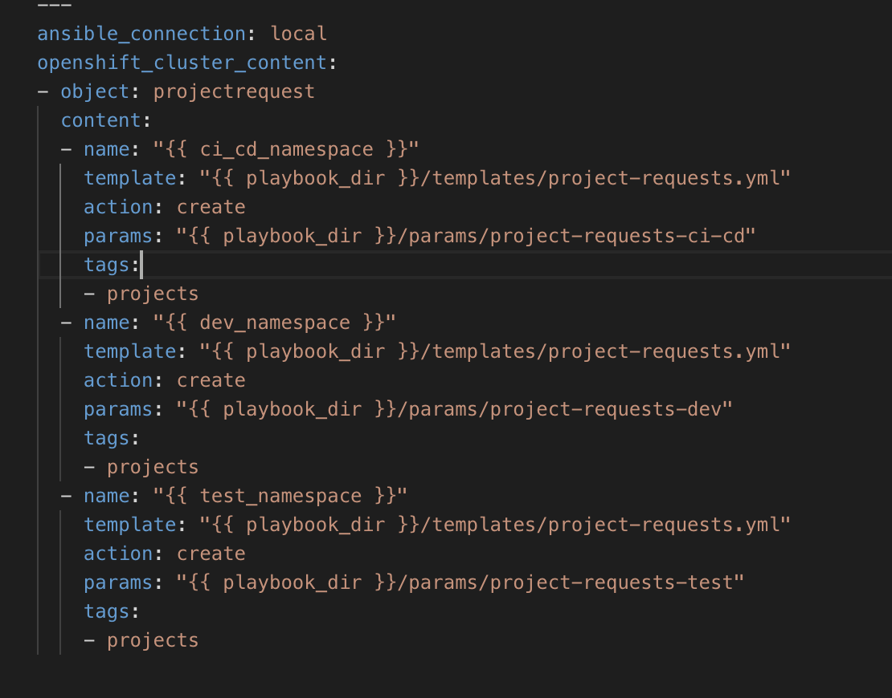
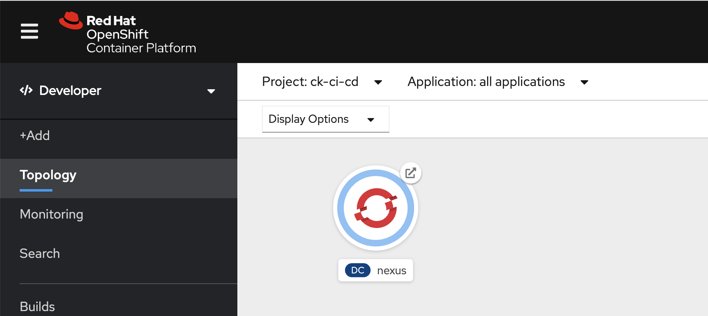
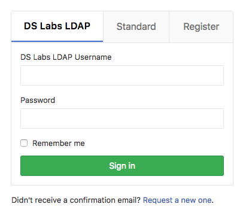
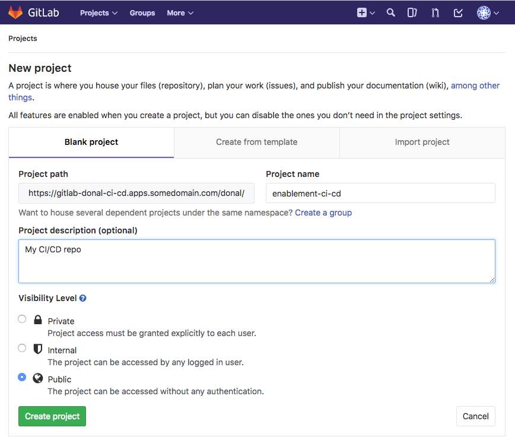
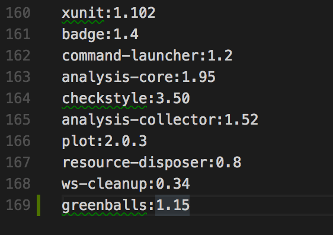
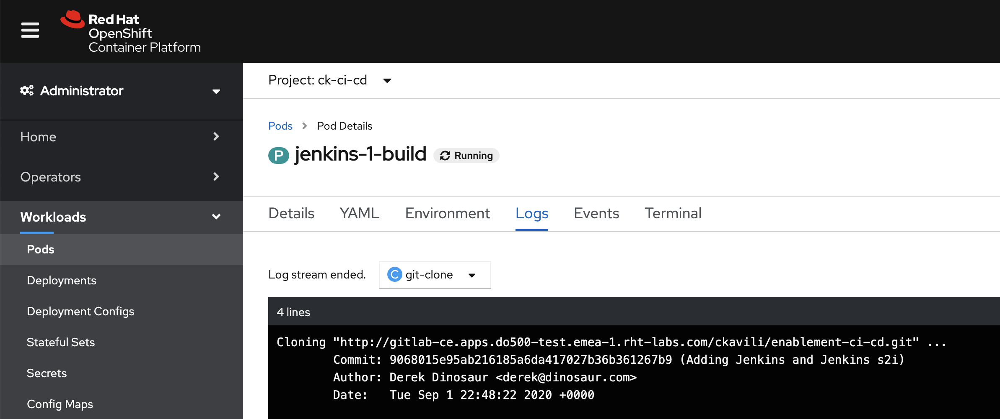
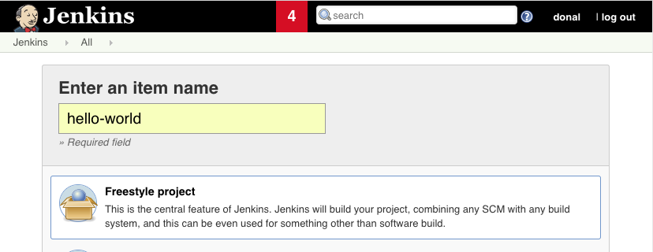
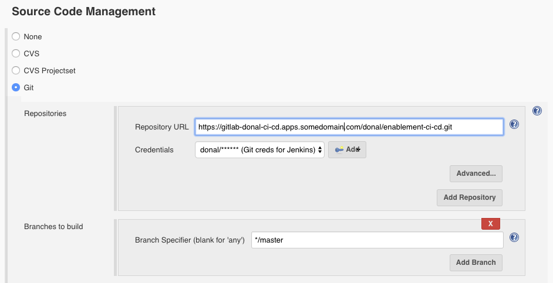
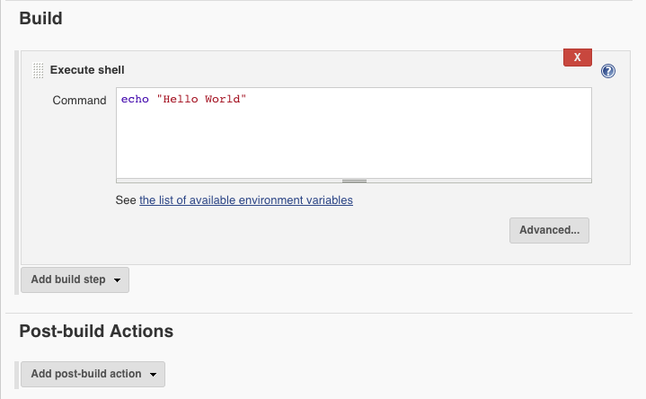

# The Manual Menace
> In this lab learners will use Ansible to drive automated provisioning of Projects in Openshift, Git, Jenkins and Nexus.


## Exercise Intro
In this exercise we will use automation tooling to create Project namespaces for our `CI/CD` tooling along with the `dev` and `test` namespaces for our deployments to live. We do this to manually using the OpenShift CLI; but as we go from cluster to cluster or project to project Dev and Ops teams often find themselves having to redo these tasks again and again. Configuring our cluster using code; we can easily store this in Git and repeat the process again and again. By minimising the time taken to do these repetitive tasks we can accelerate our ability to deliver value to our customers; working on the hard problems they face.

This exercise uses Ansible to drive the creation of the cluster content. In particular; we'll use a play book called the `OpenShift Applier`. Once the project namespace have been created; we will add some tools to support CI/CD such as Jenkins, Git and Nexus. These tools will be needed by later lessons to automate the build and deploy of our apps. Again; we will use OpenShift Templates and drive their creation in the cluster using Ansible. To prove things are working, finally we'll delete all our content and re-apply the inventory to re-create our clusters content.

#### Why is config-as-code important? 
* Assurance - Prevents unwanted config changes from people making arbitrary changes to environments. No more Snowflake servers!
* Traceability - Commiting config as code means a user has approved and changes can be tracked.
* Phoenix Server -  Burn it all to the ground and bring it back; exactly the way it was!

_____

## Learning Outcomes
As a learner you will be able to

1. Run the OpenShift Applier to automate creating cluster content
1. Create and admin project namespaces in OpenShift
1. Deploy commonly used applications to support the development process

## Tools and Frameworks

* [GitLab](https://about.gitlab.com/) - Community driven Git server now with integrated DevOps Toolchain.
* [Nexus](https://www.sonatype.com/nexus-repository-sonatype) - Repository manager for storing lots of application types. Can also host `npm` and `Docker` registries.
* [Jenkins](https://jenkins.io/) - OpenSource Build automation server. Highly customisable with plugins.
* [Ansible](https://www.ansible.com/) - IT Automation tool used to provision and manage state of cloud and physical infrastructure.
* [OpenShift Applier](https://github.com/redhat-cop/openshift-applier) - used to apply OpenShift objects to an OpenShift Cluster.


## Big Picture
This exercise begins with an empty Cluster
> TODO - add big picture here...

_____

## 10,000 Ft View
> This lab is aimed at the creation of the tooling that will be used to support the rest of the Exercises. The highlevel goal is to create a collection of project namespaces and populate them with Git, Jenkins & Nexus.

If you're feeling confident and don't want to follow the step-by-step guide these highlevel instructions should provide a challenge for you:

2. Clone the repo `https://github.com/rht-labs/enablement-ci-cd` which contains the scaffold of the project.

2. Create `<your-name>-ci-cd`, `<your-name>-dev` and `<your-name>-test` project namespaces using the inventory and run them with the OpenShift Applier to populate the cluster

2. Use the templates provided to create build and deployment configs in `<your-name>-ci-cd` for. Templates are on a branch called `exercise1/git-nexus` && `exercise1/jenkins`:
    * Nexus
    * GitLab
    * Jenkins (using an s2i to pre-configure jenkins)

2. Commit your `enablement-ci-cd` repository to the GitLab Instance you've created

2. Burn it all down and re-apply your inventory proving config-as-code works. 

## Step by Step Instructions
> This is a structured guide with references to exact filenames and explanations.

### Part 1 - Create OpenShift Projects
> _Using the OpenShift Applier, we will add new project namespaces to the cluster which will be used throughout the exercise._

3. Clone the scaffold project to your local machine and pull all remote branches for use in later labs. Open the repo in your favourite editor.
```bash
$ git clone https://github.com/rht-labs/enablement-ci-cd && cd enablement-ci-cd
```
Followed by;
```
$ for branch in `git branch -a | grep remotes | grep -v HEAD | grep -v master`; do
   git branch --track ${branch#remotes/origin/} $branch
done
```

3. The project is laid out as follows
```
.
├── README.md
├── apply.yml
├── docker
│   └── jenkins-slave-npm
├── inventory
│   ├── host_vars
│   │   ├── ci-cd-tooling.yml
│   │   └── projects-and-policies.yml
│   └── hosts
├── jenkins-s2i
├── params
│   └── project-requests-ci-cd
├── requirements.yml
└── templates
    └── project-requests.yml
```
 * `docker` folder contains our jenkins-slave images that will be used by the builds.
 * `jenkins-s2i` contains the configuration and plugins we want to bring jenkins to life with
 * `params` houses the variables we will load the templates with
 * `templates` is a collection of OpenShift templates
 * `inventory/host_vars/*.yml` is the collection of objects we want to insert into the cluster.
 * `requirements.yml` is a manifest which contains the ansible modules needed to run the playbook
 * `apply.yml` is a playbook that sets up some variables and runs the OpenShift Applier role.

3. Open the `apply.yml` file in the root of the project. Update the namespace variables by replacing the `<YOUR_NAME>` with your name or initials. For example; my name is Dónal so I've created: 
```yaml
  hosts: "{{ target }}"
  vars:
    ci_cd_namespace: donal-ci-cd
    dev_namespace: donal-dev
    test_namespace: donal-test
  tasks:
```
<p class="tip">
NOTE - yaml is indentation sensitive so keep things lined up properly!
</p>

3. Open the `inventory/host_vars/projects-and-policies.yml` file; you should see some variables setup already to create the `<YOUR_NAME>-ci-cd` namespace. This object is passed to the OpenShift Applier to call the `templates/project-requests.yml` template with the `params/project-requests-ci-cd` parameters. We will add some additional content here but first let's explore the parameters and the template

3. Open the `params/project-requests-ci-cd` and replace the `<YOUR_NAME>` with your name to create the correstponding projects in the cluster. 


3. Let's add two more param files to pass to our template to be able to create a `dev` and `test` project.
  * Create another two params files `params/project-requests-dev` & `params/project-requests-test`. 
  * Add to `params/project-requests-dev` the following; substituting `<YOUR_NAME>` accordingly
```
NAMESPACE=<YOUR_NAME>-dev
NAMESPACE_DISPLAY_NAME=<YOUR-NAME> Dev
```
  * Add to `params/project-requests-test` the following; substituting `<YOUR_NAME>` accordingly
```
NAMESPACE=<YOUR_NAME>-test
NAMESPACE_DISPLAY_NAME=<YOUR-NAME> Test
```

3. In the `inventory/host_vars/projects-and-policies.yml` file; add the new objects for the projects you want to create (dev & test) by adding another object to the content array for each. You can copy and paste them from the `ci-cd` example and update them accordingly. If you do this; remember to change the params file! e.g.
```yaml
    - name: "{{ dev_namespace }}"
      template: "{{ playbook_dir }}/templates/project-requests.yml"
      template_action: create
      params: "{{ playbook_dir }}/params/project-requests-dev"
      tags:
      - projects
    - name: "{{ test_namespace }}"
      template: "{{ playbook_dir }}/templates/project-requests.yml"
      template_action: create
      params: "{{ playbook_dir }}/params/project-requests-test"
      tags:
      - projects
```


3. With the configuration in place; install the OpenShift Applier dependency
```bash
$ ansible-galaxy install -r requirements.yml --roles-path=roles
```

3. Apply the inventory by logging into OpenShift and running the following: 
```bash
$ oc login -p <password> -u <user> <cluster_url>
$ ansible-playbook apply.yml -i inventory/ -e target=bootstrap
```
where the `-e target=bootstrap` is passing an additional variable specifying that we run the `bootstrap` inventory

3. Once successful you should see an output similar to this: 

3. You can check to see the projects have been created successfully by running 
```bash
$ oc projects
```


### Part 2 - Nexus and GitLab
> _Now that we have our Projects setup; we can start to populate them with Apps to be used in our dev lifecycle_

#### Part 2a - Nexus
4. In the `enablement-ci-cd` repo, checkout the templates for Nexus by running
```bash
$ git checkout exercise1/git-nexus templates/nexus.yml
```
The template contains all the things needed to setup a persistent nexus server, exposing a service and route while also creating the persistent volume needed. Have a read through the template; at the bottom you'll see a collection of parameters we will pass to the template.

4. Add some parameters for running the template by creating a new file in the `params` directory. 
```bash
$ touch params/nexus
```

4. The essential params to inclue in this file are: `params` directory. 
```bash
VOLUME_CAPACITY=5Gi
MEMORY_LIMIT=2Gi
```

4. Create a new object in the inventory variables `inventory/host_vars/ci-cd-tooling.yml` called `ci-cd-deployments` and populate it's `content` is as follows

```yaml
---
ansible_connection: local
openshift_cluster_content:
- object: ci-cd-tooling
  content:
    - name: "nexus"
      namespace: "{{ ci_cd_namespace }}"
      template: "{{ playbook_dir }}/templates/nexus.yml"
      params: "{{ playbook_dir }}/params/nexus"
      tags:
      - nexus
```


4. Run the OpenShift applier, specifying the tag `nexus` to speed up it's execution (`-e target=tools` is to run the other inventory).
```bash
$ ansible-playbook apply.yml -e target=tools \
     -i inventory/ \
     -e "filter_tags=nexus"
```

4. Once successful; login to the cluster through the browser (using cluster URL) and navigate to the `<YOUR_NAME>-ci-cd`. You should see Nexus up and running. You can login with default credentials (admin / admin123) 

#### Part 2b - GitLab
<p class="tip">
NOTE - This section may already have been completed for you, please check with your tutor. If this is the case, skip to section 6 to add your code to GitLab.
</p>

4. Now let's do the same thing for GitLab to get it up and running. Checkout the template and params provided by running
```bash
$ git checkout exercise1/git-nexus templates/gitlab.yml params/gitlab
``` 
Explore the template; it contains the PVC, buildConfig and services. The DeploymentConfig is made up of these apps
 - Redis (3.2.3)
 - PostgreSQL (9.4)
 - GitLab CE (v10.2.3)

4. Open the `params/gitlab` file and complete the following params
<p class="tip">
Note - The values here for the LDAP and BIND credentials will be provided by your tutor.
</p>
```
LDAP_BIND_DN=uid=<BIND_USER>,ou=People,dc=<YOUR_DOMAIN>,dc=com
LDAP_USER_FILTER=(memberof=CN=YourGroup,OU=Users,DC=<YOUR_DOMAIN>,DC=com)
LDAP_PASSWORD=<BIND_USER_PASSWORD>
LDAP_HOST=<LDAP_HOST>
LDAP_BASE=ou=People,dc=<YOUR_DOMAIN>,dc=com
LDAP_LABEL="<LDAP_DESCRIPTION>"
GITLAB_ROOT_PASSWORD=<GITLAB_ROOT_USER_PASSWORD>
GITLAB_DATA_VOL_SIZE=2Gi
POSTGRESQL_VOL_SIZE=1Gi
APPLICATION_HOSTNAME=<GITLAB_URL>
NAMESPACE=<YOUR_NAME>-ci-cd
```
where the following need to be replaced by actual values:
    * `<BIND_USER>` is the user used to query the LDAP
    * `<BIND_USER_PASSWORD>` is the password used when querying the LDAP
    * `<YOUR_DOMAIN>` is the domain the LDAP is hosted on
    * `<LDAP_HOST>` is fqdn of the LDAP server
    * `<LDAP_DESCRIPTION>` is the description to be used on the sign-in header for GitLab eg "Name LDAP Login"
    * `<GITLAB_ROOT_USER_PASSWORD>` is the root user for GOD access on the GitLab instance eg password123
    * `<GITLAB_URL>` is the endpoint for gitlab. It will take the form `gitlab-<YOUR_NAME>-ci-cd.apps.<ENV_ID>.<YOUR_DOMAIN>.com`

4. Create another object in the inventory `inventory/host_vars/ci-cd-tooling.yml` file to run the build & deploy of this template. Add the following and update the `namespace:` accordingly
```yaml
    - name: "gitlab"
      namespace: "{{ ci_cd_namespace }}"
      template: "{{ playbook_dir }}/templates/gitlab.yml"
      params: "{{ playbook_dir }}/params/gitlab"
      tags:
      - gitlab
```

4. Run the OpenShift applier, specifying the tag `gitlab` to speed up it's execution.
```bash
$ ansible-playbook apply.yml -e target=tools \
     -i inventory/ \
     -e "filter_tags=gitlab"
```

4. Once successful; login to the cluster and navigate to the `<YOUR_NAME>-ci-cd`. You should see GitLab up and running. 

4. Navigate to gitlab. You can login using your cluster credentials using the LDAP tab displaying your `<LDAP_DESCRIPTION>` from previous steps


4. Once logged in create a new project called `enablement-ci-cd` and mark it as internal. Once created; copy out the `git remote add origin ...` instructions for use on the next step.

<p class="tip">
Note - we would not normally make the project under your name but create an group and add the project there on residency but for simplicity of the exercise we'll do that here
</p>

4. Commit your local project to this new origin by first removing the existing origin (github) where the the project was cloned from. Remember to substitute `<YOUR_NEW_GIT_PROJECT>` accordingly
```bash
$ git remote set-url origin <YOUR_NEW_GIT_PROJECT>
$ git add . 
$ git commit -m "Adding git and nexus config"
$ git push -u origin --all
```
**Note - When making changes to enablement-ci-cd you should frequently commit the changes to git.**

### Part 3 - Jenkins & s2i
> _Create a build and deployment config for Jenkins. Add new configuration and plugins to the OCP Stock Jenkins using s2i_

5. Add the Jenkins Build & Deployment configs to the `enablement-ci-cd` repo by merging the contents `exercise1/jenkins` in
```bash
$ git checkout exercise1/jenkins templates/jenkins.yml
```
The Jenkins template is essentially the standard persistent jenkins one with OpenShift.

5. As before; create a new set of params by creating a `params/jenkins` file and adding some overrides to the template and updating the `NAMESPACE` value.
```bash
MEMORY_LIMIT=8Gi
VOLUME_CAPACITY=10Gi
JVM_ARCH=x86_64
NAMESPACE=<YOUR_NAME>-ci-cd
JENKINS_OPTS=--sessionTimeout=720
```

5. Add a `jenkins` variable to the ansible inventory underneath the git (if you have it) and nexus ones.
```yaml
    - name: "jenkins"
      namespace: "{{ ci_cd_namespace }}"
      template: "{{ playbook_dir }}/templates/jenkins.yml"
      params: "{{ playbook_dir }}/params/jenkins"
      tags:
      - jenkins
```
This configuration, if applied now, will create the deployment configuration needed for Jenkins but the `${NAMESPACE}:${JENKINS_IMAGE_STREAM_TAG}` in the template won't exist yet.

5. To create this image we will take the supported OpenShift Jenkins Image and bake into it some extra configuration using an [s2i](https://github.com/openshift/source-to-image) builder image. More information on Jenkins s2i is found on the [openshift/jenkins](https://github.com/openshift/jenkins#installing-using-s2i-build) github page. To create an s2i configuration for jenkins, check out the pre-canned configuration source in the `enablement-ci-cd` repo
```bash
$ git checkout exercise1/jenkins-s2i jenkins-s2i
```
The structure of the jenkins s2i config is 
```
jenkins-s2i
├── README.md
├── configuration
│   ├── build-failure-analyzer.xml
│   ├── init.groovy
│   ├── jenkins.plugins.slack.SlackNotifier.xml
│   └── jobs
│       └── seed-multibranch-job
│           └── config.xml
└── plugins.txt
```
 * `plugins.txt` is a list of `pluginId:version` for Jenkins to pre-install when starting
 * `./configuration` contains content that is placed in `${JENKINS_HOME}`. A `config.xml` could be placed in here to control the bulk of Jenkins configuration.
 * `./configuration/jobs/*` contains job names and xml config that jenkins loads when starting. The seed job in there we will return to in later lessons.
 * `build-failure-analyzer.xml` is config for the plugin to read the logs and look for key items based on a Regex. More on this in later lessons.
 * `init.groovy` contains a collection of settings jenkins configures itself with when launching

5. Let's add a plugin for Jenkins to be started with, [green-balls](https://plugins.jenkins.io/greenballs). This simply changes the default `SUCCESS` status of Jenkins from Blue to Green. Append the `plugins.txt` file with 
```txt
greenballs:1.15
``` 

Why does Jenkins have Blue Balls? More can be found [on reddit](https://www.reddit.com/r/programming/comments/4lu6q8/why_does_jenkins_have_blue_balls/) or the [jenkins blog](https://jenkins.io/blog/2012/03/13/why-does-jenkins-have-blue-balls/)

5. Before building and deploying the Jenkins s2i; add git credentials to it. These will be used by Jenkins to access the Git Repositories where our apps will be stored. We want Jenkins to be able to push tags to it so write access is required. There are a few ways we can do this; either adding them to the `template/jenkins.yml` as environment Variables and then including them in the `params/jenkins` file.  We could also create a token in GitLab and use it as the source secret in the jenkins template. 
But for simplicity just replace the `<USERNAME>` && `<PASSWORD>` in the `jenkins-s2i/configuration/init.groovy` with your ldap credentials as seen below. This init file gets run when Jenkins launches and will setup the credentials for use in our Jobs in the next exercises
<p class="tip">
Note in a residency we would not use your GitCredentials for pushing and pulling from Git, A service user would be created for this.
</p>
```groovy
gitUsername = System.getenv("GIT_USERNAME") ?: "<USERNAME>"
gitPassword = System.getenv("GIT_PASSWORD") ?: "<PASSWORD>"
```

5. Open the `params/jenkins-s2i` file and add the following content; replacing variables as appropriate. 
```
SOURCE_REPOSITORY_URL=<YOUR_ENABLEMENT_REPO>
NAME=jenkins
SOURCE_REPOSITORY_CONTEXT_DIR=jenkins-s2i
IMAGE_STREAM_NAMESPACE=<YOUR_NAME>-ci-cd
SOURCE_REPOSITORY_USERNAME=<BASE64_YOUR_LDAP_USERNAME>
SOURCE_REPOSITORY_PASSWORD=<BASE64_YOUR_LDAP_PASSWORD>
```
where 
    * `<YOUR_ENABLEMENT_REPO>` is the full path clone path of the repo where this project is stored (including the https && .git)
    * `<YOUR_NAME>` is the prefix for your `-ci-cd` project.
    * Explore some of the other parameters in `templates/jenkins-s2i.yml`
    * `<BASE64_YOUR_LDAP_USERNAME>` is the base64encoded username builder pod will use to login and clone the repo with
    * `<BASE64_YOUR_LDAP_PASSWORD>` is the base64encoded password the builder pod will use to authenticate and clone the repo using
You can use `echo -n '<YOUR_LDAP_PASSWORD>' | openssl base64` to encode your username and password accordingly. For example 'password' base64 encoded will look like `cGFzc3dvcmQ=`.
<p class="tip">
Note in a residency we would not use your GitCredentials for pushing and pulling from Git, A service user would be created for this.
</p>

5. Create a new object `ci-cd-builds` in the ansible `inventory/host_vars/ci-cd-tooling.yml` to drive the s2i build configuration.
```yaml
  - object: ci-cd-builds
    content:
    - name: "jenkins-s2i"
      namespace: "{{ ci_cd_namespace }}"
      template: "{{ playbook_dir }}/templates/jenkins-s2i.yml"
      params: "{{ playbook_dir }}/params/jenkins-s2i"
      tags:
      - jenkins
```

5. Commit your code to your GitLab instance
```bash
$ git add .
$ git commit -m "Adding Jenkins and Jenkins s2i"
$ git push
```

5. When your code is commited; run the OpenShift Applier to add the config to the cluster
```bash
$ ansible-playbook apply.yml -e target=tools \
     -i inventory/ \
     -e "filter_tags=jenkins"
```

5. This will trigger a build of the s2i and when it's complete it will add an imagestream of `<YOUR_NAME>-ci-cd/jenkins:latest` to the project. The Deployment config should kick in and deploy the image once it arrives. You can follow the build of the s2i by going to the OpenShift console's project


5. When the Jenkins deployment has completed; login (using your openshift credentials) and accept the role permissions. You should now see a fairly empty Jenkins with just the seed job

### Part 4 - Jenkins Hello World 
> _To test things are working end-to-end; create a hello world job that doesn't do much but proves we can pull code from git and that our balls are green._

6. Log in to Jenkins and hit `New Item` .

6. Create a freestyle job called `hello-world` .

6. On the Source Code Management tab; add your `enablement-ci-cd` git repo and hit the dropdown to add your credentials we baked into the s2i on previous steps 

6. On the build tab add an Execute Shell step and fill it with `echo "Hello World"` .

6. Run the build and we should see if pass succesfully and with Green Balls! 

### Part 5 - Live, Die, Repeat
> _In this section you will proove the infra as code is working by deleting your Cluster Content and recreating it all_

7. Commit your code to the new repo in GitLab
```bash
$ git add .
$ git commit -m "ADD - all ci/cd contents"
$ git push
```

7. Burn your OCP content to the ground
```bash
$ oc delete project <YOUR_NAME>-ci-cd
$ oc delete project <YOUR_NAME>-dev
$ oc delete project <YOUR_NAME>-test
```

7. Re-apply the inventory to re-create it all!
```bash
$ oc login -p <password> -u <user> <cluster_url>
$ ansible-playbook apply.yml -i inventory/ -e target=bootstrap
$ ansible-playbook apply.yml -i inventory/ -e target=tools
```

_____

## Extension Tasks
> _Ideas for go-getters. Advanced topic for doers to get on with if they finish early. These will usually not have a solution and are provided for additional scope._

 - Add more secure access for Nexus (ie not admin / admin123) using the automation to drive secret creation
 - Add a SonarQube persistent deployment to the `ci-cd-deployments` section.
 - Add `jenkins.plugins.slack.SlackNotifier.xml` to `jenkins-s2i/configuration` to include URL of Slack for team build notifications and rebuild Jenkins S2I

_____

## Additional Reading
> List of links or other reading that might be of use / reference for the exercise

## Slide links

- [Intro](https://docs.google.com/presentation/d/1LsfAkH8GfIhulEoy_yd-usWBfDHnZEyQdNvYeTmAg4A/)
- [Wrap-up](https://docs.google.com/presentation/d/1cfyJ6SHddZNbM61oz67r870rLYVKY335zGclXN2uLMY/)
- [All Material](https://drive.google.com/drive/folders/13Bt4BXf9P2OB8VI4YQNcNONF1786dqOx)
