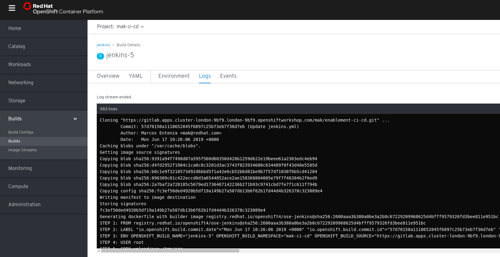

# The Manual Menace
> In this exercise learners will use Ansible to drive automated provisioning of Projects in OpenShift, Git, Jenkins and Nexus.


[image-ref](https://xkcd.com/)

## Exercise Intro
In this exercise we will use automation tooling to create Project namespaces for our `CI/CD` tooling along with the `dev` and `test` namespaces for our deployments to live. We do this manually using the OpenShift CLI; but as we go from cluster to cluster or project to project Dev and Ops teams often find themselves having to redo these tasks again and again. Configuring our cluster using code; we can easily store this in Git and repeat the process again and again. By minimising the time taken to do these repetitive tasks we can accelerate our ability to deliver value to our customers; working on the hard problems they face.

This exercise uses Ansible to drive the creation of the cluster content. In particular; we'll use a play book called the `OpenShift Applier`. Once the project namespace have been created; we will add some tools to support CI/CD such as Jenkins, Git and Nexus. These tools will be needed by later lessons to automate the build and deploy of our apps. Again; we will use OpenShift Templates and drive their creation in the cluster using Ansible. To prove things are working, finally we'll delete all our content and re-apply the inventory to re-create our cluster's content.

#### Why is config-as-code important?
* Assurance - Prevents unwanted config changes from people making arbitrary changes to environments. No more Snowflake servers!
* Traceability - Committing config as code means a user has approved and changes can be tracked.
* Phoenix Server -  Burn it all to the ground and bring it back; exactly the way it was!

_____

## Learning Outcomes
As a learner you will be able to

1. Run the OpenShift Applier to automate creating cluster content
1. Create and admin project namespaces in OpenShift
1. Deploy commonly used applications to support the development process

## Tools and Frameworks

* [GitLab](https://about.gitlab.com/) - Community driven Git server now with integrated DevOps Toolchain.
* [Nexus](https://www.sonatype.com/nexus-repository-sonatype) - Repository manager for storing lots of application types. Can also host `npm` and `Docker` registries.
* [Jenkins](https://jenkins.io/) - OpenSource Build automation server. Highly customisable with plugins.
* [Ansible](https://www.ansible.com/) - IT Automation tool used to provision and manage state of cloud and physical infrastructure.
* [OpenShift Applier](https://github.com/redhat-cop/openshift-applier) - used to apply OpenShift objects to an OpenShift Cluster.

## Big Picture
> The Big Picture is our emerging architecture; starting with an empty cluster we populate it with projects and some ci/cd tooling.


_____

<!-- ## 10,000 Ft View
> This exercise is aimed at the creation of the tooling that will be used to support the rest of the Exercises. The high-level goal is to create a collection of project namespaces and populate them with Git, Jenkins & Nexus.

If you're feeling confident and don't want to follow the step-by-step guide these high-level instructions should provide a challenge for you:

1. Clone the repo `https://github.com/rht-labs/enablement-ci-cd` which contains the scaffold of the project. Ensure you get all remote branches.

2. Create `<your-name>-ci-cd`, `<your-name>-dev` and `<your-name>-test` project namespaces using the inventory and run them with the OpenShift Applier to populate the cluster

3. Use the templates provided to create build of the jenkins-s2i. The templates are in `exercise1/jenkins-s2i`

4. Use the templates provided to create build and deployment configs in `<your-name>-ci-cd` for. Templates are on a branch called `exercise1/git-nexus` && `exercise1/jenkins`:
    * Nexus
    * GitLab
    * Jenkins (using an s2i to pre-configure Jenkins)

5. Commit your `enablement-ci-cd` repository to the GitLab Instance you've created

6. Burn it all down and re-apply your inventory proving config-as-code works.
-->

## Step by Step Instructions
<!-- > This is a structured guide with references to exact filenames and explanations.  -->

### Part 1 - Create OpenShift Projects
> _Using the OpenShift Applier, we will add new project namespaces to the cluster which will be used throughout the exercise._

1. In this course three different git projects will be created. To setup your local machine for each of these, create a new folder on the terminal in the root of your HOME directory for convenience. To do this, open a new Terminal session and create the new folder using the following command (new terminal sessions will start in your HOME dir).

For Linux and MacOS systems
```bash
mkdir -p ~/do500-workspace && cd ~/do500-workspace
```

For Microsoft Windows systems, navigate to the `C:\do500-workspace` directory
```bash
cd C:\do500-workspace
```
<p class="tip">
<b>NOTE</b> - If you do not want to have this folder at the root of your home directory, that's fine, just ensure any parent directories of this `do500-workspace` folder do <b>NOT</b> have any spaces in them as it breaks Ansible in later labs...
</p>

2. Clone the scaffold project to your local machine's `do500-workspace` folder and pull all remote branches for use in later exercises. You may see an error saying `fatal: A branch named 'develop' already exists.` This error can be safely ignored.

```bash
git clone https://github.com/rht-labs/enablement-ci-cd && cd enablement-ci-cd
```
```bash
./git-pull-all.sh
```

If you are using a Microsoft Windows system, run the above shell script using the `Git Bash` terminal instead of the default Windows command line. You need to navigate to the `C:\do500-workspace\enablement-ci-cd` directory by running
```bash
cd /c/do500-workspace/enablement-ci-cd
```
```bash
./git-pull-all.sh
```
```bash
exit
```

3. Open the `enablement-ci-cd` folder in VSCode (or your favourite editor). The project is laid out as follows
```
.
├── README.md
├── apply.yml
├── docker
├── inventory
│   ├── host_vars
│   │   ├── ci-cd-tooling.yml
│   │   └── projects-and-policies.yml
│   └── hosts
├── jenkins-s2i
├── params
│   └── project-requests-ci-cd
├── requirements.yml
└── templates
    └── project-requests.yml
```
 * `docker` folder contains sample Dockerfiles for our jenkins-slave images that will be used by the builds.
 * `jenkins-s2i` contains the configuration and plugins we want to bring jenkins to life with
 * `params` houses the variables we will load the templates with
 * `templates` is a collection of OpenShift templates
 * `inventory/host_vars/*.yml` is the collection of objects we want to insert into the cluster.
 * `requirements.yml` is a manifest which contains the ansible modules needed to run the playbook
 * `apply.yml` is a playbook that sets up some variables and runs the OpenShift Applier role.

4. Open the `apply.yml` file in the root of the project. Update the namespace variables by replacing the `<YOUR_NAME>` with your name or initials. Don't use uppercase or special characters. For example; my name is Donal so I've created:

```yaml
  # apply.yml

  hosts: "{{ target }}"
  vars:
    ci_cd_namespace: donal-ci-cd
    dev_namespace: donal-dev
    test_namespace: donal-test
  tasks:
```
<p class="tip">
<b>NOTE</b> - YAML is indentation sensitive so keep things lined up properly!
</p>

5. Open the `inventory/host_vars/projects-and-policies.yml` file; you should see some variables setup already to create the `<YOUR_NAME>-ci-cd` namespace. This object is passed to the OpenShift Applier to call the `templates/project-requests.yml` template with the `params/project-requests-ci-cd` parameters. We will add some additional content here but first let's explore the parameters and the template

6. Open the `params/project-requests-ci-cd` file:
```yaml
  # params/project-requests-ci-cd

  NAMESPACE=<YOUR_NAME>-ci-cd
  NAMESPACE_DISPLAY_NAME=<YOUR_NAME> Labs CI/CD
```
and replace the `<YOUR_NAME>` with your name to create the corresponding projects in the cluster.
```yaml
  # params/project-requests-ci-cd

  NAMESPACE=donal-ci-cd
  NAMESPACE_DISPLAY_NAME=Donal Labs CI/CD
```

7. Let's add two more params files to pass to our template to be able to create a `dev` and `test` project.
  * Create another two params files `params/project-requests-dev` & `params/project-requests-test`. On the terminal run
```bash
touch params/project-requests-dev params/project-requests-test
```
  * In your editor; Open `params/project-requests-dev` and add the following by substituting `<YOUR_NAME>` accordingly
  ```yaml
  # params/project-requests-dev

    NAMESPACE=<YOUR_NAME>-dev
    NAMESPACE_DISPLAY_NAME=<YOUR_NAME> Dev
  ```
  * In your editor; Open `params/project-requests-test` and add the following by substituting `<YOUR_NAME>` accordingly
  ```yaml
  # params/project-requests-test
  
    NAMESPACE=<YOUR_NAME>-test
    NAMESPACE_DISPLAY_NAME=<YOUR_NAME> Test
  ```

8. In the `inventory/host_vars/projects-and-policies.yml` file; add the new objects for the projects you want to create (dev & test) by adding another object to the content array for each. You can copy and paste them from the `ci-cd` example and update them accordingly. If you do this; remember to change the params file! e.g.
```yaml
   # inventory/host_vars/projects-and-policies.yml

    - name: "{{ dev_namespace }}"
      template: "{{ playbook_dir }}/templates/project-requests.yml"
      action: create
      params: "{{ playbook_dir }}/params/project-requests-dev"
      tags:
      - projects
    - name: "{{ test_namespace }}"
      template: "{{ playbook_dir }}/templates/project-requests.yml"
      action: create
      params: "{{ playbook_dir }}/params/project-requests-test"
      tags:
      - projects
```


For Microsoft Windows systems, you need to run Ansible and OpenShift client commands from inside the `do500-toolbox` container. Linux and MacOS users should skip this step and jump directly to Step 10.

<p class="tip">
<b>NOTE</b> - On Microsoft Windows systems, we recommend you keep the container running for the duration of the lab. Run all Ansible and OpenShift client ("oc") CLI commands from inside the container. Do NOT launch the container on Linux and MacOS systems, since you should already have Ansible and the OpenShift client natively installed on your system by following the pre-requisites setup guide.
</p>

9. Launch the toolbox container using the Windows command line terminal, and navigate to the `enablement-ci-cd` directory inside the container
```bash
docker run -it -v C:/do500-workspace:/home/tool-box/workarea:Z quay.io/redhat/do500-toolbox /bin/bash
bash-4.4$ cd workarea/enablement-ci-cd
```

10. With the configuration in place; install the OpenShift Applier dependency
```bash
ansible-galaxy install -r requirements.yml --roles-path=roles
```

11. Apply the inventory by logging into OpenShift on the terminal and running the playbook as follows (<CLUSTER_URL> should be replaced with the one you've been provided by the instructor). Accept any insecure connection warning 👍:
```bash
oc login <CLUSTER_URL>
```
```bash
ansible-playbook apply.yml -i inventory/ -e target=bootstrap
```
where the `-e target=bootstrap` is passing an additional variable specifying that we run the `bootstrap` inventory

12. Once successful you should see an output similar to this (Cows not included): 

13. You can check to see the projects have been created successfully by running
```bash
oc projects
```


### Part 2 - Nexus
> _Now that we have our Projects setup; we can start to populate them with Apps to be used in our dev lifecycle_

1. In the `enablement-ci-cd` repo, checkout the templates for Nexus by running
```bash
git checkout exercise1/git-nexus templates/nexus.yml
```
The template contains all the things needed to setup a persistent nexus server, exposing a service and route while also creating the persistent volume needed. Have a read through the template; at the bottom you'll see a collection of parameters we will pass to the template.

2. Add some parameters for running the template by creating a new file in the `params` directory.
```bash
touch params/nexus
```

3. The essential params to include in this file are:
```bash
# params/nexus

  VOLUME_CAPACITY=5Gi
  MEMORY_LIMIT=1Gi
```

4. Add a new content item in the inventory variables `inventory/host_vars/ci-cd-tooling.yml` called `nexus` and populate it as follows

```yaml
# inventory/host_vars/ci-cd-tooling.yml

---
ansible_connection: local
openshift_cluster_content:
- object: ci-cd-tooling
  content:
  - name: "nexus"
    namespace: "{{ ci_cd_namespace }}"
    template: "{{ playbook_dir }}/templates/nexus.yml"
    params: "{{ playbook_dir }}/params/nexus"
    tags:
    - nexus
```


5. Run the OpenShift applier, specifying the tag `nexus` to speed up its execution (`-e target=tools` is to run the other inventory).
```bash
ansible-playbook apply.yml -e target=tools \
     -i inventory/ \
     -e "filter_tags=nexus"
```

6. Once successful; login to the cluster through the browser (using cluster URL) and navigate to the `<YOUR_NAME>-ci-cd`. You should see Nexus up and running. You can login with default credentials (admin / admin123) 

### Part 3 - GitLab

<!-- #### 3a - GitLab install -->

<p class="tip">
<b>NOTE</b> - A Gitlab instance in the cloud has already been set up for you, please check with your instructor for the Gitlab instance URL.
</p>

<!-- 4. Now let's do the same thing for GitLab to get it up and running. Checkout the template and params provided by running
```bash
git checkout exercise1/git-nexus templates/gitlab.yml params/gitlab
```
Explore the template; it contains the PVC, buildConfig and services. The DeploymentConfig is made up of these apps
 - Redis (3.2.3)
 - PostgreSQL (9.4)
 - GitLab CE (v10.2.3)

4. Open the `params/gitlab` file and complete the following params

<p class="tip">
<b>NOTE</p> - The values here for the LDAP and BIND credentials will be provided by your tutor.
</p>
```
LDAP_BIND_DN=uid=<BIND_USER>,ou=People,dc=<YOUR_DOMAIN>,dc=com
LDAP_USER_FILTER=(memberof=CN=YourGroup,OU=Users,DC=<YOUR_DOMAIN>,DC=com)
LDAP_PASSWORD=<BIND_USER_PASSWORD>
LDAP_HOST=<LDAP_HOST>
LDAP_BASE=ou=People,dc=<YOUR_DOMAIN>,dc=com
LDAP_LABEL="<LDAP_DESCRIPTION>"
GITLAB_ROOT_PASSWORD=<GITLAB_ROOT_USER_PASSWORD>
GITLAB_DATA_VOL_SIZE=2Gi
POSTGRESQL_VOL_SIZE=1Gi
APPLICATION_HOSTNAME=<GITLAB_URL>
NAMESPACE=<YOUR_NAME>-ci-cd
```
where the following need to be replaced by actual values:
    * `<BIND_USER>` is the user used to query the LDAP
    * `<BIND_USER_PASSWORD>` is the password used when querying the LDAP
    * `<YOUR_DOMAIN>` is the domain the LDAP is hosted on
    * `<LDAP_HOST>` is fqdn of the LDAP server
    * `<LDAP_DESCRIPTION>` is the description to be used on the sign-in header for GitLab e.g. "Name LDAP Login"
    * `<GITLAB_ROOT_USER_PASSWORD>` is the root user for GOD access on the GitLab instance e.g. password123
    * `<GITLAB_URL>` is the endpoint for gitlab. It will take the form `gitlab-<YOUR_NAME>-ci-cd.apps.<ENV_ID>.<YOUR_DOMAIN>.com`

4. Create another object in the inventory `inventory/host_vars/ci-cd-tooling.yml` file to run the build & deploy of this template. Add the following and update the `namespace:` accordingly
```yaml
    - name: "gitlab"
      namespace: "{{ ci_cd_namespace }}"
      template: "{{ playbook_dir }}/templates/gitlab.yml"
      params: "{{ playbook_dir }}/params/gitlab"
      tags:
      - gitlab
```

4. Run the OpenShift applier, specifying the tag `gitlab` to speed up its execution.
```bash
ansible-playbook apply.yml -e target=tools \
     -i inventory/ \
     -e "filter_tags=gitlab"
```

4. Once successful; login to the cluster and navigate to the `<YOUR_NAME>-ci-cd`. You should see GitLab up and running.  -->

<!-- #### 3b - Commit CI/CD -->

1. Navigate to GitLab login page. You can login using your cluster credentials using the LDAP tab


2. Once logged in create a new project called `enablement-ci-cd` and mark it as internal. Once created; copy out the `git url` for use on the next step.

<!-- 
<p class="tip">
<b>NOTE</b> - we would not normally make the project under your name but create a group and add the project there on residency but for simplicity of the exercise we'll do that here
</p>
-->

3. If you have not used Git before; you may need to tell Git who you are and what your email is before we commit. Run the following commands, substituting your email and "Your Name". If you've done this before move on to the next step. The last git config command is used to bypass SSL key verification in this repo since we are using self-signed certificates on the GitLab sever.

```bash
git config --global user.email "yourname@mail.com"
```
```bash
git config --global user.name "Your Name"
```

```bash
git config http.sslVerify false
```

4. Commit your local project to this new remote by first removing the existing origin (github) where the Ansible project was cloned from in the first steps. Remember to substitute `<GIT_URL>` accordingly with the one created for your `enablement-ci-cd` repository a moment ago.
```bash
git remote set-url origin <GIT_URL>
```
```bash
git add .
```
```bash
git commit -m "Adding git and nexus config"
```
```bash
git push -u origin --all
```

### Part 4 - MongoDB for CI tests
> _In order to run our API tests in CI in later labs; we need there to be a MongoDB available for executing our tests. As this is part of our CI/CD Lifecycle; we will add it now._

1. In our `enablement-ci-cd` repo; checkout the mongo templates as shown below to bring in the template and params.
```bash
git checkout exercise1/mongodb params/mongodb templates/mongodb.yml
```

1. Open `enablement-ci-cd` in your favourite editor. Edit the `inventory/host_vars/ci-cd-tooling.yml` to include a new object for our mongodb as shown below. This item can be added below Nexus in the `ci-cd-tooling` section.
```yaml
# inventory/host_vars/ci-cd-tooling.yml

  - name: "jenkins-mongodb"
    namespace: "{{ ci_cd_namespace }}"
    template: "{{ playbook_dir }}/templates/mongodb.yml"
    params: "{{ playbook_dir }}/params/mongodb"
    tags:
    - mongodb
```


3. Git commit your updates to the inventory to git for traceability.
```bash
git add .
```
```bash
git commit -m "ADD - mongodb for use in the pipeline"
```
```bash
git push
```

4. Apply this change as done previously using Ansible. The deployment can be validated by going to your `<YOUR_NAME>-ci-cd` namespace and checking if it is there!
```bash
ansible-playbook apply.yml -e target=tools \
  -i inventory/ \
  -e "filter_tags=mongodb"
```


<p class="tip">
<b>NOTE</b> - When making changes to the "enablement-ci-cd" repo, you should frequently commit the changes to git.
</p>

### Part 5 - Jenkins & S2I
> _Create a build and deployment config for Jenkins. Add new configuration and plugins to the OpenShift default Jenkins image using s2i_

1. Add the Jenkins Build & Deployment configs to the `enablement-ci-cd` repo by checking out the contents from `exercise1/jenkins` with 
```bash
git checkout exercise1/jenkins templates/jenkins.yml
```

1. As before; create a new set of params by creating a `params/jenkins` file and adding some overrides to the template and updating the `<YOUR_NAME>` value accordingly.
```yaml
# params/jenkins

  MEMORY_LIMIT=3Gi
  VOLUME_CAPACITY=10Gi
  JVM_ARCH=x86_64
  NAMESPACE=<YOUR_NAME>-ci-cd
  JENKINS_OPTS=--sessionTimeout=720
```

3. Add a `jenkins` variable to the Ansible inventory underneath the jenkins-mongo (and git if you have it) in  `inventory/host_vars/ci-cd-tooling.yml`.
```yaml
   # inventory/host_vars/ci-cd-tooling.yml

    - name: "jenkins"
      namespace: "{{ ci_cd_namespace }}"
      template: "{{ playbook_dir }}/templates/jenkins.yml"
      params: "{{ playbook_dir }}/params/jenkins"
      tags:
      - jenkins
```
This configuration, if applied now, will create the deployment configuration needed for Jenkins but the `${NAMESPACE}:${JENKINS_IMAGE_STREAM_TAG}` in the template won't exist yet.

4. To create this image we will take the supported OpenShift Jenkins Image and bake into it some extra configuration using an [s2i](https://github.com/openshift/source-to-image) builder image. More information on Jenkins s2i is found on the [openshift/jenkins](https://github.com/openshift/jenkins#installing-using-s2i-build) GitHub page. To create an s2i configuration for Jenkins, check out the pre-canned configuration source in the `enablement-ci-cd` repo
```bash
git checkout exercise1/jenkins-s2i jenkins-s2i
```
The structure of the Jenkins s2i config is
```
jenkins-s2i
├── README.md
├── configuration
│   ├── build-failure-analyzer.xml
│   ├── init.groovy
│   ├── jenkins.plugins.slack.SlackNotifier.xml
│   ├── scriptApproval.xml
│   └── jobs
│       └── seed-multibranch-job
│           └── config.xml
└── plugins.txt
```
 * `plugins.txt` is a list of `pluginId:version` for Jenkins to pre-install when starting
 * `./configuration` contains content that is placed in `${JENKINS_HOME}`. A `config.xml` could be placed in here to control the bulk of Jenkins configuration.
 * `./configuration/jobs/*` contains job names and xml config that jenkins loads when starting. The seed job in there we will return to in later lessons.
 * `build-failure-analyzer.xml` is config for the plugin to read the logs and look for key items based on a Regex. More on this in later lessons.
 * `init.groovy` contains a collection of settings jenkins configures itself with when launching

5. Let's add a plugin for Jenkins to be started with, [green-balls](https://plugins.jenkins.io/greenballs). This simply changes the default `SUCCESS` status of Jenkins from Blue to Green. Append the `jenkins-s2i/plugins.txt` file with
```txt
greenballs:1.15
```


Why does Jenkins use blue to represent success? More can be found [on reddit](https://www.reddit.com/r/programming/comments/4lu6q8/why_does_jenkins_have_blue_balls/) or the [Jenkins blog](https://jenkins.io/blog/2012/03/13/why-does-jenkins-have-blue-balls/).

6. Before building and deploying the Jenkins s2i; add your git credentials to it. These will be used by Jenkins to access the Git Repositories where our apps will be stored. We want Jenkins to be able to push tags to it, so write access is required. 

There are a few ways we can do this; either adding them to the `template/jenkins.yml` as environment variables and then including them in the `params/jenkins` file.  We could also create a token in GitLab and use it as the source secret in the Jenkins template.

For the sake of simplicity, just replace the `<USERNAME>` && `<PASSWORD>` in the `jenkins-s2i/configuration/init.groovy` with your LDAP credentials as seen below. This init file gets run when Jenkins launches, and will setup the credentials for use in our Jobs in the next exercises
```groovy
gitUsername = System.getenv("GIT_USERNAME") ?: "<USERNAME>"
gitPassword = System.getenv("GIT_PASSWORD") ?: "<PASSWORD>"
```

7. Checkout the params and the templates for the `jenkins-s2i`
```bash
git checkout exercise1/jenkins-s2i params/jenkins-s2i templates/jenkins-s2i.yml
```

8. Open `params/jenkins-s2i` and add the following content; replacing variables as appropriate.
```yaml
# params/jenkins-s2i

  SOURCE_REPOSITORY_URL=<GIT_URL>
  NAME=jenkins
  SOURCE_REPOSITORY_CONTEXT_DIR=jenkins-s2i
  IMAGE_STREAM_NAMESPACE=<YOUR_NAME>-ci-cd
  SOURCE_REPOSITORY_USERNAME=<YOUR_LDAP_USERNAME>
  SOURCE_REPOSITORY_PASSWORD=<YOUR_LDAP_PASSWORD>
```
where
    * `<GIT_URL>` is the full clone path of the repo where this project is stored (including the https && .git)
    * `<YOUR_NAME>` is the prefix for your `-ci-cd` project.
    * Explore some of the other parameters in `templates/jenkins-s2i.yml`
    * `<YOUR_LDAP_USERNAME>` is the username builder pod will use to login and clone the repo with
    * `<YOUR_LDAP_PASSWORD>` is the password the builder pod will use to authenticate and clone the repo using

1. Create a new object `ci-cd-builds` in the Ansible `inventory/host_vars/ci-cd-tooling.yml` to drive the s2i build configuration.
```yaml
  # inventory/host_vars/ci-cd-tooling.yml
  
  - object: ci-cd-builds
    content:
    - name: "jenkins-s2i"
      namespace: "{{ ci_cd_namespace }}"
      template: "{{ playbook_dir }}/templates/jenkins-s2i.yml"
      params: "{{ playbook_dir }}/params/jenkins-s2i"
      tags:
      - jenkins
```

10. Commit your code to your GitLab instance
```bash
git add .
```
```bash
git commit -m "Adding Jenkins and Jenkins s2i"
```
```bash
git push
```

11.  In order for Jenkins to be able to run `npm` builds and installs we must configure a `jenkins-build-slave` for Jenkins to use. This slave will be dynamically provisioned when we run a build. It needs to have NodeJS and npm installed in it. These slaves can take a time to build themselves so to speed up we have placed the slave within OpenShift and you can use the following commands to be able to use them in your project.
```bash
oc project <YOUR_NAME>-ci-cd
```
```bash
oc tag openshift/jenkins-slave-npm:latest jenkins-slave-npm:latest
```
```bash
oc label is jenkins-slave-npm role=jenkins-slave
```
This is pulling the container image into your namespace and then adding a label which will allow Jenkins to take notice of it. Don't worry if the label is already there and this last command fails!

12. Now your code is commited, and you have bought in the Jenkins slave; run the OpenShift Applier to add the config to the cluster
```bash
ansible-playbook apply.yml -e target=tools \
     -i inventory/ \
     -e "filter_tags=jenkins"
```

13. This will trigger a build of the s2i and when it's complete it will add an imagestream of `<YOUR_NAME>-ci-cd/jenkins:latest` to the project. The Deployment config should kick in and deploy the image once it arrives. You can follow the build of the s2i by going to the OpenShift console's project


14. When the Jenkins deployment has completed; login (using your OpenShift credentials) and accept the role permissions. You should now see a fairly empty Jenkins with just the seed job

### Part 6 - Jenkins Hello World
> _To test things are working end-to-end; create a hello world job that doesn't do much but proves we can pull code from git and that our builds are green._

1. Log in to Jenkins and hit `New Item` .

2. Create a freestyle job called `hello-world` .

3. On the Source Code Management tab; add your `enablement-ci-cd` git repo and hit the dropdown to add your credentials we baked into the s2i on previous steps 

4. On the build tab add an Execute Shell step and fill it with `echo "Hello World"` .

5. Run the build and we should see it pass successfully and with a Green ball! 

### Part 7 - Live, Die, Repeat
> _In this section you will prove the infra as code is working by deleting your Cluster Content and recreating it all_

1. Commit your code to the new repo in GitLab
```bash
git add .
```
```bash
git commit -m "ADD - all ci/cd contents"
```
```bash
git push
```

2. Burn your OpenShift project resources to the ground
```bash
oc delete project <YOUR_NAME>-ci-cd
```
```bash
oc delete project <YOUR_NAME>-dev
```
```bash
oc delete project <YOUR_NAME>-test
```

3. Check to see the projects that were marked for deletion are removed.
```bash
oc get projects | egrep '<YOUR_NAME>-ci-cd|<YOUR_NAME>-dev|<YOUR_NAME>-test'
```

4. Re-apply the inventory to re-create it all!
```bash
oc login <CLUSTER_URL>
```
```bash
ansible-playbook apply.yml -i inventory/ -e target=bootstrap
```
```bash
ansible-playbook apply.yml -i inventory/ -e target=tools
```

_____

## Extension Tasks
> _Ideas for go-getters. Advanced topic for doers to get on with if they finish early. These will usually not have a solution and are provided for additional scope._

 - Install Cowsay for 100% more Ansible Fun!
 - Add more secure access for Nexus (ie not admin / admin123) using the automation to drive secret creation
 - Add a SonarQube persistent deployment to the `ci-cd-deployments` section.
 - Add `jenkins.plugins.slack.SlackNotifier.xml` to `jenkins-s2i/configuration` to include URL of Slack for team build notifications and rebuild Jenkins S2I

_____

<!-- ## Additional Reading
> List of links and other reading material that might be of use for the exercise

## Slide links

- TBD
- TBD
- TBD -->

<!-- - [Intro](https://docs.google.com/presentation/d/1LsfAkH8GfIhulEoy_yd-usWBfDHnZEyQdNvYeTmAg4A/)
- [Wrap-up](https://docs.google.com/presentation/d/1cfyJ6SHddZNbM61oz67r870rLYVKY335zGclXN2uLMY/)
- [All Material](https://drive.google.com/drive/folders/13Bt4BXf9P2OB8VI4YQNcNONF1786dqOx) -->