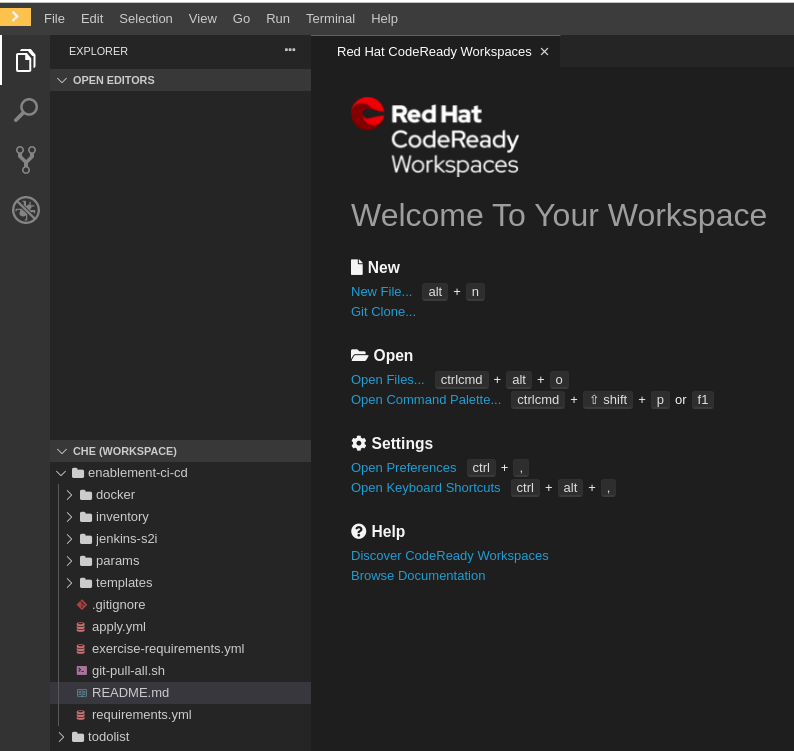
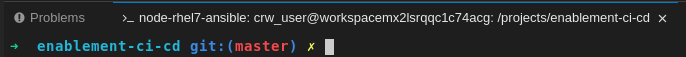

# The Manual Menace
> In this exercise learners will use Ansible to drive automated provisioning of Projects in OpenShift, Git, Jenkins and Nexus.


[image-ref](https://xkcd.com/)

## Exercise Intro
In this exercise we will use automation tooling to create Project namespaces for our `CI/CD` tooling along with the `dev` and `test` namespaces for our deployments to live. We do this manually using the OpenShift CLI; but as we go from cluster to cluster or project to project Dev and Ops teams often find themselves having to redo these tasks again and again. Configuring our cluster using code; we can easily store this in Git and repeat the process again and again. By minimising the time taken to do these repetitive tasks we can accelerate our ability to deliver value to our customers; working on the hard problems they face.

This exercise uses Ansible to drive the creation of the cluster content. In particular; we'll use an implementation called the [OpenShift Applier](https://github.com/redhat-cop/openshift-applier). Once the project namespace have been created; we will add some tools to support CI/CD such as Jenkins, Git and Nexus. These tools will be needed by later lessons to automate the build and deploy of our apps. Again; we will use OpenShift Templates and drive their creation in the cluster using Ansible. To prove things are working, finally we'll delete all our content and re-apply the inventory to re-create our cluster's content.

#### Why is config-as-code important?
* Assurance - Prevents unwanted config changes from people making arbitrary changes to environments. No more Snowflake servers!
* Traceability - Committing config as code means a user has approved and changes can be tracked.
* Phoenix Server -  Burn it all to the ground and bring it back; exactly the way it was!

_____

## Learning Outcomes
As a learner you will be able to

1. Run the [openshift-applier](https://github.com/redhat-cop/openshift-applier) to automate creating cluster content
2. Create and admin project namespaces in OpenShift
3. Deploy commonly used applications to support the development process

## Tools and Frameworks

* [GitLab](https://about.gitlab.com/) - Community driven Git server now with integrated DevOps Toolchain.
* [Nexus](https://www.sonatype.com/nexus-repository-sonatype) - Repository manager for storing lots of application types. Can also host `npm` and `Docker` registries.
* [Jenkins](https://jenkins.io/) - OpenSource Build automation server. Highly customisable with plugins.
* [Ansible](https://www.ansible.com/) - IT Automation tool used to provision and manage state of cloud and physical infrastructure.
* [OpenShift Applier](https://github.com/redhat-cop/openshift-applier) - Used to apply OpenShift objects to an OpenShift Cluster.
* [Eclipse Che](https://www.eclipse.org/che/) - A cloud ide accessible from your browser, we use a version called [`CodeReady Workspaces`](https://developers.redhat.com/products/codeready-workspaces/overview)

## Big Picture
> The Big Picture is our emerging architecture; starting with an empty cluster we populate it with projects and some ci/cd tooling.


_____

<!-- ## 10,000 Ft View
> This exercise is aimed at the creation of the tooling that will be used to support the rest of the Exercises. The high-level goal is to create a collection of project namespaces and populate them with Git, Jenkins & Nexus.

If you're feeling confident and don't want to follow the step-by-step guide these high-level instructions should provide a challenge for you:

1. Clone the repo `https://github.com/rht-labs/enablement-ci-cd` which contains the scaffold of the project. Ensure you get all remote branches.

2. Create `<your-name>-ci-cd`, `<your-name>-dev` and `<your-name>-test` project namespaces using the inventory and run them with the [OpenShift Applier](https://github.com/redhat-cop/openshift-applier) to populate the cluster

3. Use the templates provided to create build of the jenkins-s2i. The templates are in `exercise1/jenkins-s2i`

4. Use the templates provided to create build and deployment configs in `<your-name>-ci-cd` for. Templates are on a branch called `exercise1/git-nexus` && `exercise1/jenkins`:
    * Nexus
    * GitLab
    * Jenkins (using an s2i to pre-configure Jenkins)

5. Commit your `enablement-ci-cd` repository to your GitLab repository.

6. Burn it all down and re-apply your inventory proving config-as-code works.
-->

## Step by Step Instructions
<!-- > This is a structured guide with references to exact filenames and explanations.  -->

### Part 1 - Create your cloud workspace
> _Create your cloud ide environment using Che_

<p class="tip">
⚡ <b>NOTE</b> ⚡ - The instructor may have created your cloud IDE for you - if so, login directly to the url provided and move on to Part 2.
</p>

1. To create your cloud ide environment, open a web browser using the following URL:

```
https://codeready-workspaces.apps.<DOMAIN_FOR_YOUR_CLASS>/?https://raw.githubusercontent.com/rht-labs/enablement-codereadyworkspaces/do500-devfile.yaml
```

<p class="tip">
<b>NOTE</b> - Complete URL should be replaced with the one you've been provided by the instructor.
</p>

2. Login using the `OpenShift/Keycloak` button using your credentials


3. You should see your workspace creating


4. And finally your cloud ide should be ready



### Part 2 - Create OpenShift Projects
> _Using the OpenShift Applier, we will add new project namespaces to the cluster which will be used throughout the exercise._

1. In this course two different git projects will be created. Select `Terminal > Run Task` in your cloud ide.

<p class="tip">
⛷️ <b>NOTE</b> ⛷️ - If you do not plan on using the cloud ide you can clone the repository locally from here https://github.com/rht-labs/enablement-ci-cd
</p>

2. The following projects should be available in your IDE


3. Open the `enablement-ci-cd` folder in your cloud ide (or your favourite editor if using a local machine). The project is laid out as follows
```
.
├── README.md
├── apply.yml
├── docker
├── inventory
│   ├── group_vars
│   │   ├── all.yml
│   ├── host_vars
│   │   ├── ci-cd-tooling.yml
│   │   └── projects-and-policies.yml
│   └── hosts
├── jenkins-s2i
├── requirements.yml
└── templates
    └── project-requests.yml
```
 * `docker` folder contains sample Dockerfiles for our jenkins-slave images that will be used by the builds.
 * `jenkins-s2i` contains the configuration and plugins we want to bring jenkins to life with
 * `params` houses the variables we will load the templates with
 * `templates` is a collection of OpenShift Container Platform templates
 * `inventory/*.yml` is the ansible inventory used to manage the objects and content for the OpenShift cluster
 * `requirements.yml` is a manifest which contains the ansible roles needed to run the playbook
 * `apply.yml` is a playbook that sets up some variables and runs the OpenShift Applier role.

4. Open the `inventory/groups_vars/all.yml` file. Update the `namespace_prefix` variables by replacing the `<YOUR_NAME>` (including the `<` and `>`) with your name or initials. **Don't use uppercase or special characters**. For example; if your name is Tim Smith you would replace `<YOUR_NAME>` and set `namespace_prefix` to something like `tim` or `tsmith`.

<kbd>📝 *enablement-ci-cd/inventory/groups_vars/all.yml*</kbd>
```yaml
  namespace_prefix: "<YOUR_NAME>"
```

5. Open the `inventory/host_vars/projects-and-policies.yml` file; you should see some variables setup already to create the `<YOUR_NAME>-ci-cd` namespace. This object is passed to the OpenShift Applier to call the `templates/project-requests.yml` template with the parameters composed from the inventory and the `ci_cd` vars in the `apply.yml` playbook. We will add some additional content here but first let's explore the parameters and the template

6. Inside of the `inventory/host_vars/projects-and-policies.yml` you'll see the following

<kbd>📝 *enablement-ci-cd/inventory/host_vars/projects-and-policies.yml*</kbd>
```yaml
  ci_cd:
    NAMESPACE: "{{ namespace_prefix }}-ci-cd"
    NAMESPACE_DISPLAY_NAME: "{{ namespace_prefix | title }} CI/CD"
```

 * This will define the variables that we'll soon be using to deploy our CI/CD project. It relies on the `namespace_prefix` that we updated earlier. Pulling these two sets of variables together will now allow us to pass the newly created variables to our template that will create our project appropriately. You'll notice that the name of the variable above (`ci_cd`) is then assigned to `params_from_vars` in our inventory.

<kbd>📝 *enablement-ci-cd/inventory/host_vars/projects-and-policies.yml*</kbd>
```yaml
  ansible_connection: local
  openshift_cluster_content:
  - object: projectrequest
    content:
    - name: "{{ ci_cd_namespace }}"
      template: "{{ playbook_dir }}/templates/project-requests.yml"
      action: create
      params_from_vars: "{{ ci_cd }}"
      tags:
      - projects
```

7. Let's add two more params dicts to pass to our template to be able to create a `dev` and `test` project. At the top of `enablement-ci-cd/inventory/host_vars/projects-and-policies.yml` create a dictionary called `dev` and `test` similar to how you see `ci_cd` defined.

 * In your editor, open `enablement-ci-cd/inventory/host_vars/projects-and-policies.yml` and add the following lines before `openshift_cluster_content`:

<kbd>📝 *enablement-ci-cd/inventory/host_vars/projects-and-policies.yml*</kbd>
```yaml
dev:
  NAMESPACE: "{{ namespace_prefix }}-dev"
  NAMESPACE_DISPLAY_NAME: "{{ namespace_prefix | title }} Dev"

test:
  NAMESPACE: "{{ namespace_prefix }}-test"
  NAMESPACE_DISPLAY_NAME: "{{ namespace_prefix | title }} Test"
```

8. In the `enablement-ci-cd/inventory/host_vars/projects-and-policies.yml` file, add the new objects for the projects you want to create (dev & test) by adding another object to the `content` array (previously defined) for each. You can copy and paste them from the `ci_cd_namespace` example and update them accordingly. If you do this, remember to set the names to `{{ dev_namespace }}` and `{{ test_namespace }}` and change the `params_from_vars` variable accordingly. The values for these variables used for the names (`ci_cd_namespace`, `dev_namespace` etc.) are defined in `apply.yml` file in the root of the project.

<kbd>📝 *enablement-ci-cd/inventory/host_vars/projects-and-policies.yml*</kbd>
```yaml
  - name: "{{ dev_namespace }}"
    template: "{{ playbook_dir }}/templates/project-requests.yml"
    action: create
    params_from_vars: "{{ dev }}"
    tags:
    - projects
  - name: "{{ test_namespace }}"
    template: "{{ playbook_dir }}/templates/project-requests.yml"
    action: create
    params_from_vars: "{{ test }}"
    tags:
    - projects
```

9. Use the `Terminal > Open Terminal in specific container` menu item to open a terminal in the `node-rhel7-ansible` container



Use either `bash` or `zsh` as your shell by typing:
```
bash
# OR
zsh
```

<p class="tip">
<b>NOTE</b> - If you want to try <b>z shell</b> as your default in the cloud ide run this command
</p>

```
echo "zsh" >> ~/.bashrc
```

10.   Change to the `enablement-ci-cd` directory

```bash
cd enablement-ci-cd
```

11. With the configuration in place, install the OpenShift Applier dependency

```bash
ansible-galaxy install -r requirements.yml --roles-path=roles
```

12.   Apply the inventory by logging into OpenShift on the terminal. You will need to retrieve a token first, by browsing to the token request page. This is also available from the `Copy Login Command` once you have logged into the OpenShift Web UI. (`<CLUSTER_URL>` should be replaced with the one you've been provided by the instructor). Accept any insecure connection warning(s) from the cli 👍:
```
# oc login will ask you to retrieve a token
You must obtain an API token by visiting https://oauth-openshift.apps.<CLUSTER_URL>/oauth/token/request
```
You should see a screen like this


Copy this command and run it in your cloud ide terminal to login:
```
oc login --token=<Your Token> --server=<CLUSTER_URL>
```

13.  Then run the ansible playbook as follows.

```bash
ansible-playbook apply.yml -i inventory/ -e target=bootstrap
```

where the `-e target=bootstrap` is passing an additional variable specifying that we run the `bootstrap` group of the inventory.

14.  Once successful you should see an output similar to this: 

15.  You can check to see the projects have been created successfully by running

```bash
oc projects
```


### Part 3 - Nexus
> _Now that we have our Projects setup; we can start to populate them with Apps to be used in our dev lifecycle_

For this part, we will use an OpenShift Container Platform **template** to install and configure Nexus. This template contains all the things needed to set up a persistent Nexus server, exposing a service and route while also creating the persistent volume needed. Have a read through the template; at the bottom you'll see a collection of parameters we will pass to the template.

<p class="tip">
<b>NOTE</b> - Below how we are utilizing an OpenShift Container Platform template from a different repository by accessing it by its RAW GitHub URL (from the redhat-cop repo in this case)
</p>

1. In your cloud ide terminal add some parameters for running the template by creating a new file in the `params` directory.
```bash
touch params/nexus
```

2. The essential params to include in this file are:

<kbd>📝 *enablement-ci-cd/params/nexus*</kbd>
```
VOLUME_CAPACITY=5Gi
MEMORY_LIMIT=1Gi
```

* You'll notice that this is different from how we defined our params for our projects. This is because there are multiple ways to do this. In cases like this, there may be a need to change some of these variables more frequently than others (i.e. giving the app more memory,etc.). In this case, it's easier to maintain them within their own separate params files.


3. Create a new object in the inventory variables `inventory/host_vars/ci-cd-tooling.yml` called `ci-cd-tooling` and populate its `content` as follows

<kbd>📝 *enablement-ci-cd/inventory/host_vars/ci-cd-tooling.yml*</kbd>
```yaml
---
ansible_connection: local
openshift_cluster_content:
- galaxy_requirements:
  - "{{ inventory_dir }}/../exercise-requirements.yml"
- object: ci-cd-tooling
  content:
  - name: "nexus"
    namespace: "{{ ci_cd_namespace }}"
    template: "{{ openshift_templates_raw }}/{{ openshift_templates_raw_version_tag }}/nexus/nexus-deployment-template.yml"
    params: "{{ playbook_dir }}/params/nexus"
    tags:
    - nexus
```


<p class="tip">
<b>NOTE</b> The <i>galaxy_requirements</i> above is necessary to pull in the pre/post steps dependencies as explained under the Jenkins section below.
</p>

4. Run the OpenShift applier, specifying the tag `nexus` to speed up its execution (`-e target=tools` is to run the other inventory).
```bash
ansible-playbook apply.yml -e target=tools \
     -i inventory/ \
     -e "filter_tags=nexus"
```

5. Once successful, login to the cluster through the browser (using cluster URL) and navigate to the `<YOUR_NAME>-ci-cd`. You should see Nexus up and running. You can login with default credentials (admin / admin123) 

### Part 4 - Commit CI/CD

1. Navigate to GitLab login page. You can login using your cluster credentials using the LDAP tab


2. Once logged in create a new project called `enablement-ci-cd` and mark it as internal. Once created, copy out the `git url` for use on the next step.


3. Commit your local project to this new remote by first removing the existing origin (github) where the Ansible project was cloned from in the first steps. Remember to substitute `<GIT_URL>` accordingly with the one created for your `enablement-ci-cd` repository a moment ago.
```bash
git remote set-url origin <GIT_URL>
```
```bash
git add .
```
```bash
git commit -m "Adding git and nexus config"
```
```bash
git push -u origin --all
```

4. On browsing to the first project - you will need to set a local password in gitlab so you can push code.


Select the banner and use the same password you logged into OpenShift as your local gitlab credential. `SSH keys` are not available in this environment.

### Part 5 - MongoDB for CI tests
> _In order to run our API tests in CI in later labs; we need there to be a MongoDB available for executing our tests. As this is part of our CI/CD Lifecycle; we will add it now._

1. Open `enablement-ci-cd` in your favourite editor. Edit the `inventory/host_vars/ci-cd-tooling.yml` to include a new object for our mongodb as shown below. This item can be added below Nexus in the `ci-cd-tooling` section.

<kbd>📝 *enablement-ci-cd/inventory/host_vars/ci-cd-tooling.yml*</kbd>
```yaml
  - name: "jenkins-mongodb"
    namespace: "{{ ci_cd_namespace }}"
    template: "openshift//mongodb-ephemeral"
    params: "{{ playbook_dir }}/params/mongodb"
    tags:
    - mongodb
```


2. Git commit your updates to the inventory to git for traceability.
```bash
git add .
```
```bash
git commit -m "ADD - mongodb for use in the pipeline"
```
```bash
git push
```

3. Apply this change as done previously using Ansible. The deployment can be validated by going to your `<YOUR_NAME>-ci-cd` namespace and checking if it is there!
```bash
ansible-playbook apply.yml -e target=tools \
  -i inventory/ \
  -e "filter_tags=mongodb"
```


<p class="tip">
<b>NOTE</b> - When making changes to the "enablement-ci-cd" repo, you should frequently commit and push the changes to git.
</p>

### Part 6 - Jenkins & S2I
> _Create a build and deployment config for Jenkins. Add new configuration and plugins to the OpenShift default Jenkins image using s2i_

1. As before; create a new set of params by creating a `params/jenkins` file and adding some overrides to the template and updating the `<YOUR_NAME>` value accordingly.

<kbd>📝 *enablement-ci-cd/params/jenkins*</kbd>
```
MEMORY_LIMIT=3Gi
VOLUME_CAPACITY=15Gi
JVM_ARCH=x86_64
NAMESPACE=<YOUR_NAME>-ci-cd
JENKINS_OPTS=--sessionTimeout=720
```
  * You might be wondering why we have to replace <YOUR_NAME> here and can't just rely on the `namespace_prefix` variable that we've been using previously. This is because the replacement is handled by two different engines (one being ansible -- which knows about `namespace_prefix` and the other being the oc client, which does not). Because the params files are processed by the oc client, we need to update this here.

2. Add a `jenkins` variable to the Ansible inventory underneath the jenkins-mongo in  `inventory/host_vars/ci-cd-tooling.yml` as shown below to create a DeploymentConfig for Jenkins. In order for Jenkins to be able to run `npm` commands we must configure a jenkins build slave for it to use. This slave will be dynamically provisioned when we run a build. It needs to have Node.js and npm and a C compiler installed in it. 

<p class="tip">
<b>NOTE</b> These slaves can take a time to build themselves so to speed up we have placed the slave with a corresponding ImageStream within OpenShift. To leverage this existing slave image, we are using a feature of the openshift-applier to process a couple of post-steps part of the inventory. These steps are utilized to perform pre and post tasks necessary to make our inventory work correctly. In this case, we use the post steps to tag and label the jenkins-slave-npm ImageStream within our CI/CD project so Jenkins knows how to find and use it.
</p>

<kbd>📝 *enablement-ci-cd/inventory/host_vars/ci-cd-tooling.yml*</kbd>
```yaml
  - name: "jenkins"
    namespace: "{{ ci_cd_namespace }}"
    template: "{{ openshift_templates_raw }}/{{ openshift_templates_raw_version_tag }}/jenkins/jenkins-persistent-template.yml"
    params: "{{ playbook_dir }}/params/jenkins"
    post_steps:
      - role: casl-ansible/roles/openshift-imagetag
        vars:
          source_img: "quay.io/rht-labs/enablement-npm:latest"
          img_tag: "jenkins-slave-npm:latest"
      - role: casl-ansible/roles/openshift-labels
        vars:
          label: "role=jenkins-slave"
          target_object: "imagestream"
          target_name: "jenkins-slave-npm"
    tags:
    - jenkins
```
This configuration, if applied now, will create the deployment configuration needed for Jenkins but the `${NAMESPACE}:${JENKINS_IMAGE_STREAM_TAG}` in the template won't exist yet.

3. To create this image we will take the supported OpenShift Container Platform Jenkins Image and bake in some extra configuration using an [s2i](https://github.com/openshift/source-to-image) builder image. More information on Jenkins s2i is found on the [openshift/jenkins](https://github.com/openshift/jenkins#installing-using-s2i-build) GitHub page. To create an s2i configuration for Jenkins, start with the pre-canned configuration source in the `enablement-ci-cd` repo (in the jenkins-s2i directory).

The structure of the Jenkins s2i config is
```
jenkins-s2i
├── README.md
├── configuration
│   ├── build-failure-analyzer.xml
│   ├── init.groovy
│   ├── jenkins.plugins.slack.SlackNotifier.xml
│   ├── scriptApproval.xml
└── plugins.txt
```
 * `plugins.txt` is a list of `pluginId:version` for Jenkins to pre-install when starting
 * `./configuration` contains content that is placed in `${JENKINS_HOME}`. A `config.xml` could be placed in here to control the bulk of Jenkins configuration.
 * `build-failure-analyzer.xml` is config for the plugin to read the logs and look for key items based on a Regex. More on this in later lessons.
 * `init.groovy` contains a collection of settings jenkins configures itself with when launching

4. Let's add a plugin for Jenkins to be started with, [green-balls](https://plugins.jenkins.io/greenballs). This simply changes the default `SUCCESS` status of Jenkins from Blue to Green. Append the `jenkins-s2i/plugins.txt` file with
```txt
greenballs:1.15
```


Why does Jenkins use blue to represent success? More can be found [on reddit](https://www.reddit.com/r/programming/comments/4lu6q8/why_does_jenkins_have_blue_balls/) or the [Jenkins blog](https://jenkins.io/blog/2012/03/13/why-does-jenkins-have-blue-balls/).

5. Before building and deploying the Jenkins s2i; add your git credentials to it. These will be used by Jenkins to access the Git Repositories where our apps will be stored. We want Jenkins to be able to push tags to it, so write access is required. Create `params/jenkins-s2i-secret` and add the following content; replacing variables as appropriate. There is an annotation on the secret which binds the credential in Jenkins

<kbd>📝 *enablement-ci-cd/params/jenkins-s2i-secret*</kbd>
```
SECRET_NAME=gitlab-auth
USERNAME=<YOUR_LDAP_USERNAME>
PASSWORD=<YOUR_LDAP_PASSWORD>
```
where
    * `<YOUR_LDAP_USERNAME>` is the username builder pod will use to login and clone the repo with
    * `<YOUR_LDAP_PASSWORD>` is the password the builder pod will use to authenticate and clone the repo using


6. Create `params/jenkins-s2i` and add the following content; replacing variables as appropriate.

<kbd>📝 *enablement-ci-cd/params/jenkins-s2i*</kbd>
```
SOURCE_REPOSITORY_URL=<GIT_URL>
NAME=jenkins
SOURCE_REPOSITORY_CONTEXT_DIR=jenkins-s2i
SOURCE_REPOSITORY_SECRET=gitlab-auth
```
where
    * `<GIT_URL>` is the full clone path of the repo where this project is stored (including the https && .git)


7. At the top of `inventory/host_vars/ci-cd-tooling.yml` file underneath the `---`, add the following:

<kbd>📝 *enablement-ci-cd/inventory/host_vars/ci-cd-tooling.yml*</kbd>
```yaml
ci_cd:
  IMAGE_STREAM_NAMESPACE: "{{ ci_cd_namespace }}"
```

8. Create a new object `ci-cd-builds` in the Ansible `inventory/host_vars/ci-cd-tooling.yml` to drive the s2i build configuration.

<p class="tip">
⚡ <b>NOTE</b> ⚡ - We are using a custom jenkins template that works with latest version of OpenShift until the changes can be merged upstream.
</p>

<kbd>📝 *enablement-ci-cd/inventory/host_vars/ci-cd-tooling.yml*</kbd>
```yaml
- object: ci-cd-builds
  content:
  - name: "jenkins-s2i-secret"
    namespace: "{{ ci_cd_namespace }}"
    template: "{{ openshift_templates_raw }}/{{ openshift_templates_raw_version_tag }}/secrets/secret-user-pass-plaintext.yml"
    params: "{{ playbook_dir }}/params/jenkins-s2i-secret"
    tags:
    - jenkins
  - name: "jenkins-s2i"
    namespace: "{{ ci_cd_namespace }}"
    template: "https://raw.githubusercontent.com/eformat/enablement-ci-cd/master/templates/jenkins-s2i-build-template-with-secret.yml"
    params: "{{ playbook_dir }}/params/jenkins-s2i"
    params_from_vars: "{{ ci_cd }}"
    tags:
    - jenkins
```

9. Commit your code to your GitLab instance
```bash
git add .
```
```bash
git commit -m "Adding Jenkins and Jenkins s2i"
```
```bash
git push
```

10. Now your code is commited; run the OpenShift Applier to add the config to the cluster
```bash
ansible-playbook apply.yml -e target=tools \
     -i inventory/ \
     -e "filter_tags=jenkins"
```

11. This will trigger a build of the s2i and when it's complete it will add an imagestream of `<YOUR_NAME>-ci-cd/jenkins:latest` to the project. The Deployment config should kick in and deploy the image once it arrives. You can follow the build of the s2i by going to the OpenShift console's project


12. When the Jenkins deployment has completed; login (using your OpenShift credentials) and accept the role permissions. You should now see a fairly empty Jenkins with just the seed job

### Part 7 - Jenkins Hello World
> _To test things are working end-to-end; create a hello world job that doesn't do much but proves we can pull code from git and that our builds are green._

1. Log in to Jenkins and hit `New Item`<br>.

2. Create an item called `hello-world` with type `Freestyle project` .

3. Click on the `hello-world` project and then click on `configuration`.
 On the Source Code Management tab, add your `enablement-ci-cd` git repo and hit the dropdown to add your credentials we baked into the s2i on previous steps 

4. On the build tab add an Execute Shell step and fill it with `echo "Hello World"` .

5. Run the build and we should see it pass successfully and with a Green ball! 

### Part 8 - Live, Die, Repeat
> _In this section you will prove the infra as code is working by deleting your Cluster Content and recreating it all_

1. Commit your code to the new repo in GitLab
```bash
git add .
```
```bash
git commit -m "ADD - all ci/cd contents"
```
```bash
git push
```

2. Burn your OpenShift project resources to the ground
```bash
oc delete project <YOUR_NAME>-ci-cd <YOUR_NAME>-dev <YOUR_NAME>-test
```

3. Check to see the projects that were marked for deletion are removed.
```bash
oc get projects | egrep '<YOUR_NAME>-ci-cd|<YOUR_NAME>-dev|<YOUR_NAME>-test'
```

4. Re-apply the inventory to re-create it all!
```bash
oc login --token=<Your Token> --server=<CLUSTER_URL>
```
```bash
ansible-playbook apply.yml -i inventory/ -e target=bootstrap
```
```bash
ansible-playbook apply.yml -i inventory/ -e target=tools
```

_____

## Extension Tasks
> _Ideas for go-getters. Advanced topic for doers to get on with if they finish early. These will usually not have a solution and are provided for additional scope._

 - Add more secure access for Nexus (ie not admin / admin123) using the automation to drive secret creation
 - Add a SonarQube persistent deployment to the `ci-cd-deployments` section.
 - Add `jenkins.plugins.slack.SlackNotifier.xml` to `jenkins-s2i/configuration` to include URL of Slack for team build notifications and rebuild Jenkins S2I

_____

<!-- ## Additional Reading
> List of links and other reading material that might be of use for the exercise

## Slide links

- TBD
- TBD
- TBD -->

<!-- - [Intro](https://docs.google.com/presentation/d/1LsfAkH8GfIhulEoy_yd-usWBfDHnZEyQdNvYeTmAg4A/)
- [Wrap-up](https://docs.google.com/presentation/d/1cfyJ6SHddZNbM61oz67r870rLYVKY335zGclXN2uLMY/)
- [All Material](https://drive.google.com/drive/folders/13Bt4BXf9P2OB8VI4YQNcNONF1786dqOx) -->
