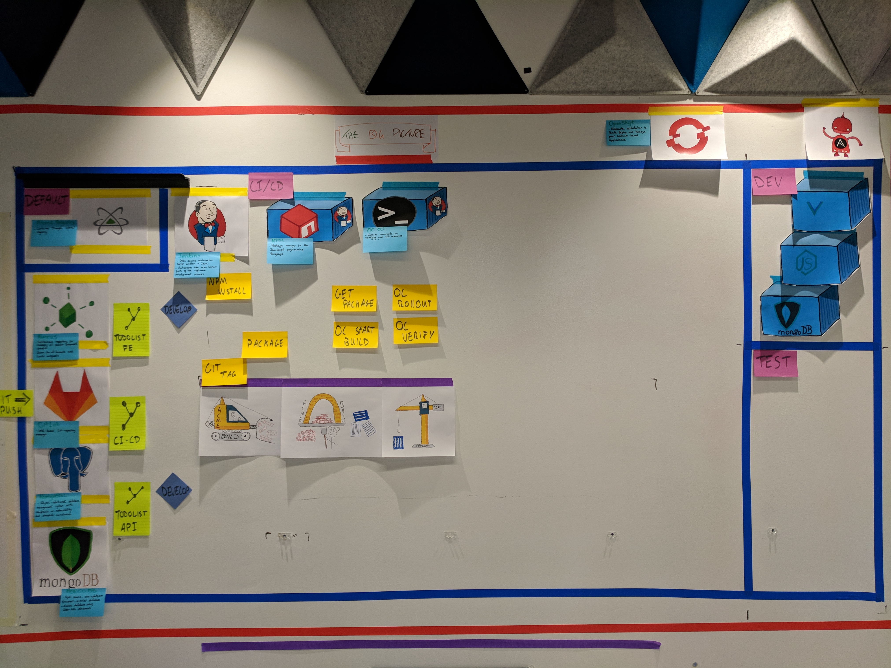
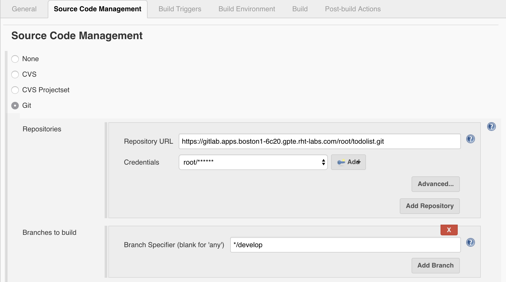
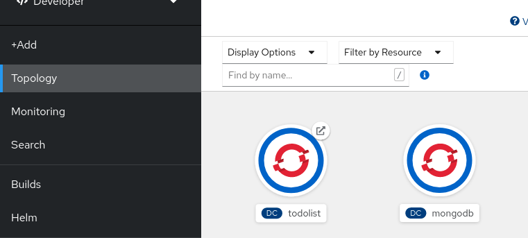
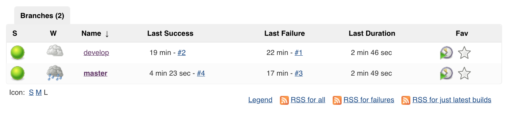

# Attack of the Pipelines

> In this exercise we will explore the sample TODO List application and create a pipeline in Jenkins to build and deploy our code.


[image-ref](https://devrant.com/rants/390132/jenkins-builds)

## Exercise Intro
This lesson is focused on creating a pipeline for our application. What is a pipeline? A pipeline is a series of steps or stages that takes our code from source to a deployed application. There can be many stages to a pipeline but a simple flow is to run a `build > bake > deploy`. Usually the first stage is triggered by something like a git commit.

There could be many steps in each of these stages; such as compiling code, running tests and linting. All of these are done to try and drive up code quality and give more assurance that what is deployed is behaving as expected. In the exercise we will create a Jenkins pipeline by configuring it through the Jenkins web UI, which will create an un-gated pathway to production.

First we will explore the sample application and get it running locally. The sample app is a `todolist` app - the `Hello World` app of the modern day.

#### Why create pipelines
* Assurance - drive up code quality and remove the need for dedicated deployment / release management teams
* Freedom - allow developers to take ownership of how and when code gets built and shipped
* Reliability - pipelines are a bit boring; they execute the same way each and every time they're run!
* A pathway to production:
    - Puts the product in the hands of the customer quicker
    - Enables seamless and repeatable deploys
    - More prod like infrastructure increases assurance
    - “We have already done it” behavior de-risks go live

## Learning Outcomes
As a learner by the end of this lesson you will be able to:

- Build and run the full stack of the TODO List application locally
- Create an un-gated pipeline using the Jenkins UI for the backend and frontend
- Add branching to the pipeline to target specific namespaces

## Tools and Frameworks
> The following tools are used throughout this exercise. Familiarity with them is not required but knowing what they are may help. You will not need to install Vue or MongoDB. They are taken care of by our `todolist` app.

1. [Jenkins](https://jenkins.io/) - OpenSource build automation server; highly customisable through plugins
2. [Node.js](https://nodejs.org/en/) - Node.js® is a JavaScript runtime built on Chrome's V8 JavaScript engine. Node.js uses an event-driven, non-blocking I/O model that makes it lightweight and efficient. Node.js' package ecosystem, npm, is the largest ecosystem of open source libraries in the world.
3. [MongoDB](https://www.mongodb.com/what-is-mongodb) - MongoDB stores data in flexible, JSON-like documents, meaning fields can vary from document to document and data structure can be changed over time
4. [VueJS](https://vuejs.org/) - Vue (pronounced /vjuː/, like view) is a progressive framework for building user interfaces. It is designed from the ground up to be incrementally adoptable, and can easily scale between a library and a framework depending on different use cases. It consists of an approachable core library that focuses on the view layer only, and an ecosystem of supporting libraries that helps you tackle complexity in large Single-Page Applications.
5. [Jenkins Pipeline](https://jenkins.io/doc/book/pipeline/) - Overview of the Jenkinsfile approach
6. [Pipeline Syntax](https://jenkins.io/doc/book/pipeline/syntax/) - Documentation for the declarative pipeline
7. [Groovy](http://groovy-lang.org/) - Groovy is a powerful, optionally typed and dynamic language, with static-typing and static compilation capabilities, for the Java platform aimed at improving developer productivity thanks to a concise, familiar and easy to learn syntax. It integrates smoothly with any Java program, and immediately delivers to your application powerful features, including scripting capabilities, Domain-Specific Language authoring, runtime and compile-time meta-programming and functional programming. Jenkinsfile are written in Groovy but minimal knowledge is required thanks to the Jenkins Pipeline DSL

## Big Picture
> From the previous exercise; we created some supporting tooling needed by our app. Now we will introduce our Sample App and create a pipeline for it



<!-- ## 10,000 Ft View
> _This lab requires users to take the sample TODO app and create a build pipeline in Jenkins by clicking your way to success ending up with an app deployed to each of the namespaces created previously_

2. Import the projects into your gitlab instance. See the README of each for build instructions

2. Deploy a `MongoDB` using the provided template to all project namespace.

2. Create 2 pipelines with three stages (`build`, `bake`, `deploy`) in Jenkins for `develop` & `master` branches on the `todolist-fe` such that:
    * a `Build` job is responsible for compiling and packaging our code:
        1. Checkout from source code (`develop` for `<yourname>-dev` & `master` for `<yourname>-test`)
        2. Install node dependencies and run a build / package
        3. Send the package to Nexus
        4. Archive the workspace to persist the workspace in case of failure
        4. Tag the GitLab repository with the `${JOB_NAME}.${BUILD_NUMBER}` from Jenkins. This is our `${BUILD_TAG}` which will be used on downstream jobs.
        5. Trigger the `bake` job with the `${BUILD_TAG}` param
    * a `Bake` job should take the package and put it in a Linux Container
        1. Take an input of the previous jobs `${BUILD_TAG}` ie `${JOB_NAME}.${BUILD_NUMBER}`.
        2. Checkout the binary from Nexus and unzip its contents
        3. Run an oc start-build of the App's BuildConfig and tag its imagestream with the provided `${BUILD_TAG}`
        4. Trigger a deploy job using the parameter `${BUILD_TAG}`
    * a `deploy` job should roll out the changes by updating the image tag in the DC:
        1. Take an input of the `${BUILD_TAG}`
        2. Patch / set the DeploymentConfig to the image's `${BUILD_TAG}`
        3. Rollout the changes
        4. Verify the deployment

2. Repeat the above setup for the backend `todolist-fe`. TIP - use the copy config to speed things up!

2. Verify that both apps and the DB are talking to one another as expected. -->

## Step by Step Instructions

### Part 1 - Explore the Todo List App
> _In this part of the exercise we will explore the sample application, become familiar with it locally before building and deploying in OCP Land_

The Todolist application is a monorepo which has both front end and server layers in a single repo.

1. Your cloud IDE should already have the `todolist` application cloned under `/projects/todolist` directory from the develop branch.

<p class="tip">
⛷️ <b>NOTE</b> ⛷️ - If you do not plan on using the cloud IDE you can clone the repository locally from here https://github.com/rht-labs/todolist.git
</p>

2. Open up GitLab and log in. Create a new project (internal) in GitLab called `todolist` to host your clone of the project and copy its remote address. 

3. Later in the exercise we'll automatically trigger Jenkins builds on commit, but we'll add the WebHook now. Add a WebHook to the newly created project by going to Settings > Integrations.  

4. In the field add the URL for Jenkins and the route for the webhook and token. Disable SSL Verification if the cluster has unsigned certs and Add the webhook. 
```bash
https://<YOUR_JENKINS_URL>/multibranch-webhook-trigger/invoke?token=todolist
```

5. In your local clone of the `todolist`, remove the origin and add the GitLab origin by replacing `<YOUR_GIT_LAB_PROJECT>`. Push your app to GitLab. Use the `Terminal > Open Terminal in specific container` menu item to open a terminal in the `node-rhel7-ansible` container

```bash
cd todolist
git checkout -b develop
git remote set-url origin <YOUR_GIT_LAB_PROJECT>
# verify the origin has been updated
git remote -v
git push --all
```

6. The `todolist` app has a package.json at the root of the project, this defines the configuration for the app including its dependencies, dev dependencies, scripts and other configuration. Install the app's dependencies
```bash
npm install
```

7. When you are using the cloud hosted environment, you must login to OpenShift from the command line as your user.

```bash
oc login --token=<Your Token> --server=<CLUSTER_URL>
```

<p class="tip">
️🐇 <b>NOTE</b> 🐇- A bit of black magic here - Run the helper script fixApiUrl
</p>

Because we are in a cloud IDE hosted environment, the client side config needs to be updated to use the route that is generated application API. Run the `fixApiUrl` script in your terminal

<p class="tip">
🔥 <b>NOTE</b> 🔥 - Make sure that you are in your `workspace*` project while running this command. Otherwise the terminal will crash and the helper function won't help.
</p>


This updates the API endpoint in the `index.js` config file. Before you run the command, it will look like the following.

<kbd>📝 *todolist/src/config/index.js*</kbd>
```
export default {
  todoEndpoint: "/api/todos"
};
```
Afterwards, you should see something like this:


8. The `todolist` has some scripts defined in the package.json at the root of the project. A snippet of the npm scripts are shown below. To run any of these scripts run `npm run <SCRIPT_NAME>`.
<kbd>📝 *todolist/package.json*</kbd>
```
  "scripts": {
    "serve": "vue-cli-service serve --open",
    "serve:all": "npm-run-all -p -r serve dev:server",
    "start": "node server/app.js",
    "clean": "rm -rf reports package-contents* reports dist ",
    "build:client": "vue-cli-service build",
    "build:ci": "cp src/config/openshift.js src/config/index.js && npm run build:client && mkdir -p package-contents && cp -vr dist server Dockerfile package.json package-contents",
    "package": "zip -r package-contents.zip package-contents",
```


9. Let's start by serving our application and starting the database. Use the `Terminal > Open Terminal in specific container` menu item to open a terminal in the `node-rhel7-ansible` container. Then run the mongo database.

```bash
cd todolist
npm run mongo:start-ide
```
<p class="tip" >
<b>NOTE</b> - If you're not using the cloud hosted environment, you can start mongo using <i>npm run mongo</i> which will pull the latest `mongo` image from [Docker Hub](https://hub.docker.com/).
</p>

You will get a pop-up in your cloud IDE asking if you want to `add a redirect` that you can close.


10. Use the `Terminal > Open Terminal in specific container` menu item in the cloud IDE to open your second terminal in the `node-rhel7-ansible` container. Now we can run the todolist application.

```bash
cd todolist
npm run serve:all
```

Once the application starts, we will get an `Open Link` popup that we can select to open the todolist web application


11. Within the cloud IDE a preview of `todolist` app homepage appears when you start the application
 

You can open the preview into a web browser outside of the cloud IDE by clicking on the arrow box next to the url


<p class="tip" >
<b>NOTE</b> - In a local environment you may open the browser (http://localhost:8080) for displaying the homepage.
</p>

12. Use the `Terminal > Open Terminal in specific container` menu item in the cloud IDE to open your third terminal in the `node-rhel7-ansible` container. Check things are up and running by testing the API with a `curl`. The API should return some seeded data (stored in `server/config/seed.js`)

```bash
cd todolist
curl -s localhost:9000/api/todos | jq
```
```json
[{
    "_id": "5ac8ff1fdfafb02138698948",
    "title": "Learn some stuff about MongoDB",
    "completed": false,
    "__v": 0
  },
  {
    "_id": "5ac8ff1fdfafb02138698949",
    "title": "Play with NodeJS",
    "completed": true,
    "__v": 0
}]
```

13. Within the cloud IDE a preview of `todolist` app homepage appears when you start the application
    * Click 'Todo' at the top of the home page to get to the above page.
    * The server hosting live reloads; so if you make changes to your code base the app will live update

14.  The app is a todolist manager built in Vue.js. with a Node.js backend. Play around with the App. You will notice when you add todos they appear and clear as expected. If you refresh the page your todos are persisted.

15.  The structure of the `todolist` is as follows.
```bash
todolist
├── Dockerfile
├── Gruntfile.js
├── jest.config.js
├── jsconfig.json
├── nightwatch.config.js
├── node_modules
├── package.json
├── public
│   ├── favicon.ico
│   ├── img
│   ├── index.html
│   └── manifest.json
├── server
│   ├── api
│   │   └── todo
│   ├── app.js
│   ├── components
│   │   └── errors
│   ├── config
│   │   ├── environment
│   │   ├── express.js
│   │   ├── local.env.sample.js
│   │   └── seed.js
│   ├── mocks
│   │   ├── mock-routes-config.json
│   │   ├── mock-routes.js
│   │   └── mock-routes.spec.js
│   ├── routes.js
│   └── views
│       └── 404.html
├── src
│   ├── App.vue
│   ├── assets
│   ├── components
│   │   └── *
│   ├── config
│   ├── main.js
│   ├── registerServiceWorker.js
│   ├── router.js
│   ├── scss
│   ├── services
│   ├── store
│   │   └── *
│   └── views
│       └── *
└── tasks
│   └── perf-test.js
├── tests
│   ├── e2e
│   └── unit
└── vue.config.js
```
where the following are the important things:
    * `./src` is the collection of front end files. The entrypoint is the `main.js` which is used to load the root `App.vue` file.
    * `./node_modules` is where the dependencies are stored
    * `./test` contains our end-to-end tests and unit tests. More covered on these in later exercises.
    * `./src/components` contains small, lightweight reusable components for our app. For example, the `NewTodo` component which encapsulates the styling, logic and data for adding a new todo to our list
    * `./src/store` is the `vuex` files for managing application state and backend connectivity
    * `./src/views` is the view containers; which are responsible for loading components and managing their interactions.
    * the `./src/router.js` controls routing logic. In our case the app only has one real endpoint.
    * `./src/scss` contains custom SCSS used in the application.
    * `./*.js` is mostly config files for running and managing the app and the tests.
    * `./server` is the main collection of files needed by the app. The entrypoint is the `app.js`.
    * `./server/api` is where the API's controller, data model & unit test are stored.
    * `./server/mocks` is a mock server used for when there is no DB access.
    * `./server/config` stores our Express.js config, header information and other middleware.
    * `./server/config/environment` stores environment specific config; such as connectivity to backend services like MongoDB.
    * `./tasks` is a collection of additional `Grunt` tasks which will be used in later exercises.
    * `Grunt` is a task runner for use with Node.js projects.
    * `package.json` contains the dependency list and a lot of very helpful scripts for managing the app lifecycle.

16. To prepare Nexus to host the binaries created by the frontend and backend builds we need to run a prepare-nexus script. Before we do this we need to export some variables and change `<YOUR_NAME>` accordingly in the below commands. This is a one time activity and would be automated in a non-training environment.

```bash
oc login --token=<Your Token> --server=<CLUSTER_URL>
```
```bash
export NEXUS_SERVICE_HOST=$(oc get route nexus --template='{{.spec.host}}' -n <YOUR_NAME>-ci-cd)
```
```bash
export NEXUS_SERVICE_PORT=443
```
```bash
npm run prepare-nexus
```
<p class="tip">
<b>NOTE</b> - This step in a residency would be automated by a more complex nexus deployment in the ci-cd project
</p>

### Part 2 - Add configs to cluster
> _In this exercise; we will use the OpenShift Applier to drive the creation of cluster content required by the app such as MongoDB and the Apps Build / Deploy Config_

1. On your terminal navigate to the root of the `todolist` application. The app contains a hidden folder called `.openshift-applier`. Move into this `.openshift-applier` directory and you should see a familiar looking directory structure for an Ansible playbook.
```
├── README.md
├── inventory
│   ├── group_vars
│   │   └── all.yml
│   └── hosts
├── params
│   └── ocp-pipeline
├── requirements.yml
├── roles
├── apply.yml
└── templates
    ├── mongodb.yml
    ├── ocp-pipeline.yml
    ├── todolist-build.yml
    └── todolist-deploy.yml
```
with the following
    * the `apply.yml` file is the entrypoint.
    * the `inventory` contains the objects to populate the cluster with.
    * the `params` contains the variables we'll apply to the `templates`
    * the `templates` required by the app. These include the Build, Deploy configs as well as the services, health checks, and other app definitions.

2. Before we do this we need to change `<YOUR_NAME>` accordingly in the apply.yml file.

<kbd>📝 *todolist/.openshift-applier/apply.yml*</kbd>
```
- name: Build and Deploy todolist
  hosts: app
  vars:
    namespace_prefix: '<YOUR_NAME>'
    ci_cd_namespace: '{{ namespace_prefix }}-ci-cd'
```


3. With those changes in place we can now run the playbook. First install the `openshift-applier` dependency, using the `ansible-galaxy tool` as per exercise one and then run the playbook (from the todolist directory). This will populate the cluster with all the config needed for the front end app.

```bash
# login if needed
oc login --token=<Your Token> --server=<CLUSTER_URL>
```

```bash
ansible-galaxy install -r .openshift-applier/requirements.yml --roles-path=.openshift-applier/roles
```
```bash
ansible-playbook .openshift-applier/apply.yml -i .openshift-applier/inventory/
```


4. Once successful, `commit` and `push` your changes to gitlab.
```bash
git add .
```
```bash
git commit -m "UPDATE - change namespace vars to the teams"
```
```bash
git push
```

5.  Validate the build and deploy configs have been created in OpenShift by opening the console and checking `<YOUR_NAME> CI-CD builds` for the `BuildConfigs`


6. Check `<YOUR_NAME>-dev` to see the deployment configs are in place


### Part 3 - Build > Bake > Deploy
> _In this exercise; we take what we have working locally and get it working in OpenShift_

This exercise will involve creating three stages (or items) in our pipeline, each of these is detailed below at a very high level. Move on to the next step to begin implementation.
* a *build* job is responsible for compiling and packaging our code:
    1. Checkout from source code (`develop` for `<YOUR_NAME>-dev` & `master` for `<YOUR_NAME>-test`)
    2. Install node dependencies and run a build / package
    3. Send the package to Nexus
    4. Archive the workspace to persist the workspace in case of failure
    5. Tag the GitLab repository with the `${JOB_NAME}.${BUILD_NUMBER}` from Jenkins.
* a *bake* job should take the package and put it in a Linux Container
    1. Checkout the binary from Nexus and unzip its contents
    2. Run an oc start-build of the App's BuildConfig and tag its imagestream with the provided `${BUILD_TAG}`
* a *deploy* job should roll out the changes by updating the image tag in the DC:
    1. Patch / set the DeploymentConfig to the image's `${BUILD_TAG}`
    2. Rollout the changes
    3. Verify the deployment
* We will now go through these steps in detail.

#### 3a - Build

1. With the BuildConfig and DeployConfig in place for both the app from previous steps; Log into Jenkins and create a `New Item`. This is just jenkins speak for a new job configuration.<br><br> 

2. Name this job `dev-todolist-build` and select `Freestyle Project`. Our job will take the form of `<ENV>-<APP_NAME>-<JOB_FUNCTION>`. 

3. The page that loads is the Job Configuration page and it can be returned to at anytime from Jenkins. Let's start configuring our job. To conserve space; we will make sure Jenkins only keeps the last build's artifacts. Tick the `Discard old builds` checkbox, then `Advanced` and set `Max # of builds to keep with artifacts` to 1 as indicated below


4. Our Node.js build needs to be run on the `jenkins-agent-npm` we bought in in the previous chapter. Specify this in the box labelled `Restrict where this project can be run` 

5. On the Source Code Management tab, select the Git radio button, specify the endpoint for our GitLab `todolist` Project and specify your credentials (`<YOUR_NAME>-ci-cd-gitlab-auth`) from the dropdown box. Set the Branch Specifier to `develop`. 

6. Scroll down to the Build Environment tab and select the `Color ANSI Console Output` checkbox 

7. Move on to the Build section and select `Add build step`. From the dropdown select `Execute shell`. On the box that appears; insert the following, to build package and deploy our app to Nexus:
```bash
set -o xtrace
npm install
npm run build:ci
npm run package
npm run publish
```


8. Scroll to the final section; the Post-build Actions. Add a new post-build action from the dropdown called `Archive the artifacts` and specify `**` in the box. This will zip the entire workspace and copy it back to Jenkins for inspection if needed. 

9. On the Post-build Actions; Add another post-build action from the dropdown called `Git Publisher`. This is useful for tying the git check-in to the feature in your tracking tool to the built product.
    * Tick the box `Push Only If Build Succeeds`
    * Add the Tag to push of
```bash
${JOB_NAME}.${BUILD_NUMBER}
```
    * Specify the commit message to be
```bash
Automated commit by jenkins from ${JOB_NAME}.${BUILD_NUMBER}
```

    * Check `Create New Tag` and set `Target remote name` to `origin`


10. Finally; add the trigger for the next job in the pipeline. This is to trigger the bake job with the current build tag. Add another post-build action from the dropdown called `Trigger parameterized build on other projects`.
    * Set the project to build to be `dev-todolist-bake-deploy`
    * Set the condition to be `Stable or unstable but not failed`
    * Click Add Parameters dropdown and select Predefined parameters.
    * In the box, insert our BUILD_TAG as follows
```bash
BUILD_TAG=${JOB_NAME}.${BUILD_NUMBER}
```

<p class="tip">
    <b>NOTE</b> - Jenkins might say "No such project ‘dev-todolist-bake-deploy’. Did you mean ...." at this point. Don't worry; it's because we have not created the next job yet.
</p>

11. Hit `save` which will take you to the job overview page - and that's it; our *build* phase is complete!

#### 3b - bake & deploy

1. Next we will setup our *bake* and *deploy* phase; which is a little simpler. Go to Jenkins home and create another Freestyle Job (as before) called `dev-todolist-bake-deploy`.

2. This job will take in the BUILD_TAG from the previous one so check the `This project is parameterized` box on the General tab.
    * Add string parameter type
    * set the Name to `BUILD_TAG`. This will be available to the job as an Enviroment Variable.
    * You can set `dev-todolist-build.` as the default value for ease when triggering manually.
    * The description is not required but a handy one for reference would be `${JOB_NAME}.${BUILD_NUMBER} of previous build e.g. dev-todolist-build.1232`
<p class="tip">
    <b>NOTE</b> - Don't forget to include the <i>.</i> after <i>dev-todolist-build</i> in the Default Value box.
</p>


3. This time set the `Restrict where this project can be run` label to `master`.
<p class="tip">
    <b>NOTE</b> The <i>bake</i> step can only be executed on the <i>master</i> node because it contains the tools for baking.
</p>

4. There is no Git or SCM needed for this job so move down to the Build Environment and tick `Delete workspace before build starts`

5. Move on to the Build section and select `Add build step`. From the dropdown select `Execute shell`. On the box the appears; insert the following, to pull the package from Nexus. We patch the BuildConfig with the Jenkins Tag to get traceablility from feature to source code to built item. Finally; the oc start-build command is run:
Remember to replace `<YOUR_NAME>` accordingly.
```bash
#!/bin/bash
set -o xtrace
echo "### START BAKE IMAGE ###"
curl -v -f \
    http://admin:admin123@${NEXUS_SERVICE_HOST}:${NEXUS_SERVICE_PORT}/repository/zip/com/redhat/todolist/${BUILD_TAG}/package-contents.zip \
    -o package-contents.zip
unzip package-contents.zip
oc project <YOUR_NAME>-ci-cd
NAME=todolist
oc patch bc ${NAME} -p "{\"spec\":{\"output\":{\"to\":{\"kind\":\"ImageStreamTag\",\"name\":\"${NAME}:${BUILD_TAG}\"}}}}"
oc start-build ${NAME} --from-dir=package-contents/ --follow
echo "### END BAKE IMAGE ###"
```


6. Hit `Add build step` again and from the dropdown select `Execute shell`. Enter the following text and remember to change `<YOUR_NAME>` accordingly.
```bash
#!/bin/bash
set -o xtrace
echo "### START DEPLOY IMAGE ###"
PIPELINES_NAMESPACE=<YOUR_NAME>-ci-cd
NAMESPACE=<YOUR_NAME>-dev
NAME=todolist
oc project ${NAMESPACE}
oc tag ${PIPELINES_NAMESPACE}/${NAME}:${BUILD_TAG} ${NAMESPACE}/${NAME}:${BUILD_TAG}
oc set env dc ${NAME} NODE_ENV=dev
oc set image dc/${NAME} ${NAME}=image-registry.openshift-image-registry.svc:5000/${NAMESPACE}/${NAME}:${BUILD_TAG}
oc rollout latest dc/${NAME}
echo "### END DEPLOY IMAGE ###"
```


7.  Hit `save` which will take you to the job overview page.

#### 3c - Pipeline

1. Back on Jenkins; We can tie all the jobs in the pipeline together into a nice single view using the Build Pipeline view. Back on the Jenkins home screen Click the + beside the all tab on the top.


2. On the view that loads; Give the new view a sensible name like `dev-todolist-pipeline` and select Build Pipeline View


3. Set the Pipeline Flow's Inital Job to `dev-todolist-build` and save.


4. You should now see the pipeline view. Run the pipeline by hitting run (you can move onto the next part while it is running as it may take some time).


<p class="tip">
    <b>NOTE</b> - The pipeline may fail on the first run. In such cases, re-run the pipeline once more and the three stages will run successfully and show three green cards.
</p>

5. To check the deployment in OpenShift; open the web console and go to your `dev` namespace. You should see the deployment was successful; hit the URL to open the app and play with the deployed.


### Part 4 - The Jenkinsfile
> _In this exercise we'll use pipeline-as-code to create a pipeline in Jenkins_

1. Open up your `todolist` application in your cloud IDE and move to the `Jenkinsfile` in the root of the project. The high-level structure of the file is shown collapsed below.

Some of the key things to note:
    * `pipeline {}` is how all declarative Jenkins pipelines begin.
    * `environment {}` defines environment variables to be used across all build stages
    * `options {}` contains specific Job specs you want to run globally across the jobs e.g. setting the terminal colour
    * `stage {}` all jobs must have one stage. This is the logical part of the build that will be executed e.g. `bake-image`
    * `steps {}` each `stage` has one or more steps involved. These could be execute shell or git checkout etc.
    * `agent {}` specifies the node the build should be run on e.g. `jenkins-agent-npm`
    * `post {}` hook is used to specify the post-build-actions. Jenkins declarative pipeline syntax provides very useful callbacks for `success`, `failure` and `always` which are useful for controlling the job flow
    * `when {}` is used for flow control. It can be used at the stage level and be used to stop pipeline entering that stage. e.g. when branch is master; deploy to `test` environment.
    
2. The Jenkinsfile is mostly complete, however some minor changes will be needed to orchestrate namespaces. Find and replace all instances of `<YOUR_NAME>` in the Jenkinsfile. Update the `<GITLAB_USERNAME>` to the one you log in to the cluster with; this variable is used in the namespace of your Git projects when checking out code etc. Replace `<GITLAB_FQDN>` with your Git domain (only the hostname, without `https://` or the repository name).

<kbd>📝 *todolist/Jenkinsfile*</kbd>
```groovy
   // Jenkinsfile
   
    environment {
        // Global Vars
        NAMESPACE_PREFIX="<YOUR_NAME>"  
        GITLAB_DOMAIN = "<GITLAB_FQDN>"
        GITLAB_USERNAME = "<GITLAB_USERNAME>"

        PIPELINES_NAMESPACE = "${NAMESPACE_PREFIX}-ci-cd"
        APP_NAME = "todolist"

        JENKINS_TAG = "${JOB_NAME}.${BUILD_NUMBER}".replace("/", "-")
        JOB_NAME = "${JOB_NAME}".replace("/", "-")

        GIT_SSL_NO_VERIFY = true
        GIT_CREDENTIALS = credentials("${NAMESPACE_PREFIX}-ci-cd-gitlab-auth")
    }
```

3. With these changes in place, push your changes to the `develop` branch.
```bash
git add Jenkinsfile
```
```bash
git commit -m "ADD - namespace and git repo to pipeline"
```
```bash
git push
```

4. When the changes have been successfully pushed; Open Jenkins.

5. Create a `New Item` on Jenkins. Give it the name `todolist` and select `Multibranch Pipeline` from the bottom of the list as the job type.


6. On the job's configure page; set the Branch Sources to `git`


7. Fill in the Git settings with your `todolist` GitLab url and set the credentials as you've done before. `https://gitlab.<APPS_URL>/<YOUR_NAME>/todolist.git`


8. Set the `Scan Multibranch Pipeline Triggers` to be Scan by webhook and set the token to be `todolist` as we set at the beginning of the exercise. This will trigger the job to scan for changes in the repo when there are pushes. 


9.  Save the Job configuration to run the initial scan. The log will show scans for `master` and `develop` branches. The `develop` branch has a `Jenkinsfile`, so a pipeline is dynamically created for it.


10. You may notice that your `develop` pipleine has succeeded, and is green. To make the `master` pipleine also succeed and turn from red to green, we need to update the code in the `master` branch. In essence we want to reflect the changes made in the `develop` branch and put them into the the `master` branch.
```bash
git checkout master
```
```bash
git checkout develop Jenkinsfile
```
```bash
git commit -m "Updated Jenkinsfile taken from develop branch"
```
```bash
git push
```
You should notice your Jenkins pipeline detect the changes in the code base and as a result start the pipeline again. Once complete both pipelines should now be green.


11.  The pipeline file is setup to only run `bake` & `deploy` stages when on `master` or `develop` branch. This is to provide us with very fast feedback for team members working on feature or bug fix branches. Each time someone commits or creates a new branch a basic build with testing occurs to give very rapid feedback to the team. 

12.  With the build running for  `develop`, we can explore the Blue Ocean View for Jenkins. On the Job overview page, hit the `Open Blue Ocean` button on the side to see what modern Jenkins looks like.


_____

## Extension Tasks
> _Ideas for go-getters. Advanced topic for doers to get on with if they finish early. These will usually not have a solution available and are provided for additional scope._

- Pipeline Tasks:
    * Add pipeline for `master` branch for each project. Use `test-` instead of `dev-` across all config and names in the pipeline.
    * Do the `.openshift-applier` steps as part of the pipeline for greater end to end automation.
- Promote build:
    * Create a _promote-to-uat_ phase after the `master` branch deploy.
    * Create a `uat` env using the OpenShift Applier as seen before.
    * Tag and promote the image without rebuilding after the `test-**-deploy`
- MongoDB tasks:
    * Add MongoDB Stateful set for the UAT environment (or test).
    * Inject MongoDB config into the Node.js app using config map & secrets.
    * Improve the security of the DB by making the user /passwords randomly generated.
- Setup Nexus as an `npm` mirror registry and use it in the builds to speed up the build time.

<!-- 
## Additional Reading
> List of links or other reading that might be of use / reference for the exercise

## Slide links

- [Intro](https://docs.google.com/presentation/d/1t1CONuy-_IRPZYmU010Qgk2rshiDJTennvLyQR8GllE)
- [Wrap-up](https://docs.google.com/presentation/d/1kZ8SV6iJnrKk_AqPpyPuNZifv7VzItHOB9HYdOnNJjI)
- [All Material](https://drive.google.com/drive/folders/1lf66ks2tT0eQ4A9RSU48u0ZhvBXzoHWJ) -->
