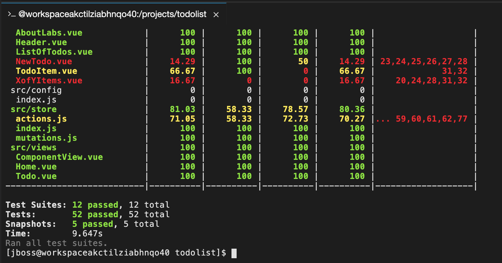
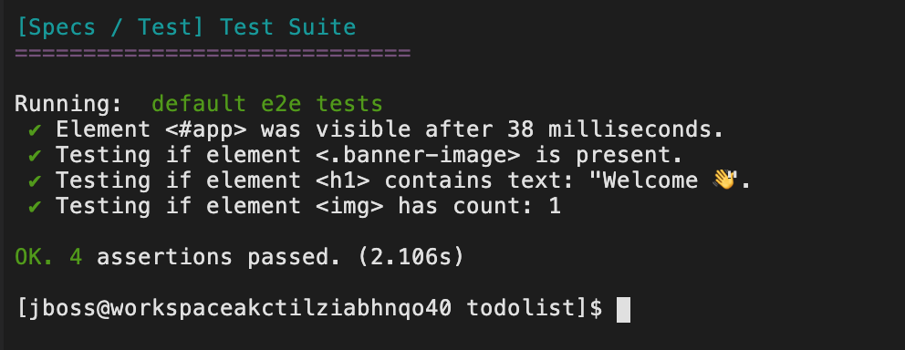

# Revenge Of The Automated Testing

> The purpose of this exercise is to develop and validate a new feature using TDD; and to promote the assured feature through the pipeline.


[Image Source](https://cdn-images-1.medium.com/max/1600/1*wF_fSCH-gLYfMbkwb3gR2w.png)

## Introduction to TDD.

> _Here is a brief introduction of TDD and why we use it._

**Test Driven Development (TDD)** is a software development process that relies on the repetition of a very short development cycle. Requirements are turned into test cases, where the software is developed to pass the tests. In other words, it creates a safety net that serves to keep the developer's problems/bugs at bay while enabling the developer to refactor efficiently. This is opposed to software development that allows software to be added that is not proven to meet requirements.

The TDD cycle can be illustrated with the following diagram;


### The TDD Cycle 

1. `Write a test` -
In TDD a new feature begins by writing a test. Write a test that clearly defines a function or one that provides an improvement to an existing function. It's important the developer clearly understands the features specification and requirements, or the feature could be wrong from the get-go. 

2. `Test Fails` -
When a test is first implemented it is expected to fail. This failure validates the test is working correctly as the feature is yet to be implemented. 

3. `Write code to make test pass` -
This step involves implementing the feature to pass the failed test. Code written at this stage may be inelegant and still pass the test, however this is acceptable as TDD is a recursive cycle which includes code refactoring.

4. `Code Passes tests` -
If all tests pass, the developer can be confident that the new code meets the test requirements.

5. `Refactor` -
The refactoring step will allow the developer to clean up their code without changing its behaviour. Not changing the behaviour should ensure the tests still pass. The process of refactoring can include; removal of duplication, renaming of object, class, module, variable and method names to clearly represent their current purpose and use, decoupling of functionality and increasing code cohesion.

6. `Repeat` -
Starting with another new test, the cycle is then repeated to push forward the functionality. The size of the steps should always be small, with as few as 1 to 10 edits between each test run. If new code does not rapidly satisfy a new test, or other tests fail unexpectedly, the programmer should undo or revert in preference to excessive debugging.

### Testing Bananalogy
Explanation of Mocha and js test syntax through Bananalogy! Imagine for a moment; we're not building software but creating a bowl of fruit. To create a `Bunch of Bananas` component for our fruit bowl we could start with our tests as shown below.

  * `describe` is used to group tests together. The string `"a bunch of ripe bananas"` is for human reading and allows you to identify tests.
  * `it` is a statement that contains a test. It should contain an assertion such as `expect` or `should`. It follows the syntax of `describe` where the string passed in identifies the statement.

---

## Learning Outcomes

As a learner you will be able to

* Understand the why behind TDD
* Implement a feature using TDD for front end and backend
* Write end to end tests for the feature and run them in CI

## Tools and Frameworks

> Name of tool - short description and link to docs or website

1.  [Jest](https://facebook.github.io/jest/) - Zero configuration testing platform
Jest is used by Facebook to test all JavaScript code including React applications. One of Jest's philosophies is to provide an integrated "zero-configuration" experience. We observed that when engineers are provided with ready-to-use tools, they end up writing more tests, which in turn results in more stable and healthy code bases.
1.  [Vue Test Utils](https://vue-test-utils.vuejs.org/en/) - Vue Test Utils is the official unit testing utility library for Vue.js.
1.  [Nightwatch.js](http://nightwatchjs.org/) - Nightwatch.js is an easy to use Node.js based End-to-End (E2E) testing solution for browser based apps and websites. It uses the powerful W3C WebDriver API to perform commands and assertions on DOM elements.
1.  [Mocha](https://mochajs.org/) - Mocha is a feature-rich JavaScript test framework running on Node.js and in the browser, making asynchronous testing simple and fun. Mocha tests run serially, allowing for flexible and accurate reporting, while mapping uncaught exceptions to the correct test cases. Hosted on GitHub.
1.  [Sinon](http://sinonjs.org/) - Standalone test spies, stubs and mocks for JavaScript. 
Works with any unit testing framework.

## Big Picture

This exercise begins cluster containing blah blah

---

## 10,000 Ft View

> The goal of this exercise is to add a new component to the application using TDD to create and validate it's behaviour. The User story we have been given is as follows:

*As a doer I want to mark todos as important so that I can keep track of and complete high prirority todos first*

_Acceptance Criteria_
- [ ] should be doable with a single click
- [ ] should add a red flag against the todo when marked important
- [ ] should remove the red colour flag on the flag when important removed
- [ ] should not affect existing todos

_On page load:_
- [ ] should display existing todos that are not marked important
- [ ] should display existing todos that are marked important with an red flag

## Step by Step Instructions
> This is a fairly structured guide with references to exact filenames and sections of text to be added.

### Part 1 - Tests in our Pipeline
> _In this part we will get familiar with the layout of our tests. We will also improve the pipeline created already by adding some unit tests for the front end & backend along with some end to end tests (e2e) to validate the full solution_

#### 1a - FE Unit tests
> In this exercise we will execute our test for the front end locally. Once verified we will add them to Jenkins.

2. Before linking our automated testing to the pipeline we'll first ensure the tests run locally. Change to the `todolist-fe` directory and run `test`.
```bash
$ cd todolist-fe
$ npm run test
```
<p class="tip" > 
`test` is an alias used that runs `vue-cli-service test` from the scripts object in `package.json`
</p>


2. This command will run all `*spec.js` files. Our test files are stored in the following places. There are 12 front end test files stored in these directories: `todolist-fe/tests/unit/vue-components/*` & `todolist-fe/tests/unit/javascript/*`

2. You should see an output similar to the following. The above command has run a test suite for every `*.spec.js` file. The table generated in the terminal shows the code coverage. We're going to be focusing on the unit tests for now.


2. Repeat the same process for `todolist-api` and verify that all the tests run. If you have an ExpressJS server already running from previous exercise; you should kill it before running the tests. The `mocha` test suite will launch a dev server for running the tests. There are 2 Api test files: `todolist-api/server/api/todo/todo.spec.js` & `todolist-api/server/mocks/mock-routes.spec.js` for our API and the Mocks server.
```bash
$ cd todolist-api
$ npm run test
```

2. Navigate to your instance of jenkins at `https://jenkins-<YOUR_NAME>-ci-cd.apps.somedomain.com/`. 
Click on `dev-todolist-fe-build` and then click the `configure` button on the left-hand side.


2. Scroll to the `Build` part of the configuration page and add `npm run test` below `npm install`.


2. Scroll to the `Post-build Actions` section and click `Add post-build action`. Select `Publish xUnit test result report` (Jenkins might place this at the top of the `Post-build Actions` list).


2. Click the `Add` button under `Publish xUnit test result report` and select `JUnit`. In the pattern field enter `test-report.xml`. In the `Failed Tests Thresholds`  input box enter 0 under `Red Ball Total`. It should look a little something like this:


2. Click `save` or `apply` at the bottom to save the changes. Run the `dev-todolist-fe-build` job and verify that this passes and the `build` and `bake` jobs are both triggered.

2. We're now going to deliberately fail a test to ensure that `bake` and `deploy` jobs aren't triggered if any tests fail. Open the `todolist-fe` source code in your favourite editor. Open `ListOfTodos.spec.js` in `/tests/unit/vue-components` and head to `line 39`. Add `not.` before `toHaveBeenCalled()` to fail the test.


2. Push this to Gitlab and run the build job.
```bash
$ git add .
$ git commit -m "TEST - failing build with tests"
$ git push
```

2. Rerun the `dev-todolist-fe-build` job. It should have failed and not run any other jobs. 


2. You can examine the test results on the jobs home page. Drill down into the tests to see which failed and other useful stats


2. Undo the changes you made to the `ListOfTodos.spec.js` file, commit your code and rerun the build. This should trigger a full `build --> bake --> deploy` of `todolist-fe`.

#### 1b - BE Unit tests
> In this exercise we will execute our test for the backend locally. Once verified we will add them to Jenkins and add a mongodb to Jenkins for running tests there.

2. We're now going to do the same for the api. However, in order to run our API tests in CI; we need there to be a MongoDB available for testing. In our `enablement-ci-cd` repo; checkout the mongo branch as shown below to bring in the template and params. The mongodb template we're using is the same as the one for our `todolist-fe` created in previous exercise.
```bash
$ git checkout exercise3/mongodb params/mongodb templates/mongodb.yml
```

2. Open `enablement-ci-cd` in your favourite editor. Edit the `inventory/host_vars/ci-cd-tooling.yml` to include a new object for our mongodb  as shown below. This item can be added below the jenkins slave in the `ci-cd-builds` section.
```yaml
  - name: "jenkins-mongodb"
    namespace: "{{ ci_cd_namespace }}"
    template: "{{ playbook_dir }}/templates/mongodb.yml"
    params: "{{ playbook_dir }}/params/mongodb"
    tags:
    - mongodb
```


2. Git commit your updates to the inventory to git for traceability.
```bash
$ git add .
$ git commit -m "ADD - mongodb for use in the pipeline"
$ git push
```

2. Apply this change as done previously using ansible. The deployment can be validated by going to your `<YOUR_NAME>-ci-cd` namespace! 
```bash
$ ansible-playbook apply.yml -e target=tools \
  -i inventory/ \
  -e "filter_tags=mongodb"
```


2. With the mongodb in place Open up Jenkins and head to the `configure` panel of the `dev-todolist-api-build` job. 
 
2. Add `npm run test:ci` above `npm run build:ci`.


2. Scroll to the `Post-build Actions` section and click `Add post-build action`. Select `Publish xUnit test result report`.

2. Click the `Add` button under `Publish xUnit test result report` and select `JUnit`. In the pattern field enter `reports/server/mocha/test-results.xml`. In the `Failed Tests Thresholds`  input box enter 0 under `Red Ball Total`. It should look a little something like this. Save your changes:


2. We're now going to deliberately fail a test again to ensure that `bake` and `deploy` jobs aren't triggered if any tests fail. Go to `todo.spec.js` in `/server/api/todo` and head to `line 35`. Replace `false` with `true`. 


2. Push this to Gitlab and run the build job.
```bash
$ git add .
$ git commit -m "TEST - failing build with tests"
$ git push
```

2. If successful this will fail the build and not run the `bake` or `deploy` jobs! Undo your changes and move on to the next section.

<p class="tip">
  NOTE - Don't forget to undo the changes that you made to your tests!
</p>

#### 1c - End to End tests (e2e)
> _Unit tests are a great way to get immediate feedback as part of testing an application. End to end tests that drive user behaviour are another amazing way to ensure an application is behaving as expected._

In this exercise we will add a new stage to our pipeline called `dev-todolist-fe-e2e` that will run after the deploy has been completed. End to end tests will use Nightwatchjs to orchestrate a selenium webdriver instance that controls the web browser; in this case Chrome!

2. Let's start by checking our tests execute locally. On the terminal move to the `todolist-fe` folder. Our end to end tests are stored in `tests/e2e/specs/`. The vuejs cli uses nightwatch and comes pre-configured to run tests against Chrome. We have created some additional configuration in the root of the project `nightwatch.config.js` to run headless in CI mode on Jenkins.
```bash
$ cd todolist-fe
```

2. Run the tests locally by executing the following. This should start the dev server and run the test. You may see the browser pop up and close while tests execute.
```bash
$ npm run e2e
```


2. With tests executing locally; let's add them to our Jenkins pipeline. To do this; we'll create a new job and connect it up to our `todolist-fe` jobs. Open Jenkins and create a `New Item` called `dev-todolist-fe-e2e`. Make this Job `Freestyle`.

2. On the configuration page (under the general tab); Set the Label for the job to run on as `jenkins-slave-npm`. Check the box marking the build parameterised and add a String parameter of `BUILD_TAG` as done before


2. On the Source Code Management tab; set the source code to git and add the url to your `todolist-fe` app. Set the branch to `refs/tags/${BUILD_TAG}`


2. Set `Color ANSI Console Output` on the `Build Environment` section

2. On the Build section; add a build step to execute shell and fill in the following substituting `<YOUR_NAME>` and `somedomain` accordingly:
```bash
export E2E_TEST_ROUTE=todolist-fe-<YOUR_NAME>-dev.apps.somedomain.com
npm install
npm run e2e:ci
```


2. Add a Post Build action to `Publish Junit test result report`. Add `reports/e2e/specs/*.xml` to the report location and save the configuration to be brought back to the Job's homepage.


2. We want to connect the e2e job we just created to our dev pipleline by editing the post build actions on `dev-todolist-fe-deploy` job. Open the `dev-todolist-fe-deploy` job and hit `configure`. In the `Post-build actions` section of this job add a `Trigger parameterised build` on other jobs. Set the `Projects to build` to be `dev-todolist-fe-e2e`. Add a Parameter and set the it to the `Current build parameters`. Save the settings.


2. Run the pipeline from the beginning to see the tests executed (two executions will show tests scores on the graph!).

### Part 2 - TodoList new feature
> _In this exercise we will introduce a new feature to create an important flag on the todos. In order to be able to build and test our feature we will use TDD_

*As a doer I want to mark todos as important so that I can keep track of and complete high prirority todos first*

_Acceptance Criteria_
- [ ] should be doable with a single click
- [ ] should add a red flag against the todo when marked important
- [ ] should remove the red colour flag on the flag when important removed
- [ ] should not affect existing todos

_On page load:_
- [ ] should display existing todos that are not marked important
- [ ] should display existing todos that are marked important with an red flag

#### 2a - Create todolist-api tests
> Using [Mocha](https://mochajs.org/) as our test runner; we will now write some tests for backend functionality to persist our important-flag. The changes required to the backend are minimal but we will use TDD to create our test first, then implement the functionality.

3.  Create a new branch in your `todolist-api` app for our feature and push it to the remote
```bash
$ git checkout -b feature/important-flag
$ git push -u origin feature/important-flag
```

3.  Navigate to the `server/api/todo/todo.spec.js` file. This contains all of the existing todo list api tests. These are broken down into simple `describe("api definition", function(){})` blocks which is BDD speak for how the component being tested should behave. Inside of each `it("should do something ", function(){})` statements we use some snappy language to illustrate the expected behaviour of the test. For example a `GET` request of the api is described and tested for the return to be of type Array as follows.
```javascript
describe("GET /api/todos", function() {
    it("should respond with JSON array", function(done) {
        request(app)
        .get("/api/todos")
        .expect(200)
        .expect("Content-Type", /json/)
        .end(function(err, res) {
            if (err) return done(err);
            // Test goes here
            res.body.should.be.instanceof(Array);
            done();
        });
      });
});
```
where:
  - `describe` is used to group tests together into a collection asserting some feature; for example the get all todos api.
  - `it` is an individual test statement and should contain an `expect` or a `should` statement asserting behaviour of the API under test.
  - `request` is a library for making http calls to the api.
  - `.expect(200)` asserts the HTTP Return Code
  - `res.body.should.be.instanceof(Array);` is the actual test call
  - `done();` tells the test runner that `mocha` has finished execution. This is needed as the http calls are asynchronous.

3.  With this knowledge; let's implement our test for the `important` flag. We expect the front end to introduce a new property on each `todo` that gets passed to the backend called `important`. The API will need to handle this new property and pass it into the mongodb. Let's begin implementing this functionality by writing our test case. Navigate to the `PUT /api/todos` section of the `server/api/todo/todo.spec.js` test file (which should be at the bottom) 


3. Before writing our test; let's first make sure all the existing tests are passing.
```bash
$ npm run test
```

3. With all the tests passing; let's add our new one. For ease of completing this exercise a template of a new test has been written at the very end of the file (just below the `  // Exercise 3 test case!` comment). A PUT request responds in our API with the data that it has just updated. So provided that MongoDB accepted the change, the API will respond with an object that has the `important` property on it. To write our test; edit the template test by completing the following:
    * Edit the `it("should ...")` to describe the important flag we're testing
    * Edit the `.send()` to include `important: true` property
    * Edit the `.expect()` to be `.expect(200)`
    * Add a new test assertion to check that `res.body.important` is `true` below the `// YOUR TEST GO HERE` line.
```javascript
// Exercise 3 test case!
it("should mark todo as important and persist it", function(done) {
    request(app)
      .put("/api/todos/" + todoId)
      .send({
        title: "LOVE endpoint/server side testing!",
        completed: true,
        important: true
      })
      .expect(200)
      .expect("Content-Type", /json/)
      .end(function(err, res) {
          if (err) return done(err);
          res.body.should.have.property("_id");
          res.body.title.should.equal("LOVE endpoint/server side testing!");
          // YOUR TEST GO HERE
          res.body.important.should.equal(true);
          done();
      });
});
```

3.  Run your test. It should fail.
```bash
$ npm run test
```


3.  With our test now failing; let's implement the feature. This is quite a simple change - we first need to update the `server/api/todo/todo.model.js`. Add an additional property on the schema called `important` and make its type Boolean.
```javascript
const TodoSchema = new Schema({
  title: String,
  completed: Boolean,
  important: Boolean
});
```

3. Next we need to update the `server/config/seed.js` file so that the pre-generated todos have an important propety. Add `important: true` below `completed: *` for each object. Don't forget to add a comma at the end of the `completed: *` line. 


3.  With your changes to the Database schema updated; re-run your tests.
```bash
$ npm run test
```

3.  Commit your code to the `feature/important-flag` branch and then merge onto the `develop` branch as follows
<p class="tip">
NOTE - At this point in a residency we would peer review the code before pushing it to develop or master branch!
</p>
```bash
$ git add .
$ git commit -m "ADD backend schema updates"
$ git push
# Now Update our develop branch to trigger a build!
$ git checkout develop
$ git merge feature/important-flag
$ git push
```

3.  After pushing your changes; start back up the `todolist-api` app on a new terminal session
```bash
$ npm run start
```

#### 2b - Create todolist-fe tests
> Using [Jest](https://facebook.github.io/jest/) as our test runner and the `vue-test-utils` library for managing our vue components; we will now write some tests for front end functionality to persist our important-flag. The changes required to the front end are quite large but we will use TDD to create our test first, then implement the functionality. 

Our TodoList App uses `vuex` to manage the state of the apps' todos and `axios` HTTP library to connect to the backend. `Vuex` is an opinionated framework for managing application state and has some key design features you will need to know to continue with the exercise. 

In `vuex` the application state is managed by a `store`. The `store` houses all the todos we have retrieved from the backend as well as the `getter` methods for our array of `todos`. In order to make changes to the store, we could call the store directly and update each todo item but as earlier said; vuex is an opinionated module with it's own way of updating the store. It is bad practice to call the store directly. 

There are two parts of the lifecycle to updating the store, the `actions` & `mutations`. When the user clicks a todo to mark it as complete; the `actions` are called. An action could involve a call to the backend or some pre-processing of the data. Once this is done, the change is committed to the store by calling the `mutation` function. A store should only ever be manipulated through a mutation function. Calling the mutation will then update the todo object in the apps local store for rendering in the view.

For example; when marking a todo as done in the UI, the following flow occurs
  * The `TodoItem.vue` calls the `markTodoDone()` function which dispatches an event to the store.
  * This calls the `updateTodo()` function in the `actions.js` file
  * The action will update the backend db (calling our `todolist-api`) with our updated todo object.
  * The action will commit the change to the store by calling the mutation method `MARK_TODO_COMPLETED`
  * The `MARK_TODO_COMPLETED` will directly access the store object and update it with the new state value
  * The `ListOfTodos.vue` component is watching the store for changes and when something gets updated it re-renders the `TodoItem.vue`.

The implementation of our `important` flag will follow this same flow.

3. Let's implement our feature by first creating a branch. Our new feature, important flag will behave in the same way as the `MARK_TODO_COMPLETED`. Create a new branch in your `todolist-fe` app for our feature and push it to the remote
```bash
$ git checkout -b feature/important-flag
$ git push -u origin feature/important-flag
```

3. Let's get our tests running by executing a `--watch` on our tests. This will keep re-running our tests everytime there is a file change. It is hany to have this running in a new terminal session.
```bash
$ npm run test -- --watch
```

3. All the tests should be passing when we begin. If `No tests found related to files changed since last commit` is on show; hit `a` on the terminal to re-run `all` tests.


3. There are three places we will add new tests to validate our function behaves as expected against the acceptance criteria from the Feature Story supplied to us. We will need to write tests for our `TodoItem.vue` to handle having a red flag and that it is clickable. Our app is going to need to persist the changes in the backend so we'll want to make changes to our `actions.js` and `mutations.js` to keep the api and local copy of the store in sync. Let's start with our `TodoItem.vue` component. Open the `tests/unit/vue-components/TodoItem.spec.js` file. This has been templated with some example test to correspond with our A/Cs for speed of doing the exercise. Find the describe block for our important flag tests. It is setup already with a `beforeEach()` hook for test setup.


3. Each of our test cases has it's skeleton in place already for example the `TodoItem.vue` component takes a property of `todos` when rendering. This setup is already done for each of our tests so all we have to do is fill in our assertions.


3. Let's implement the first test `it("should render a button with important flag"`. This test will assert if the button is present on the page and it contains the `.important-flag` CSS class. To implement this; add the `expect` statement as follows below the `// TODO - test goes here!` comment.  
```javascript
  it("should render a button with important flag", () => {
    const wrapper = mount(TodoItem, {
      propsData: { todoItem: importantTodo }
    });
    // TODO - test goes here!
    expect(wrapper.find(".important-flag").exists()).toBe(true);
  });
```

3. Save the file and we should see in our test watch the test case has started failing because we have not yet implemented the feature!


3. With a basic assertion in place, let's continue on to the next few tests. We want the important flag to be red when an item in the todolist is marked accordingly. Conversely we want it to be not red when false. Let's create a check for `.red-flag` CSS property to be present when important is true and not when false. Complete the `expect` statements in your test file as shown below for both tests.
```javascript
  it("should set the colour to red when true", () => {
    const wrapper = mount(TodoItem, {
      propsData: { todoItem: importantTodo }
    });
    // TODO - test goes here!
    expect(wrapper.find(".red-flag").exists()).toBe(true);
  });
  it("should set the colour to not red when false", () => {
    importantTodo.important = false;
    const wrapper = mount(TodoItem, {
      propsData: { todoItem: importantTodo }
    });
    // TODO - test goes here!
    expect(wrapper.find(".red-flag").exists()).toBe(false);
  });
```

3. Finally, we want to make the flag clickable and for it to call a function to update the state. The final test in the `TodoItem.spec.js` we want to create should simulate this behaviour. Implement the `it("call makImportant when clicked", () ` test by first simulating the click of our important-flag and asserting the function `markImportant()` to write is executed.
```javascript
  it("call makImportant when clicked", () => {
    const wrapper = mount(TodoItem, {
      methods,
      propsData: { todoItem: importantTodo }
    });
    // TODO - test goes here!
    const input = wrapper.find(".important-flag");
    input.trigger("click");
    expect(methods.markImportant).toHaveBeenCalled();
  });
```

3. With our tests written for the feature's UI component, let's implement our code to pass the tests. Explore the `src/components/TodoItem.vue`. Each vue file is broken down into 3 sections
    * The `<template></template>` contains the HTML of our component. This could include references to other Components also
    * The `<script></script>` contains the JavaScript of our component and is essentially the logic for our component. It defines things like `properties`, `methods` and other `components`
    * The `<style></style>` contains the encapsulated CSS of our component

3. Underneath the `</md-list-item>` tag, let's add a new md-button. Add a `.important-flag` class on the `md-button` and put the svg of the flag provided inside it.
```html
    </md-list-item>
    <!-- TODO - SVG for use in Exercise3 -->
    <md-button class="important-flag">
        <svg height="24" viewBox="0 0 24 24" width="24" xmlns="http://www.w3.org/2000/svg" ><path d="M0 0h24v24H0z" fill="none"/><path d="M14.4 6L14 4H5v17h2v-7h5.6l.4 2h7V6z"/></svg>
    </md-button>
```

3. We should now see the first of our failing tests has started to pass. Running the app locally (using `npm run serve`) should show the flag appear in the UI. It is clickable but won't fire any events and the colour is not red as per our requirement. Let's continue to implement the colour change for the flag. On our `<svg/>` tag, add some logic to bind the css to the property of a `todo.important` by adding ` :class="{'red-flag': todoItem.important}"  `. This logic will apply the CSS class when `todo.important`  is true.
```html
<md-button class="important-flag">
    <svg :class="{'red-flag': todoItem.important}"  height="24" viewBox="0 0 24 24" width="24" xmlns="http://www.w3.org/2000/svg" ><path d="M0 0h24v24H0z" fill="none"/><path d="M14.4 6L14 4H5v17h2v-7h5.6l.4 2h7V6z"/></svg>
</md-button>
```

3. More tests should now be passing. Let's wire the click of the flag to an event in Javascript. In the methods section of the `<script></script>` tags in the Vue file, implement the `markImportant()`. We want to wire this to the action to updateTodo, just like we have in the `markCompleted()` call above it. We also need to pass and additional property to this method call `important`
```javascript
    markImportant() {
      // TODO - FILL THIS OUT IN THE EXERCISE
      this.$store.dispatch("updateTodo", {id: this.todoItem._id, important: true});
      console.info("INFO - Mark todo as important ", this.todoItem.important);
    },
```

3. Let's connect the click button in the DOM to the Javascript function we've just created. In the template, add a click handler to the md-button to call the function `markImportant()` by adding ` @click="markImportant()"` to the `<md-button> tag 

```html
    <!-- TODO - SVG for use in Exercise3 -->
    <md-button class="important-flag" @click="markImportant()">
        <svg :class="{'red-flag': todoItem.important}"  height="24" viewBox="0 0 24 24" width="24" xmlns="http://www.w3.org/2000/svg" ><path d="M0 0h24v24H0z" fill="none"/><path d="M14.4 6L14 4H5v17h2v-7h5.6l.4 2h7V6z"/></svg>
    </md-button>
```

3. Finally - we need to make it so that when a new todo item is created it will have an important property. Head to `store/actions.js` and add `important: false`  below `completed: false` in the `addTodo(){}` action.


3. The previously failing tests should have started to pass now. With this work done, let's commit our code. On the terminal, run 
```bash
$ git add .
$ git commit -m "Implementing the todoitem flag"
$ git push
```

3. Open our local todolist app (http://localhost:8080/#/todo). If we try to use our important flag, we should see it's still not behaving as expected; this is because we're not updating the state of the app in response to the click event.

3. We need to implement the `actions` and `mutations` for our feature. Let's start with the tests. Open the `tests/unit/javascript/actions.spec.js` and navigate to the bottom of the file. Our action should should commit the `MARK_TODO_IMPORTANT` to the mutations. Scroll to the end of the test file and implement the skeleton test by adding `expect(commit.firstCall.args[0]).toBe("MARK_TODO_IMPORTANT");` as the assertion.
```javascript
  it("should call MARK_TODO_IMPORTANT", done => {
    const commit = sinon.spy();
    state.todos = todos;
    actions.updateTodo({ commit, state }, { id: 1, important: true }).then(() => {
        // TODO - test goes here!
        expect(commit.firstCall.args[0]).toBe("MARK_TODO_IMPORTANT");
        done();
    });
  });
```

3. We should now have more failing tests, let's fix this by adding the call from our action to the mutation method. Open the `src/store/actions.js` file and scroll to the bottom to the `updateTodo()` method. Complete the if block by adding `commit("MARK_TODO_IMPORTANT", i);` as shown below.
```javascript
updateTodo({ commit, state }, { id, important }) {
    let i = state.todos.findIndex(todo => todo._id === id);
    if (important) {
        // TODO - add commit important here!
        commit("MARK_TODO_IMPORTANT", i);
    } else {
        commit("MARK_TODO_COMPLETED", i);
    }
```

3. Finally, let's implement the `mutation` for our feature. Again, starting with the tests..... Open the `tests/unit/javascript/mutations.spec.js` to find our skeleton tests at the bottom of the file. Our mutation method is responsible for toggling the todo's `important` property between `true` and `false`. Let's implement the tests for this functionality by setting important to be true and calling the method expecting the inverse. Then let's set it to false and call the method expecting the inverse. Add the expectations below the `// TODO - test goes here!` comment as done previously.
```javascript
  it("it should MARK_TODO_IMPORTANT as false", () => {
    state.todos = importantTodos;
    // TODO - test goes here!
    mutations.MARK_TODO_IMPORTANT(state, 0);
    expect(state.todos[0].important).toBe(false);
  });

  it("it should MARK_TODO_IMPORTANT as true", () => {
    state.todos = importantTodos;
    // TODO - test goes here!
    state.todos[0].important = false;
    mutations.MARK_TODO_IMPORTANT(state, 0);
    expect(state.todos[0].important).toBe(true);
  });
```

3. With our tests running and failing, let's implement the feature to their spec. Open the `src/store/mutations.js` and add another function called `MARK_TODO_IMPORTANT` below the `MARK_TODO_COMPLETED` to toggle `todo.important` between true and false. NOTE - add a `,` at the end of the `MARK_TODO_COMPLETED(){}` function call.
```javascript
  MARK_TODO_IMPORTANT(state, index) {
    console.log("INFO - MARK_TODO_IMPORTANT");
    state.todos[index].important = !state.todos[index].important;
  }
```


3. All our tests should now be passing. On the watch tab where they are running, hit `a` to re-run all tests and update any snapshots with `u` if needed.

3. With all our tests now passing, let's commit our code. On the terminal, run
```bash
$ git add .
$ git commit -m "Implementing the store and actions"
$ git push
```

3. Before running a build in Jenkins, let's add our tests and code to the develop branch. Ask your neighbour to review your code changes and if they approve; merge them to Develop! (If you're feeling adventurous - raise a PR through GitLab and have someone on your desk peer review it!)
<p class="tip">
NOTE - At this point in a residency we would peer review the code before pushing it to develop or master branch!
</p>
```bash
$ git checkout develop
$ git merge feature/important-flag
$ git push --all
```

3. Run a build in Jenkins. If all things were successful; our application should be deployed as expected! Validate the flag is working as expected.


#### 2c - Create todolist e2e tests

3. TODO !!

---

## Extension Tasks

> _Ideas for go-getters. Advanced topic for doers to get on with if they finish early. These will usually not have a solution and are provided for additional scope._

* Add Config maps to inject DB creds to the app
* Create a blue/green deploy based on the success of running e2e tests against either blue or green and flopping load over to new endpoint when successful.
Advanced
* Add Auth0 support to your FE app.

## Additional Reading

> List of links or other reading that might be of use / reference for the exercise

## Slide links

- [Intro](https://docs.google.com/presentation/d/18W0GoBTwRGpgbOyHf2ZnL_OIWU_DvsoR14H0_t5jisA)
- [Wrap-up](https://docs.google.com/presentation/d/1uIYHC57POSaVD6XNZGhdetABiSnlP1TztYTgglMP-DA)
- [All Material](https://drive.google.com/drive/folders/1xVaQukmwwmyJSDN0zOkghZX7yb-0freT)