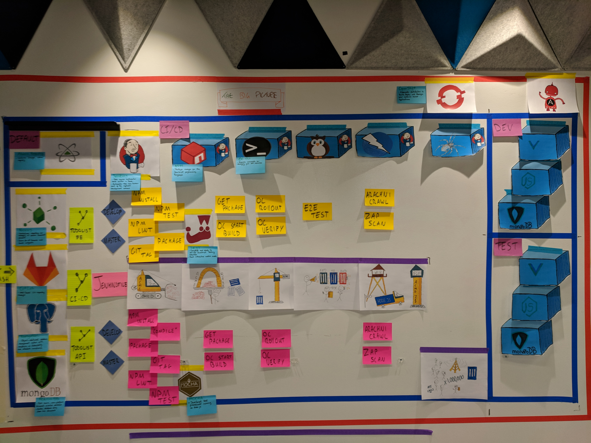

# An Enslaved Hope

> In this exercise we'll break free from the chains of point'n'click Jenkins by introducing pipeline as code in the form of `Jenkinsfile`. Following this we will introduce some new Jenkins slaves that will be used in later exercises.


[image-ref](https://memegenerator.net/instance/76565947/days-since-its-been-0-days-since-a-jenkins-fail)

There are a number of ways pipeline as code can be achieved in Jenkins.

 * The Job DSL Plugin - this is a slightly older but very functional DSL mechanism to create reusable pipelines. Create a `groovy` file to run Jenkins Domain Specific Language to create jobs, functions and other items. In Jenkins; you then can execute this file which will build all of the config.xml files needed for each Job.

 * The Scripted Pipeline - The scripted pipeline introduced the Jenkinsfile and the ability for developers to write their Jenkins setup as groovy code. A repo with a Jenkinsfile in its root can be pointed to by Jenkins and it will automatically build out each of the stages described within. The scripted pipeline is ultimately Groovy at its core.

 * The Declarative Pipeline - This approach looks to simplify and opinionate what you can do and when you can do it in a pipeline. It does this by giving you top level `block` which define sections, directives and steps. The declarative syntax is not run as groovy but you can execute groovy inside script blocks. The advantage of it over scripted is validation of the config and lighter approach with requirement to understand all of the `groovy` syntax

_____

## Learning Outcomes
As a learner you will be able to
- Use a Jenkinsfile to create a declarative pipeline to build, bake and deploy the Todolist App
- Identify the differences between scripted, declarative and DSL pipelines
- Create Jenkins slave nodes for use in builds in future exercises

## Tools and Frameworks

1. [Jenkins Pipeline](https://jenkins.io/doc/book/pipeline/) - Overview of the Jenkinsfile approach
2. [Pipeline Syntax](https://jenkins.io/doc/book/pipeline/syntax/) - Documentation for the declarative pipeline
3. [Groovy](http://groovy-lang.org/) - Groovy is a powerful, optionally typed and dynamic language, with static-typing and static compilation capabilities, for the Java platform aimed at improving developer productivity thanks to a concise, familiar and easy to learn syntax. It integrates smoothly with any Java program, and immediately delivers to your application powerful features, including scripting capabilities, Domain-Specific Language authoring, runtime and compile-time meta-programming and functional programming.
4. [Zed Attack Proxy](https://www.owasp.org/index.php/OWASP_Zed_Attack_Proxy_Project) - The OWASP Zed Attack Proxy (ZAP) is one of the world’s most popular free security tools and is actively maintained by hundreds of international volunteers*. It can help you automatically find security vulnerabilities in your web applications while you are developing and testing your applications. Its also a great tool for experienced pentesters to use for manual security testing.
5. [Arachni Crawler](http://www.arachni-scanner.com/) - Arachni is a feature-full, modular, high-performance Ruby framework aimed towards helping penetration testers and administrators evaluate the security of modern web applications. It is free, with its source code public and available for review. It is versatile enough to cover a great deal of use cases, ranging from a simple command line scanner utility, to a global high performance grid of scanners, to a Ruby library allowing for scripted audits, to a multi-user multi-scan web collaboration platform. In addition, its simple REST API makes integration a cinch.

## Big Picture
> From the previous exercise; we gated our pipeline. Now we will add a pipeline-as-code in the form of the Jenkinfile and re-use it on the Backend too.



_____

<!-- ## 10,000 Ft View
> The goal of this exercise is to move to using the Jenkinsfile in the todolist-api and todolist-fe projects. Additionally we will create new slaves for use in the next exercise.

2. On Jenkins; create a multibranch pipeline project to scan the GitLab endpoint for each app. Use the Jenkinsfile provided to run the stages. Replace `<YOUR_NAME>` with the appropriate variable.

2. Create two new Jenkins slaves for the `OWASP ZAP` scanner and the `Arachni` WebCrawler -->

## Step by Step Instructions

### Part 1 - The Jenkinsfile
> _In this exercise we'll replace the Pipeline we created in the previous exercise with a Jenkinsfile approach_

1. On your terminal navigate to your `todolist-api` project and checkout the pipeline feature branch that's been already created for you.
```bash
cd todolist-api
```
```bash
git checkout feature/jenkinsfile
```

2. Open up your `todolist-api` application in your favourite editor and move to the `Jenkinsfile` in the root of the project. The high-level structure of the file is shown collapsed below.

Some of the key things to note:
    * `pipeline {}` is how all declarative Jenkins pipelines begin.
    * `environment {}` defines environment variables to be used across all build stages
    * `options {}` contains specific Job specs you want to run globally across the jobs e.g. setting the terminal colour
    * `stage {}` all jobs must have one stage. This is the logical part of the build that will be executed e.g. `bake-image`
    * `steps {}` each `stage` has one or more steps involved. These could be execute shell or git checkout etc.
    * `agent {}` specifies the node the build should be run on e.g. `jenkins-slave-npm`
    * `post {}` hook is used to specify the post-build-actions. Jenkins declarative pipeline syntax provides very useful callbacks for `success`, `failure` and `always` which are useful for controlling the job flow
    * `when {}` is used for flow control. It can be used at the stage level and be used to stop pipeline entering that stage. e.g. when branch is master; deploy to `test` environment.

3. The Jenkinsfile is mostly complete to do all the testing etc that was done in previous exercises. Some minor changes will be needed to orchestrate namespaces. Find and replace all instances of `<YOUR_NAME>` in the Jenkinsfile. Update the `<GIT_USERNAME>` to the one you login to the cluster with; this variable is used in the namespace of your git projects when checking out code etc. Ensure the `GITLAB_DOMAIN` matches your git host.
```groovy
    environment {
        // GLobal Vars
        PIPELINES_NAMESPACE = "<YOUR_NAME>-ci-cd"
        APP_NAME = "todolist-api"

        JENKINS_TAG = "${JOB_NAME}.${BUILD_NUMBER}".replace("/", "-")
        JOB_NAME = "${JOB_NAME}".replace("/", "-")

        GIT_SSL_NO_VERIFY = true
        GIT_CREDENTIALS = credentials('jenkins-git-creds')
        GITLAB_DOMAIN = "gitlab.<APPS_URL>"
        GITLAB_PROJECT = "<GIT_USERNAME>"
    }
```

4. With these changes in place, push your changes to the `feature/jenkinsfile` branch.
```bash
git add Jenkinsfile
```
```bash
git commit -m "ADD - namespace and git repo to pipeline"
```
```bash
git push
```

5. When the changes have been successfully pushed; Open Jenkins.

6. Create a `New Item` on Jenkins. Give it the name `todolist-api` and select `Multibranch Pipeline` from the bottom of the list as the job type.


7. On the job's configure page; set the Branch Sources to `git`


8. Fill in the Git settings with your `todolist-api` GitLab url and set the credentials as you've done before. `https://gitlab.<APPS_URL>/<YOUR_NAME>/todolist-api.git`


9. Set the `Scan Multibranch Pipeline Triggers` to be periodic and the interval to 1 minute. This will poll the GitLab instance for new branches or change sets to build.


10. Save the Job configuration to run the intial scan. The log will show scans for `master` and `develop` branches, which have no `Jenkinsfile` so are skipped. The resulting view will show the `feature/jenkinsfile` job corresponding the only branch that currently has one. The build should run automatically.


11. The pipeline file is setup to only run `bake` & `deploy` stages when on `master` or `develop` branch. This is to provide us with very fast feedback for team members working on feature or bug fix branches. Each time someone commits or creates a new branch a basic build with testing occurs to give very rapid feedback to the team. Let's now update our  `master` and `develop` branches to include the Jenkinsfile and delete the feature branch.
```bash
git checkout develop
```
```bash
git merge feature/jenkinsfile
# you may get merge conflicts at this point
```
> NOTE: You may see a number of merge conflict warnings at this point. You can safely ignore them and proceed to commit the changes.

```bash
git add .
```
```bash
git commit -m "Jenkinsfile updates"
```
```bash
git checkout master
```
```bash
git merge develop
```
```bash
git push -u origin --all
```
```bash
# this is to delete the branch from the remote
git push origin :feature/jenkinsfile
```

12. Back on Jenkins we should see our `todolist-api` pipelines have changed with the `develop` and `master` now appearing. The `feature/jenkinsfile` branch was deleted so this job will go away after some time.


13. With the builds running for  `develop` and `master` we can explore the Blue Ocean View for Jenkins. On the Job overview page, hit the `Open Blue Ocean` button on the side to see what modern Jenkins looks like.


14.   We can move on to the `todolist-fe` job. The process is the same as before, checkout the feature branch
```bash
cd todolist-fe
```
```bash
git checkout feature/jenkinsfile
```

15.  Open up your `todolist-fe` application in your favourite editor and move to the `Jenkinsfile` in the root of the project. Update all `<YOUR_NAME>` and `<GIT_USERNAME>` as you did before, including in the prepare environment steps. Check the  `GITLAB_DOMAIN` is set too.


16. Commit your changes to your feature branch as you did previously.
```bash
git add Jenkinsfile
```
```bash
git commit -m "ADD - namespace and git repo to pipeline"
```
```bash
git push
```

17. This time update your `master` and `develop` branches before creating config in Jenkins
```
git checkout develop
```
```bash
git merge feature/jenkinsfile
# you may get merge conflicts at this point
```
```bash
git add .
```
```bash
git commit -m "Jenkinsfile updates"
```
```bash
git checkout master
```
```bash
git merge develop
```
```bash
# this is to delete the branch from the remote
git push origin :feature/jenkinsfile
```
```bash
git push -u origin --all
```

18. On Jenkins; create a new `Multibranch Pipeline` job called `todolist-fe`.

19. Add the `todolist-fe` git repository and set the credentials for git accordingly.

20. Set the trigger to scan every minute as done previously. Save the configuration and we should see the collection of Jobs as shown below.


> NOTE: If the `feature/jenkinsfile` job is running, you can stop it to speed up the job execution for the `master` and `develop` branches.

21. Run the jobs and validate the app is working as expected in the `test` environment!


### Part 2 - OCP Pipeline
> _This exercise adds a new BuildConfig to our cluster for the todolist-apps to run their pipelines in OpenShift using the OpenShift Jenkins Sync Plugin. We will use the OpenShift Applier to create the content in the cluster_

1. For the rest of the lab, ensure that you are working from the `master` branch
```bash
cd todolist-fe
git checkout master
```

2. Open the `todolist-fe` app in your favourite editor. Move to the `.openshift-applier` directory. Explore the `template/ocp-pipeline`. This template creates a BuildConfig for OpenShift with a Jenkinsfile from a given repo. In this case; it will be the `Jenkinsfile` at the root of our application.

3. Open the `params/ocp-pipeline` file and update `PIPELINE_SOURCE_REPOSITORY_URL` with the git url of your project (Don't forget to add the `.git` at the end). For example:
```
PIPELINE_SOURCE_REPOSITORY_URL=https://gitlab.<APPS_URL>/<GIT_USERNAME>/todolist-fe.git
PIPELINE_SOURCE_REPOSITORY_REF=develop
NAME=todolist-fe
```

4. Create a new object in `inventory/group_vars/all.yml` to drive the `ocp-pipeline` template with the parameters file you've just created. It can be put under the existing `todolist-fe-build` object.
```yaml
  - name: todolist-fe-pipeline
    template: "{{ playbook_dir }}/templates/ocp-pipeline.yml"
    params: "{{ playbook_dir }}/params/ocp-pipeline"
    namespace: "{{ ci_cd_namespace }}"
    tags:
    - pipeline
```


5. Log in to OpenShift using the `oc` client, and use the OpenShift Applier to create the cluster content
```bash
oc login https://<CLUSTER_URL>
```
```bash
cd todolist-fe/.openshift-applier
```
```bash
ansible-playbook apply.yml -i inventory/ \
     -e "filter_tags=pipeline"
```
> NOTE: Windows users should run the `oc` command and Ansible playbook from inside the `do500-toolbox` container.

6. With these changes in place, commit your changes to GitLab
```bash
git add .
```
```bash
git commit -m "ADD - ocp pipeline in git repo"
```
```bash
git push
```

7. Login to your OpenShift Cluster and go to the `<YOUR_NAME>-ci-cd` namespace. On the side menu; hit `Builds > Pipeline` to see your newly created pipeline running in OCP Land.


8. Running the pipeline from here will run it in Jenkins. You can see the job sync between OpenShift and Jenkins if you login to Jenkins. You should see a folder with `<YOUR_NAME>-ci-cd` and your pipeline jobs inside of it.


> NOTE: If you see failures in the first pipeline run, re-run the pipeline again and it should succeed.

9. With the configuration in place for the `todolist-fe`; repeat the process for the `todolist-api`. 
```bash
cd todolist-api/.openshift-applier
```
```bash
git checkout master
```

10. Update the `todolist-api/.openshift-applier/inventory/group_vars/all.yml` with a new object to drive the params and template
```yaml
  - name: todolist-api-pipeline
    template: "{{ playbook_dir }}/templates/ocp-pipeline.yml"
    params: "{{ playbook_dir }}/params/ocp-pipeline"
    namespace: "{{ ci_cd_namespace }}"
    tags:
    - pipeline
```

11. Update the `todolist-api/.openshift-applier/params/ocp-pipeline`
```
PIPELINE_SOURCE_REPOSITORY_URL=https://gitlab.<APPS_URL>/<GIT_USERNAME>/todolist-api.git
PIPELINE_SOURCE_REPOSITORY_REF=develop
NAME=todolist-api
```

12. Use the OpenShift Applier to create the cluster content
```bash
cd todolist-api/.openshift-applier
```
```bash
oc login https://<CLUSTER_URL>
```
```bash
ansible-playbook apply.yml -i inventory/ \
     -e "filter_tags=pipeline"
```

> NOTE: Windows users should run the `oc` command and Ansible playbook from inside the `do500-toolbox` container.

13. Login to your OpenShift Cluster and go to the `<YOUR_NAME>-ci-cd` namespace. On the side menu; hit `Builds > Pipeline` to see your newly created pipeline running in OCP Land.


14. Commit your changes to GitLab
```bash
git add .
```
```bash
git commit -m "ADD - ocp pipeline in git repo"
```
```bash
git push
```

### Part 3 - Security Scanning Slaves
> _This part of the exercise focuses on updating the `enablement-ci-cd` repo with some new jenkins-slave pods for use in future exercise_

<!-- #### 3a - OWASP ZAP
> _OWASP ZAP (Zed Attack Proxy) is a free open source security tool used for finding security vulnerabilities in web applications._

3. On your  terminal; move to the `enablement-ci-cd` repo.  We need to checkout a template for OpenShift to build our Jenkins Slave images and some parameters for the `zap` slave.
```bash
git checkout exercise4/zap-and-arachni params/jenkins-slave-zap templates/jenkins-slave-generic-template.yml
```

3. This should have created the following files which we will fill out. We will use a `ZAP` image hosted on the `rht-labs/ci-cd` repo so there will be no `Dockerfile` needed:
    - `params/jenkins-slave-zap`

3. Create an object in `inventory/host_vars/ci-cd-tooling.yml` called `jenkins-slave-zap` and add the following content:
```yaml
    - name: "jenkins-slave-zap"
      namespace: "{{ ci_cd_namespace }}"
      template: "{{ playbook_dir }}/templates/jenkins-slave-generic-template.yml"
      params: "{{ playbook_dir }}/params/jenkins-slave-zap"
      tags:
      - zap
```


3. Run the ansible playbook filtering with tag `zap` so only the zap build pods are run.
```bash
ansible-playbook apply.yml -e target=tools \
     -i inventory/ \
     -e "filter_tags=zap"
```

3. Head to <CLUSTER_URL> on OpenShift and move to your ci-cd project > builds. You should see `jenkins-slave-zap` has been built.
 -->

#### 3a - Arachni Scan
> _Arachni is a feature-full, modular, high-performance Ruby framework aimed towards helping penetration testers and administrators evaluate the security of web applications._

1. To save time, a slave S2I image for Arachni scanner has already been built for you and pushed to the `openshift` namespace. Tag and label the image so that it is available for builds in the `<YOUR_NAME>-ci-cd` namespace.
```bash
oc project <YOUR_NAME>-ci-cd
```
```bash
oc tag openshift/jenkins-slave-arachni:latest jenkins-slave-arachni:latest
```
```bash
oc label is jenkins-slave-arachni role=jenkins-slave-arachni
```
> NOTE: Windows users should run the `oc` commands in the `do500-toolbox` container.

<!-- 3. Create an object in `inventory/host_vars/ci-cd-tooling.yml` called `jenkins-slave-arachni` with the following content:
```yaml
    - name: "jenkins-slave-arachni"
      namespace: "{{ ci_cd_namespace }}"
      template: "{{ playbook_dir }}/templates/jenkins-slave-generic-template.yml"
      params: "{{ playbook_dir }}/params/jenkins-slave-arachni"
      tags:
      - arachni
```

3. Update the `jenkins-slave-arachni` files `SOURCE_REPOSITORY_URL` to point to your GitLab's hosted version of the `enablement-ci-cd` repo.
```
SOURCE_REPOSITORY_URL=https://gitlab.<APPS_URL>/<GIT_USERNAME>/enablement-ci-cd.git
SOURCE_CONTEXT_DIR=docker/jenkins-slave-arachni
BUILDER_IMAGE_NAME=registry.access.redhat.com/openshift3/jenkins-slave-base-rhel7:latest
NAME=jenkins-slave-arachni
SOURCE_REPOSITORY_REF=master
```

3. With these changes in place, push your changes to the `master` branch.
```bash
git add .
```
```bash
git commit -m "ADD - Arachni scanning image"
```
```bash
git push
```

3. Run the Ansible playbook filtering with tag `arachni` so only the arachni build pods are run.
```bash
ansible-playbook apply.yml -e target=tools \
     -i inventory/ \
     -e "filter_tags=arachni"
``` -->

2. Head to <CLUSTER_URL> on OpenShift and move to your ci-cd project `Builds > Images`. You should see the `jenkins-slave-arachni` image.


3. Just like you did with the `jenkins-slave-npm`, configure the `jenkins-slave-arachni` pod template to bypass SSL certificate checks in the Jenkins global configuration settings. Log in to Jenkins and navigate to `Manage Jenkins` > `Configure System` page.

4. Locate the `Kubernetes Pod Template` section by scrolling to the bottom of the page and click on `Add Pod Template` to add a new pod template for the Arachni scanner slave.


5. For the new pod template, enter `jenkins-slave-arachni` in the `Name` and `Labels` fields. 

6. In the `Containers` section for the pod template, add a new container template with the following details:
    * Enter `jnlp` in the `Name` field
    * Enter `docker-registry.default.svc:5000/<YOUR_NAME>-ci-cd/jenkins-slave-arachni` in the `Docker image` field
    * Enter `/tmp` in the `Working directory` field
    * Enter `${computer.jnlpmac} ${computer.name}` in the `Arguments to pass to the command` field

7. Add a new environment variable for the container template called `GIT_SSL_NO_VERIFY` and set its value to `true`. Your final `jenkins-slave-arachni` kubernetes pod template should look like the following:


8. Click `Save` at the bottom of the page to save your global Jenkins settings.
_____

## Extension Tasks
> _Ideas for go-getters. Advanced topic for doers to get on with if they finish early. These will usually not have a solution and are provided for additional scope._

Jenkins S2I
 - Add the multi-branch configuration to the S2I to have Jenkins come alive with the `todolist-api` and `-fe` configuration cooked into it for future uses.

Jenkins Pipeline Extension
 - Add an extension to the pipeline that promotes code to the UAT environment once the master job has been successful.
 - Use a WAIT to allow for manual input to approve the promotion

Jenkins e2e extension (blue/green)
 - Add a step in the pipeline to only deploy to the `test` environment if the e2e tests have run successfully against which ever environment (blue or green) is not deployed.

<!-- ## Additional Reading
> List of links or other reading that might be of use / reference for the exercise

## Slide Links

- [Intro](https://docs.google.com/presentation/d/1B3Fv4g66zZ8ZkqBq9TYmImJhUDvMecXCt4q3DXGWhjc/)
- [Wrap-up](https://docs.google.com/presentation/d/1EOk6y798Xh1hsaQlxRuqyr23FIIf7sNY4any_yXIL7A/)
- [All Material](https://drive.google.com/drive/folders/1oCjpl33Db7aPocmpu3NNF0B9czRvFq3m) -->

