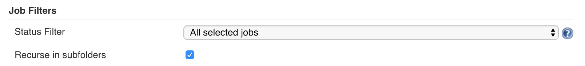

# Return of the Application Monitoring

> In this exercise we will create a build monitor to radiate vital build information and statistics
_____

## Learning Outcomes
As a learner you will be able to
- Create dashboards in Jenkins to display build status
- 

## Tools and Frameworks
> Name of tool - short description and link to docs or website

1. [Build Monitor plugin](https://wiki.jenkins.io/display/JENKINS/Build+Monitor+Plugin) - Build Monitor Plugin provides a highly visible view of the status of selected Jenkins jobs. It easily accommodates different computer screen sizes and is ideal as an Extreme Feedback Device to be displayed on a screen on your office wall. (Inspired by the no longer maintained RadiatorView plugin).
1. [Build Fail Analyser](https://wiki.jenkins.io/display/JENKINS/Build+Failure+Analyzer) - This plugin analyzes the causes of failed builds and presents the causes on the build page. It does this by using a knowledge base of build failure causes that is built up from scratch. Saving statistics about failure causes is also possible.
1. [Pipeline Aggregator View](https://wiki.jenkins.io/display/JENKINS/Pipeline+Aggregator+View) - Allows the users to view the history of their pipelines with stage information (failed/In Progress/Passed) and the changes monitored)

## Big Picture
This exercise begins cluster containing blah blah

_____

## 10,000 Ft View
> The goal of this exercise is to introduce Build Monitors to radiate teams progress on Dashboards.

2. Create a new Dashboard for our Builds using the plugin above. Use Regex to add jobs to it. Use the BuildFail Analyser to add meaningful data to the reason for failures.

2. Use the pipeline views in OpenShift and Jenkins to produce dashboards that teams can use. 

## Step by Step Instructions
> This is a fairly structured guide with references to exact filenames and sections of text to be added. Include pictures and code snippets where appropriate. Rule of thumb is learners are dumb.... so over describe _why_ we're doing things

### Part 1 - Create a build monitor
> _In this exercise we will create a new build monitor to show key information about our builds_

2. On Jenkins home page; create a new view by hitting the plus icon on the home screen (should be beside the `all` above the jobs list)

2. Give the job a sensible name such as `todolist-monitor` and select `Build Monitor View` 

2. On the configuration page; select `Recurse in subfolders`

2. Check the box to use Regular Expression and set the value to be something that should scrape our apps such as `.*todolist.*` 

2. Finally; select `Display committers` and set the Failure Analyser to `Description` 

2. Save your configuration to see your Build Monitor! 

2. Let's create another view for Jenkins using the `Pipeline Aggregator View` plugin. 

### Part 2 - Seed Jenkins Dashboards
> _TODO - Add instructions for creating dashboards as part of s2i in Jenkins setup using DSL_

2. Open the s2i in `enablement-ci-cd` .....

_____

## Extension Tasks
> _Ideas for go-getters. Advanced topic for doers to get on with if they finish early. These will usually not have a solution and are provided for additional scope._

Additional Alerting
 - Add `Slack` integration to the Pipeline by setting up a WebHook to call the slack endpoint with Build Stats
 - Add `Twillio` text integration to send you text messages when the build fails.
Additional Monitoring
 - Explore the Application's FEK stack inside OpenShift

## Additional Reading
> List of links or other reading that might be of use / reference for the exercise

## Slide links
> link back to the deck for the supporting material