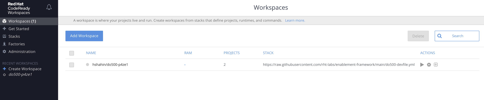

# Frequently Asked Questions and Cheat Sheet

> This section contains common information needed when working through the exercises and a command line cheat sheet to help with completing exercises.

---

## Frequently Asked Questions

### How can I get into my CodeReady Workspace (assumes you have gone through Exercise 1, Part 1 where we created the cloud IDE)?

  - Navigate to the CodeReady workspaces link provided by your facilitators. Take note that this is not the exact same link as in Exercise 1, Part 1 which was used to deploy the cloud IDE. After navigating to the link, you should see a page similar to the picture below.

  

  - On the left nav bar under "Recent Workspaces", select the workspace that has `do500-id` (in the picture above, that's `do500-p4ze1`).

  - The workspace should then start up and when complete you should be back in the cloud IDE.

### How do I get the OpenShift login token?

  - Login to the cluster at the cluster URL provided.

  - At the top right of the page after logging in, you should see your name. Click into that tab and under your name should be a `Copy Login Command` url that you should click.

  

  - You should then be prompted for your credentials. Click `ldap` and login using your cluster credentials.

  - You should then see a `Display Token` link. Once you click that, you should copy the command under the `Log in with this token` header (it starts with `oc login` and you'll want to copy the full command including the `--token` and `--server` arguments).

  - Paste the command in your cloud ide terminal. You should then be logged in. As a way to confirm, run `oc whoami` and you should see your username for the cluster.

## Labs Cheat Sheet

This cheat sheet will give you some of the most useful commands and tips which you will need to complete the exercises. This should be most helpful to non-techies who need to get up to speed with command line techniques. If you come across anything else which would be useful during the enablement, write it on a post-it and add it to the real time retro or raise a pull request.

- Changing Directory

  - `cd dir_name` Changes directory to `dir_name` within your current working directory
  - `cd /path/to/dir` Changes to the absolute location specified
  - `cd ..` Changes to the parent directory
  - `cd -` Changes to the previous diretory

- Creating a blank file or directory

  - `touch file_name` Creates a blank file named `file_name` within the current directory
  - `mkdir dir_name` Creates a new directory named `dir_name` within the current directory

- Listing files within current directory

  - `ls` prints a list of the files within your current directory
  - `ls -l` prints a list of the files within your current directory with more detail

- Quickly see the contents of a file

  - `cat file_name` prints the contents of `file_name` to the console

- Move or rename a file

  - `mv file_name dest_dir` will move the file from the current directory to `dest_dir`
  - `mv file_name new_name` will rename the file to `new_name`

- Open a file

  - `open file_name` will open the file as though it had been double clicked in a standard user interface

- Copy a file or directory

  - `cp file_name dest_dir` will create a copy of the file in the destination directory
  - `cp file_name copied_name` will create a copy of the file in the same directory and it shall be called `copied_name`
  - `cp -r dir_name dest_dir` will copy a directory to the destination location. Note the `-r` flag is necessary to copy the contents of the directory

- Delete a file or directory

  - `rm file_name` will delete the file
  - `rm -rf dir_name` will delete the directory and all of its contents
  - Whatever you do, _do not_ run `sudo rm -rf /`

- Search for a string within an input

  - `grep 'substring' file_name` will print all lines in the file which contain the string 'substring'

- Place the output of one command into the input of another

  - `command1 | command2` will run command 1 then run command 2 with the input of the result of command 1. e.g. `ls | grep 'file'` will give you all files in the current directory which have 'file' in their name

- Find out how to do things in the terminal

  - `man command1` will open the man pages (manual pages) for a particular command.
  - `man -k <search string>` will return a list of commands relevant to the search string you've entered.
  - If you want to know more about `man` try `man man` for more `man` on `man` information.

- Run commands with root privileges
  - `sudo command1` will run a command with escalated privileges. This is safer than logging on as root user.

## OpenShift 101

OpenShift, or OpenShift Container Platform (OCP) is Red Hat's container platform. It is used to run and manage containerised applications with the aim of accelerated application development and deployment. We shall be deploying all of our applications for this enablement on an OpenShift cluster.

- What is a container?

  - A container is an isolated space within the operating system which is made to look like its own computer. Things within the container can only see what is in itself and cannot see anything about the computer it is really running on. Additionally multiple containers can be deployed with no interaction between one another meaning they will not coflict.

- How do you control OpenShift?
  - There are two main ways of controlling OpenShift and the containers which reside within it. The first way is using the web interface; from here is it possible to use clicks to deploy an application. The easiest way to do this is direct from the source code using a Source-to-image (S2I) which comes out of the box with OpenShift. It is also possible (and encouraged) to use the command line interface, using the `oc` command, to control OCP. The other option is to use Ansible to set the cluster to a defined standard, as set out in an Ansible playbook.

## Ansible 101

Ansible is a tool which automates software provisioning, configuration management, and application deployment.

- How to run an Ansible playbook
  - `ansible-playbook file.yml -i inventory_dir/` will run the Ansible playbook defined in file.yml (playbooks are defined in YAML format). The inventory directory will contain all of the information about what will be deployed. In the enablement we will use Ansible extensively, but the structure will be given to you to make this easier.
