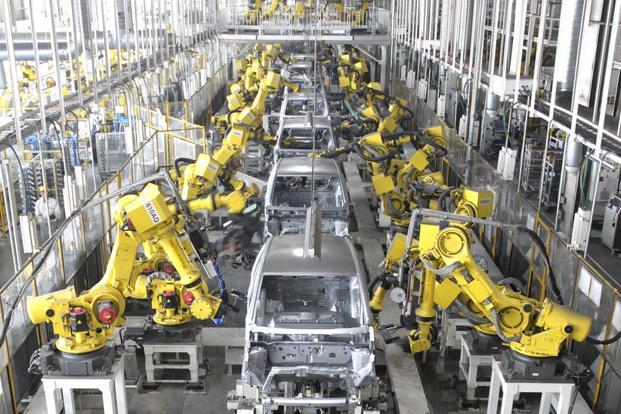

Upcoming excercies helps students to implement pipelines and understand the DevOps philosphy. Below table is a short summary of up coming exercie.

Exercise     | Description
------------- | -------------
The Manual Menace  | This exercise helps the students  - To setup the basic tools and environment required for software development  - Build software Code (Todo list app)  - Provision the infrastructure using Ansible Deploy the Code using Ansible
Attack of the pipelines  | This exercise introduces pipelines - Series of automated steps orchestrated by Jenkins to achieve the steps performed manually in Step 1.
Revenge of Automated Testing  | Exercise introduces Test driven development- a software development methodology to deliver quality components. It also demonstrates gated pipelines with automated test executions. 
An En-slaved Hope | This exercise introduces the concept of security scanning tools and its integration without pipelines.
Non-Functional Strike Back | This exercise introduces to the concept of static code analysis for measuring code quality without executing the code.
Return of app monitoring | Pipelines are fine, but who is going to monitor them and how? This chapter deals with it. 
The Cluster Awakens | After ensuring the software build is automated, we are in production. Is everything running, okay? Let us dive in.
The Last Unicorn Dev | Time for a collaborative demo.

> Before getting out hands dirty by doing these exercies, one might wonder why we need to do these and what is the problem its going to solve. Let's try to understand the need of automation and its value.

---

# Why Automation?

For a moment,let's think about car manufacturing. Thousands of cars are being manufactured every single day by assembling more than 30000 quality tested parts with highest precision and at scale. This is achieved with the help of automated assembly lines and robot hands as shown in the below picture:

Same logic applies to software world as well wherein we need to build and test hunderds of software components for the enterprises to run. IT industry face the same challenges that automobile industry has faced.

**Some key challenges** 

How can we be highly productive? 
How can we be reduce or eliminate human errors? 
How can we mitigate risks? 
How can we be more scaleable and meet growing demand? 
How can we bring in consistency and repeatability? 
How can we meet the always changing customer needs? 

If you are thinking about DevOps and pipelines as the solution,  **Yes, you are right**!

DevOps culture/philosphy/technique tries to bridge the gap between Developers and Operators through well defined methodologies to achieve business goals in the most optimal way.

Continuous Integration (CI) and Continuous Deployment (CD) pipelines are like the automated assembly lines through which our cars(code) get assembled and deployed.

