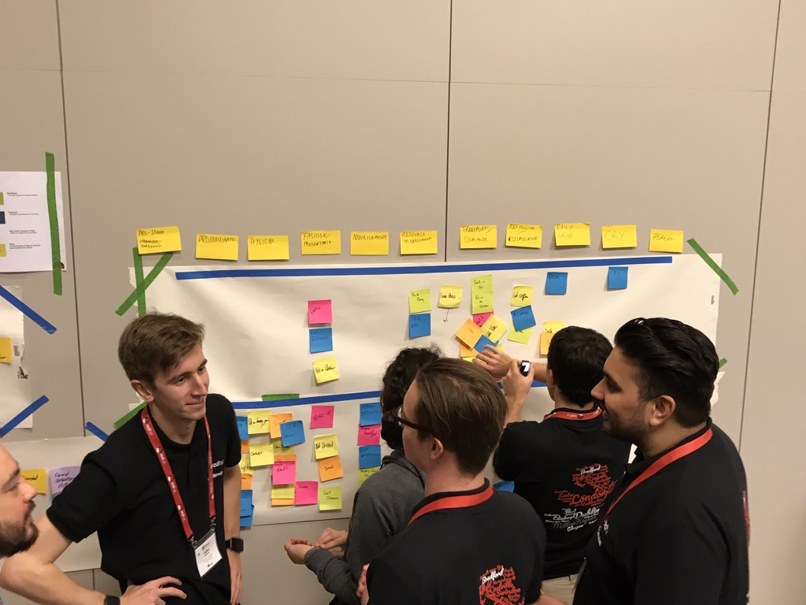

# Event Storming

> Session to introduce the practice of User Story Mapping and Value Slicing, how we use it and show some examples of real User Story Map artefacts. This will also include a short interactive exercise to practice value slicing.

_____

## Slides

The latest version of slides for the session are available [here](https://docs.google.com/presentation/d/1OnU4xMyJJUQUF40a6iJjRg_2n9BkUOrEst63iktlPyY/edit?usp=sharing)

## Facilitation Materials Needed

* Teams in table size of 4 to 6
* Sticky Notes - set of the following on each table
    * Small Square - lots of one color
    * Small Rectangular - lots of one color
* Sharpie Pens (1 per person) on each table
* Single color Painters' Tape

## Facilitation Guidelines

* Present the slides to introduce User Story Mapping and Value Slicing, what they are and why we use them
* Kick off the interactive exercise:
    * Individually, ask each person to capture on yellow sticky notes every activity they do between waking up and arriving at work (assume they're working in a local office near home)
    * Now get everyone in each table group to put their stickies on wall - in no particular order
    * Get rid of duplicates
    * Move stickies around to form logical order
    * Cluster groups of similar themed activities and present in a column
    * Give each 'theme' a title
    * Facilitator should use sticky tape to place a hotizontal line across each team's story map
    * Facilitor should now explain the scenario whereby their alarm clock has not gone off, they've woken up late and need to get to the office as sooon as possible. What valuable items do you "slice out" and place above the line?
* Present the residency examples provided in slides and encourage any Labs people present to talk about their experiences of using the practice
 
 