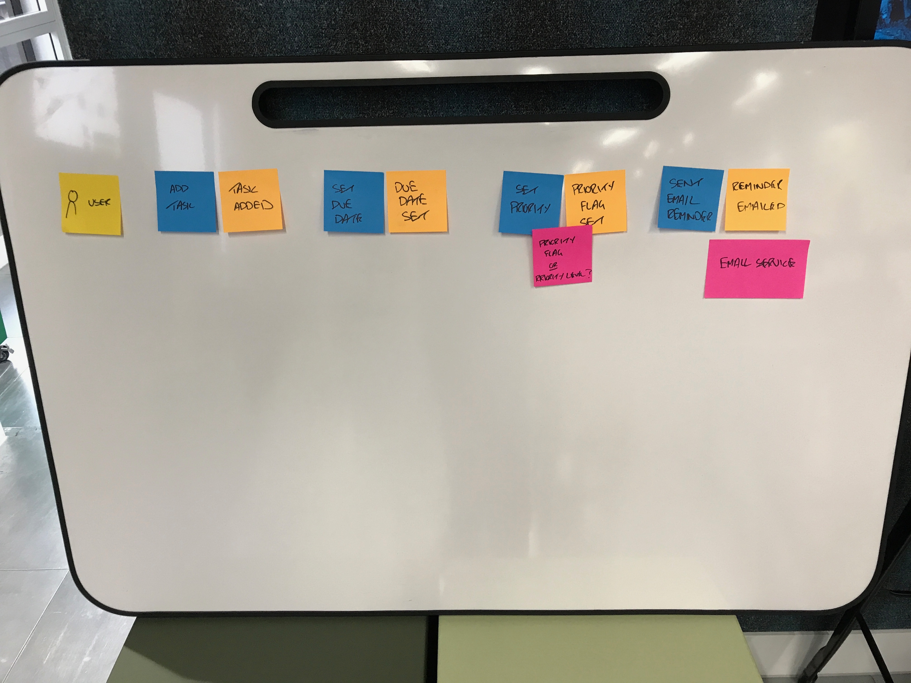

# Event Storming

> Session to introduce the practice of Event Storming, how we use it and show some examples of real Event Storm artefacts. This will also include a short interactive exercise to practice some event storming and help solidify learning.

_____

## Slides

The latest version of slides for the session are available [here](https://drive.google.com/open?id=1S_O3vfg1vJFHI7be-GDfrphCalqdPd-zV9OmZV3Y2is)

## Facilitation Materials Needed

* Teams in table size of 4 to 6
* Sticky Notes - set of the following on each table
    * Orange Small Square
    * Blue Small Square
    * Yellow Small Square
    * Pink Small Square
    * Purple/Lylic Small Rectangle
    * Purple/Lylic
    * Yellow Small Rectangle
* Sharpie Pens (1 per person) on each table
* Roll of plotter paper per table
* Tape or bluetac to fix paper to wall

## Facilitation Guidelines

* Present the slides to introduce Event Storming, what it is, why we use it and walk through the steps in how to use it
* Present the residency examples provided in slides and encourage any Labs people present to talk about their experiences of using the practice. We have found presenting a real Event Storm (ideally with the physical board) is much more effective than presenting the slides and has resulted in much better conversation. If you have access to real artefacts, consider reducing the slides.
* Kick off the interactive exercise:
    * As a class, put up the pre-baked Event Storm. The Facilitator should talk through as he/she puts up the events, commands, user, external system, etc.
 
    * Table groups should then replicate the pre-baked event storm artifact and follow the instructions in the slide to extend this to cover additional functionality. Some examples have been given. You could also encourage participants to think about their own experience of to-do-list management
    * Time box of 20 minutes. Facilitators should walk round the room and help with any questions and engage in conversations
    * As a class, talk about aggregates and what aggregates might apply to these emerging event storms